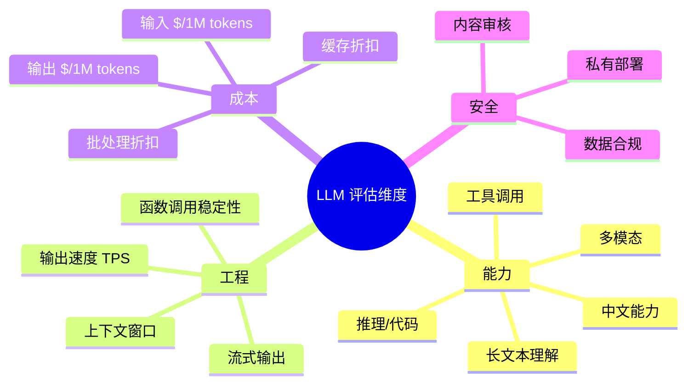

# 1.1 主流大模型对比：Claude / GPT / Gemini / 开源模型

> 了解 2025-2026 年主流 LLM 厂商的能力差异、价格区间、上下文窗口与适用场景，为 dify 中选择模型供应商提供决策依据。

## 🎯 学习目标

完成本文档后，你将能够：
- 说出 Claude / GPT / Gemini / 开源模型四大阵营的代表产品
- 理解上下文窗口、价格、推理能力、工具调用能力等关键对比维度
- 根据业务场景选择合适的 LLM 供应商
- 能在 dify 中按"供应商/模型"维度配置并切换模型

## 📚 前置知识

- HTTP 协议基础（详见 [HTTP 协议](../../_common/14-api-protocols/01-http-protocol.md)）
- 了解 dify 是一个 LLM 应用平台（参见仓库根目录 `README.md`）

## 1. 核心概念

### 1.1 LLM 厂商生态

LLM 市场已形成"闭源旗舰 + 开源生态 + 垂直小模型"三足鼎立的格局：

| 阵营 | 代表产品 | 特点 |
| --- | --- | --- |
| Anthropic | Claude Opus 4.8 / Sonnet 5 / Haiku 4.5 | 长上下文、代码能力、Agent 友好 |
| OpenAI | GPT-5 / GPT-4o / o3 | 通用能力强、生态最完善 |
| Google | Gemini 2.5 Pro / Flash | 多模态、长上下文、价格低 |
| 开源 | Llama 3.3 / Qwen 3 / DeepSeek V3 | 可私有部署、可微调 |
| 国产 | 文心 / 通义 / Kimi | 中文场景优化、合规友好 |

dify 的"供应商（Provider）"概念正是把每家厂商抽象成统一的接口，让上层业务不用关心具体协议差异。

### 1.2 关键对比维度



> 📌 **Sighting**：后文专题入口——工具调用 / Function Calling 见 [Function Calling](./17-function-calling.md)；流式输出协议见 [SSE](../../_common/14-api-protocols/04-sse.md) 与本模块 [流式输出](./32-streaming-sse.md)；Embedding 选型见 [Embedding 模型](./06-embedding-models.md)；Token 与上下文见 [Tokens 与上下文](./03-tokens-context.md)。

**为什么 dify 要支持这么多供应商？**
- 避免厂商锁定（vendor lock-in）
- 不同任务用不同模型（如 Embedding 用小模型、推理用大模型）
- 不同地区有合规要求（数据不能出境）

### 1.3 上下文窗口与价格

上下文窗口决定单次请求能塞入多少文本。Claude 4.x 系列已统一为 1M tokens，Sonnet 5、Opus 4.7/4.8 都达到了百万级。

价格方面，Anthropic 公开价（2026 年中）：

| 模型 | Input $/1M | Output $/1M | 备注 |
| --- | --- | --- | --- |
| Claude Opus 4.8 | 5.00 | 25.00 | 旗舰 |
| Claude Sonnet 5 | 3.00 | 15.00 | 平衡（2 折优惠到 2026-08-31） |
| Claude Haiku 4.5 | 1.00 | 5.00 | 轻量 |

不同厂商定价模型不一致：OpenAI 按"输入 + 输出"分计，Google Gemini 区分 ≤128K 与 >128K 上下文，国产厂商常按字符而非 token 计费。

## 2. 代码示例

### 2.1 统一接口：dify 的 Provider 抽象

dify 不让上层直接调用厂商 SDK，而是通过统一的 `ModelProvider` 抽象层接入：

```python
# 文件：example_provider.py
# dify 用 ModelProvider 把每家厂商抽象成统一接口
from abc import ABC, abstractmethod
from enum import Enum

class ModelType(str, Enum):
    LLM = "llm"               # 大语言模型
    TEXT_EMBEDDING = "embedding"
    RERANK = "rerank"
    SPEECH2TEXT = "speech2text"
    MODERATION = "moderation"
    TTS = "tts"

class AIModel(ABC):
    """所有模型实现都要继承这个抽象类"""

    @abstractmethod
    def _invoke(self, model_parameters: dict, prompt_messages: list, tools: list) -> dict:
        """真正调用厂商 SDK"""
        raise NotImplementedError

    @abstractmethod
    def get_num_tokens(self, model: str, messages: list) -> int:
        """估算 token 数（用于计费/限流）"""
        raise NotImplementedError
```

**说明**：
- 抽象类不关心厂商协议，只关心"输入 messages + 工具 → 输出结果"
- dify 在 `core/model_runtime/model_providers/` 下为每家厂商写一个实现

### 2.2 常见错误：写死厂商 SDK

```python
# ❌ 错误：业务代码直接 import openai
import openai
client = openai.OpenAI(api_key="sk-...")
resp = client.chat.completions.create(model="gpt-4o", messages=[...])
# 问题：换 Claude 时要重写，业务和厂商耦合

# ✅ 正确：通过 dify 的 ModelManager
from core.model_manager import ModelManager
model_instance = ModelManager.for_tenant(tenant_id).get_model_instance(
    tenant_id="...", model_type=ModelType.LLM,
    provider="anthropic", model="claude-sonnet-5",
)
resp = model_instance.invoke_llm(prompt_messages=[...], model_parameters={...})
```

## 3. 关键要点总结

- dify 不直接集成各厂商 SDK，而是通过 plugin daemon 统一调度
- `ModelProvider` 是抽象层，`ModelType` 区分 LLM/Embedding/Rerank 等不同模态
- 选模型时要权衡能力、价格、上下文窗口、合规四要素
- 同一业务可配置多个供应商，按任务类型路由

---

**文档版本**：v1.0
**最后更新**：2026-07-13
