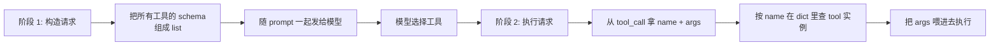

# 6.16 多工具路由与编排

> 理解当 LLM 一次会话挂载多个工具时，业务侧如何做工具选择、参数注入和按名分发。

## 🎯 学习目标

完成本文档后，你将能够：
- 解释 dify Agent Runner 的"按名分发"模式
- 追踪一个 tool_call 从产生到执行的完整路径
- 区分 CoT（Chain-of-Thought）和 FC（Function-Calling）两种 agent 策略的差异
- 理解 `ToolManager.get_agent_tool_runtime` 在路由中的作用

## 📚 前置知识

- 06-llm-and-ai/14-function-calling.md
- 06-llm-and-ai/15-tool-schema.md
- 06-llm-and-ai/01-llm-overview.md（理解 dify LLM 抽象层）

## 1. 核心概念

### 1.1 多工具路由的两个阶段

当 LLM 一次会话挂载 N 个工具时，整个流程分两阶段：



- **阶段 1（构造）**：把所有工具的 `name + description + schema` 拼成数组发给模型。模型只看到"我能调哪些函数"
- **阶段 2（路由）**：模型返回 `tool_call: (id, name, args)`，业务代码用 `name` 在本地 dict 里查对应的实现

关键：**模型不做"路由"决策**——它只是"声明要调哪个"。真正的 if-else / 字典查找在业务侧。

### 1.2 工具选择 = 字典查找

业务侧通常维护一个 `dict[str, Tool]`：

```python
tool_instances = {
    "get_weather": weather_impl,
    "query_db": db_impl,
    "send_email": email_impl,
}

# 模型返回: tool_call.name = "send_email"
# 路由:
tool = tool_instances.get("send_email")
if not tool:
    return error_response(f"unknown tool: send_email")
result = tool(**args)
```

**为什么不用 if-else 链**？
- 工具列表可能动态变化（插件加载、热更新）
- 工具可能多达几十个，if-else 链维护成本高
- 字典查找 O(1)，扩展性好

### 1.3 dify 的两种 agent 策略

dify 在 `core/agent/entities.py` 第 72-79 行定义了两种策略：

```python
class Strategy(StrEnum):
    CHAIN_OF_THOUGHT = "chain-of-thought"
    FUNCTION_CALLING = "function-calling"
```

| 策略 | 文件 | 工具调用协议 | 适用场景 |
| --- | --- | --- | --- |
| `FUNCTION_CALLING` | `fc_agent_runner.py` | 标准 `tool_calls` 字段 | 支持原生 FC 的模型（GPT-4o、Claude 3.5+） |
| `CHAIN_OF_THOUGHT` | `cot_agent_runner.py` | 让模型输出 `Action: ...` 文本再用正则解析 | 不支持 FC 的老模型、想兼容多种协议 |

CoT 策略的兼容性强，但解析鲁棒性差；FC 策略更现代、行为更可预期。

### 1.4 路由失败的常见场景

- 模型"幻觉"了一个不存在的工具名（业务侧要返回 "unknown tool" 而非崩溃）
- 工具被用户禁用（要查租户级开关）
- 工具依赖的凭据过期（要触发 OAuth 刷新或报错）
- 工具参数与 schema 不匹配（要用 JSON Schema 校验）

## 2. 代码示例

### 2.1 多工具路由器

```python
# 文件：example_router.py
import json
from typing import Callable, Any

class ToolRouter:
    """维护 tool_name -> implementation 的字典，按模型返回值分发"""

    def __init__(self):
        self._tools: dict[str, Callable[..., Any]] = {}
        self._schemas: list[dict] = []

    def register(self, name: str, description: str, parameters: dict, impl: Callable):
        self._tools[name] = impl
        self._schemas.append({
            "name": name,
            "description": description,
            "parameters": parameters,
        })

    @property
    def schemas(self) -> list[dict]:
        return self._schemas

    def dispatch(self, tool_call: dict) -> dict:
        """根据 tool_call 路由到对应实现；找不到时返回错误而不是崩溃"""
        name = tool_call["function"]["name"]
        args = json.loads(tool_call["function"]["arguments"])

        impl = self._tools.get(name)
        if not impl:
            return {
                "tool_call_id": tool_call["id"],
                "role": "tool",
                "content": f"Error: unknown tool '{name}'",
            }
        try:
            result = impl(**args)
            return {
                "tool_call_id": tool_call["id"],
                "role": "tool",
                "content": json.dumps(result, ensure_ascii=False),
            }
        except Exception as e:
            return {
                "tool_call_id": tool_call["id"],
                "role": "tool",
                "content": f"Error: {e}",
            }


# 使用
router = ToolRouter()
router.register(
    name="get_weather",
    description="查询城市天气",
    parameters={
        "type": "object",
        "properties": {"city": {"type": "string"}},
        "required": ["city"],
    },
    impl=lambda city: f"{city}: 22°C",
)
router.register(
    name="add",
    description="两个整数相加",
    parameters={
        "type": "object",
        "properties": {
            "a": {"type": "integer"},
            "b": {"type": "integer"},
        },
        "required": ["a", "b"],
    },
    impl=lambda a, b: a + b,
)

# 模拟模型返回的多工具调用
calls = [
    {"id": "c1", "function": {"name": "get_weather", "arguments": '{"city":"Beijing"}'}},
    {"id": "c2", "function": {"name": "add", "arguments": '{"a":3,"b":5}'}},
    {"id": "c3", "function": {"name": "delete_user", "arguments": '{"user_id":1}'}},  # 没注册
]

for c in calls:
    print(router.dispatch(c))
```

**说明**：
- 第 11-15 行：注册时同时记录 `name/description/parameters/impl` 四元组
- 第 19 行：暴露 `schemas` 属性给上层构造 LLM 请求
- 第 28 行：找不到工具时返回错误结果（让模型看到后能换个思路），**不抛异常**
- 第 35-40 行：业务函数自身异常也被捕获并转成错误消息

### 2.2 常见错误：未注册的 dict 没有错误兜底

```python
# ❌ 错误：直接用 dict["name"] 访问
def dispatch(tool_call):
    return self._tools[tool_call["function"]["name"]](**args)
# 模型幻觉出 "delete_user" 时 → KeyError，agent 整体崩溃

# ✅ 正确：用 .get() + 错误兜底
def dispatch(tool_call):
    impl = self._tools.get(tool_call["function"]["name"])
    if impl is None:
        return {"role": "tool", "content": "unknown tool"}
    return impl(**args)
```

## 3. dify 仓库源码解读

### 3.1 Agent 策略枚举

**文件位置**：`/Users/xu/code/github/dify/api/core/agent/entities.py`
**核心代码**（行 67-86）：

```python
class AgentEntity(BaseModel):
    """
    Agent Entity.
    """

    class Strategy(StrEnum):
        """
        Agent Strategy.
        """

        CHAIN_OF_THOUGHT = "chain-of-thought"
        FUNCTION_CALLING = "function-calling"

    provider: str
    model: str
    strategy: Strategy
    prompt: AgentPromptEntity | None = None
    tools: list[AgentToolEntity] | None = None
    max_iteration: int = 10
```

**解读**：
- 第 8-13 行：dify 把 agent 策略显式枚举为两种值，存到数据库
- 第 17-18 行：`tools` 是 `list[AgentToolEntity]`——agent 配置时挂载的工具列表
- 第 19 行：`max_iteration` 默认 10 次——防止死循环

### 3.2 fc_agent_runner 的字典路由

**文件位置**：`/Users/xu/code/github/dify/api/core/agent/fc_agent_runner.py`
**核心代码**（行 232-283）：

```python
# call tools
tool_responses = []
for tool_call_id, tool_call_name, tool_call_args in tool_calls:
    tool_instance = tool_instances.get(tool_call_name)
    if not tool_instance:
        tool_response = {
            "tool_call_id": tool_call_id,
            "tool_call_name": tool_call_name,
            "tool_response": f"there is not a tool named {tool_call_name}",
            "meta": ToolInvokeMeta.error_instance(f"there is not a tool named {tool_call_name}").to_dict(),
        }
    else:
        # invoke tool
        tool_invoke_response, message_files, tool_invoke_meta = ToolEngine.agent_invoke(
            session=session,
            tool=tool_instance,
            tool_parameters=tool_call_args,
            user_id=self.user_id,
            tenant_id=self.tenant_id,
            message=self.message,
            invoke_from=self.application_generate_entity.invoke_from,
            agent_tool_callback=self.agent_callback,
            trace_manager=trace_manager,
            app_id=self.application_generate_entity.app_config.app_id,
            message_id=self.message.id,
            conversation_id=self.conversation.id,
        )
        # publish files
        for message_file_id in message_files:
            self.queue_manager.publish(
                QueueMessageFileEvent(message_file_id=message_file_id), PublishFrom.APPLICATION_MANAGER
            )
            message_file_ids.append(message_file_id)

        tool_response = {
            "tool_call_id": tool_call_id,
            "tool_call_name": tool_call_name,
            "tool_response": tool_invoke_response,
            "meta": tool_invoke_meta.to_dict(),
        }

    tool_responses.append(tool_response)
    if tool_response["tool_response"] is not None:
        self._current_thoughts.append(
            ToolPromptMessage(
                content=str(tool_response["tool_response"]),
                tool_call_id=tool_call_id,
                name=tool_call_name,
            )
        )
```

**解读**：
- 第 2 行：**逐个处理** LLM 返回的 tool_call（不是并发——见下篇文档）
- 第 3 行：`tool_instances.get(tool_call_name)`——典型的字典查找
- 第 4-11 行：**找不到工具时的兜底**：构造一个带 `error` 的 meta 和"there is not a tool named X"消息，下一轮模型看到后会自我修正
- 第 13-26 行：找到时调 `ToolEngine.agent_invoke` 真正执行（统一异常处理、超时、文件发布等）
- 第 39-46 行：执行结果**追加回 `self._current_thoughts`**——这是 agent 维持"对话历史"的关键
- **整体设计意图**：dify 在执行层做完整的错误兜底 + 工具结果回流，让 FC 循环能稳定跑到结束

### 3.3 ToolManager 按 (provider_type, provider_id, tool_name) 三元组取运行时

**文件位置**：`/Users/xu/code/github/dify/api/core/tools/tool_manager.py`
**核心代码**（行 176-205）：

```python
@classmethod
def get_tool_runtime(
    cls,
    provider_type: ToolProviderType,
    provider_id: str,
    tool_name: str,
    tenant_id: str,
    user_id: str | None = None,
    invoke_from: InvokeFrom = InvokeFrom.DEBUGGER,
    tool_invoke_from: ToolInvokeFrom = ToolInvokeFrom.AGENT,
    credential_id: str | None = None,
) -> BuiltinTool | PluginTool | ApiTool | WorkflowTool | MCPTool:
    """
    get the tool runtime
    ...

    :return: the tool
    """
    match provider_type:
        case ToolProviderType.BUILT_IN:
            provider_controller = cls.get_builtin_provider(provider_id, tenant_id)
            builtin_tool = provider_controller.get_tool(tool_name)
            if not builtin_tool:
                raise ToolProviderNotFoundError(f"builtin tool {tool_name} not found")
            # ...
```

**解读**：
- 第 1-15 行：用 `(provider_type, provider_id, tool_name, tenant_id)` 四元组唯一定位一个运行时工具实例
- 第 18-22 行：**按 `provider_type` 走不同的分支**——BUILT_IN / API / WORKFLOW / PLUGIN / MCP，每种工具加载方式不同
- 第 23-25 行：每种 provider_controller 内部再按 `tool_name` 拿具体工具
- **整体设计意图**：dify 支持 7 种 tool provider（见 `ToolProviderType` 枚举），但上层调用方只看到一个统一接口——把"工具种类差异"收敛到 `match-case` 里

## 4. 关键要点总结

- 多工具路由 = 字典查找 `dict[name] -> impl`
- 找不到工具时**返回错误结果而非抛异常**，让 LLM 自我修正
- dify 的 agent 策略分 `FUNCTION_CALLING` 和 `CHAIN_OF_THOUGHT` 两种
- `ToolManager.get_tool_runtime` 用 (provider_type, provider_id, tool_name) 三元组唯一定位
- 工具结果必须**追加回** agent 的 thoughts 列表，agent 才能在下一轮"记住"调过什么

## 5. 练习题

### 练习 1：基础（必做）

为练习 2.1 的 `ToolRouter` 增加 `unregister(name)` 方法，并模拟"模型调一个被取消注册的工具"的场景，验证错误消息能正确返回给上游。

### 练习 2：进阶

阅读 `core/agent/cot_agent_runner.py` 第 300-346 行 `_handle_invoke_action`（非 FC 风格）：
- 它和 fc_agent_runner 的差异在哪里？
- CoT 模式下"工具名"和"工具参数"是怎么从模型输出里提取的？
- CoT 模式有什么潜在的安全风险（提示词注入）？

### 练习 3：挑战（选做）

设计一个"工具分组路由"机制：把 10 个工具分成 2 组（search 组、write 组），LLM 一次只能看到"当前激活组"的 schema。给出 3 种可能的实现思路（提示：动态改写 tools 数组 vs. 用 `tool_choice` 限制 vs. 路由器二次过滤），并比较它们的性能/复杂度。

## 6. 参考资料

- `/Users/xu/code/github/dify/api/core/agent/entities.py`
- `/Users/xu/code/github/dify/api/core/agent/fc_agent_runner.py`
- `/Users/xu/code/github/dify/api/core/agent/cot_agent_runner.py`
- `/Users/xu/code/github/dify/api/core/tools/tool_manager.py`
- OpenAI Function Calling：https://platform.openai.com/docs/guides/function-calling

---

**文档版本**：v1.0
**最后更新**：2026-07-13
