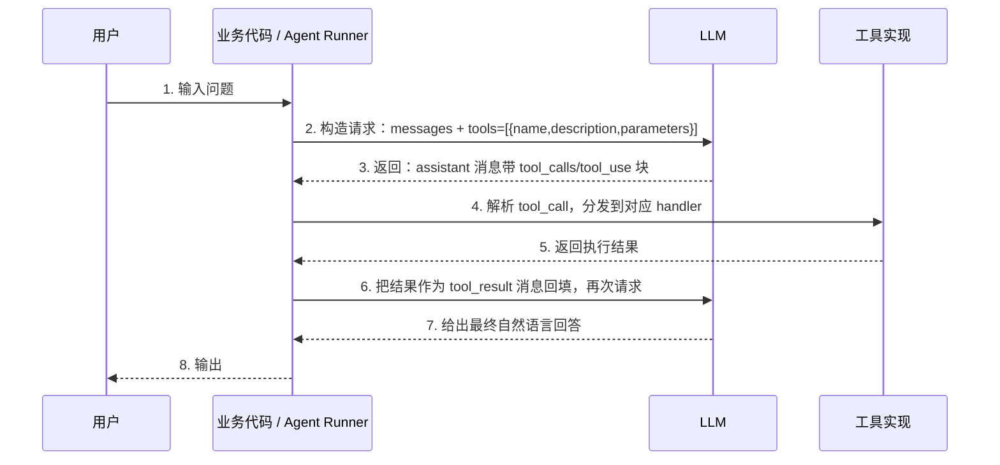

# 6.14 Function Calling：原理与调用流程

> 理解 LLM Function Calling（函数调用 / 工具调用）的核心原理，能追踪 dify 中从「模型返回 tool_call」到「工具执行并回填结果」的完整闭环。

## 🎯 学习目标

完成本文档后，你将能够：
- 说出 Function Calling 在 LLM 应用中的角色
- 画出一个完整的 tool-use 循环：构造请求 → 模型返回 tool_use → 执行 → 喂回 tool_result
- 区分 Chat Completions 风格的 `tool_calls` 字段与 Anthropic 风格的 `tool_use` 内容块
- 能读懂 dify 中 `fc_agent_runner.py` 的 stream/blocking 两条路径

## 📚 前置知识

- Python 基础语法（生成器详见 [生成器](../01-fundamentals/16-generator.md)；JSON 详见 [JSON](../01-fundamentals/20-json-processing.md)）
- LLM 的消息结构（system / user / assistant / tool；详见 [Prompt 基础](./08-prompt-basics.md)）
- dify 的 LLM 抽象层（详见 [主流大模型对比](./01-llm-overview.md)）

## 1. 核心概念

### 1.1 什么是 Function Calling

Function Calling（也称 Tool Use）是 LLM **不直接执行函数**、而是 **返回结构化调用请求**的能力。整个流程是：



> 📌 **Sighting**：Agent 循环与 ReAct 范式完整展开见 [Agent 概念](../07-rag-and-agent/21-agent-concepts.md)、[ReAct](./11-react.md)；工具参数 schema 见 [Tool Schema](./18-tool-schema.md)。

关键洞察：
- **模型只是"决定"调哪个函数、传什么参数**；具体执行由客户端负责
- 工具的契约写在 `tools` 数组里（name、description、JSON Schema 形式的 parameters）
- 模型永远不会直接访问文件系统、数据库、网络——只产出结构化请求

### 1.2 两种主流的 wire format

不同厂商的工具调用协议略有差异：

| 厂商 | assistant 消息里的字段 | tool 结果消息 |
| --- | --- | --- |
| OpenAI Chat Completions | `tool_calls: [{id, type:"function", function:{name, arguments}}]` | `{"role":"tool", "tool_call_id": id, "content": "..."}` |
| Anthropic Messages | `content: [{type:"tool_use", id, name, input}, ...]` | `{"role":"user", "content":[{type:"tool_result", tool_use_id, content}]}` |
| dify 内部统一 | `AssistantPromptMessage.tool_calls: list[ToolCall]` | `ToolPromptMessage(tool_call_id, content, name)` |

dify 屏蔽了厂商差异，对上层只暴露统一的 `PromptMessageTool` / `AssistantPromptMessage.ToolCall` / `ToolPromptMessage`（见 `core/model_runtime/entities/message_entities.py`）。

### 1.3 工具调用的边界

Function Calling 适合：
- 调用确定性、结果可结构化的动作（查 DB、调 API、跑计算）
- 把"自然语言意图"翻译成"参数化请求"

不适合：
- 需要流式中间步骤的（用 Workflow / Agent 而非单次 function call）
- 模型自己都不确定要不要调（用 `tool_choice="auto"` 即可；用 `tool_choice="any"` 强制至少调一次）

## 2. 代码示例

### 2.1 一个最小可运行的 agent 循环

```python
# 文件：example_fc_loop.py
import json
from openai import OpenAI

client = OpenAI()

tools = [
    {
        "type": "function",
        "function": {
            "name": "get_weather",
            "description": "查询指定城市的当前天气。城市名用英文。",
            "parameters": {
                "type": "object",
                "properties": {
                    "city": {"type": "string", "description": "城市英文名，例如 Beijing"},
                    "unit": {"type": "string", "enum": ["celsius", "fahrenheit"]},
                },
                "required": ["city"],
            },
        }
    }
]

def get_weather(city: str, unit: str = "celsius") -> str:
    # 真实实现应该调第三方 API；这里模拟
    return f"{city} 当前 22°{unit[0].upper()}，晴"

messages = [{"role": "user", "content": "北京今天多少度？"}]

# 第一轮：让模型决定要不要调函数
resp = client.chat.completions.create(
    model="gpt-4o",
    messages=messages,
    tools=tools,
    tool_choice="auto",
)
assistant_msg = resp.choices[0].message
messages.append(assistant_msg)  # 必须把整个 assistant 消息追加回 messages

# 第二轮：把 tool_calls 转成 tool 消息
if assistant_msg.tool_calls:
    for call in assistant_msg.tool_calls:
        args = json.loads(call.function.arguments)
        if call.function.name == "get_weather":
            result = get_weather(**args)
        else:
            result = f"unknown tool: {call.function.name}"
        messages.append({
            "role": "tool",
            "tool_call_id": call.id,  # 必须回填 id，把 call 和 result 配对
            "content": result,
        })

    # 第三轮：让模型基于 tool 结果生成自然语言
    final = client.chat.completions.create(model="gpt-4o", messages=messages)
    print(final.choices[0].message.content)
```

**说明**：
- 第 14-24 行：`tools` 数组里写好契约，模型据此判断是否要调
- 第 33 行：**整条 assistant 消息（含 tool_calls 字段）原样追加回 messages**，否则模型在下一轮会"失忆"
- 第 38-43 行：用 `tool_call_id` 把 call 和 result 配对，这是协议要求
- 第 46 行：再次请求即可拿到最终自然语言

### 2.2 常见错误：忘记把 assistant 消息追加回去

```python
# ❌ 错误：把 tool_call 拆出来直接给模型
resp = client.chat.completions.create(...)
if resp.choices[0].message.tool_calls:
    # 直接调函数
    result = call_tool(resp.choices[0].message.tool_calls[0])
    # 错误：第二轮只发 tool 结果，模型看不到自己上一轮的 tool_call，协议被破坏
    final = client.chat.completions.create(
        model="gpt-4o",
        messages=[user_msg, {"role":"tool","tool_call_id":"...","content":result}],
    )

# ✅ 正确：把 assistant 原话 + tool 结果一起发
messages.append(resp.choices[0].message)  # 关键
messages.append({"role":"tool","tool_call_id":"...","content":result})
final = client.chat.completions.create(model="gpt-4o", messages=messages)
```

## 3. 关键要点总结

- Function Calling = 模型产出结构化 `tool_call` 请求 + 客户端执行 + 把结果回填
- 必须把含 `tool_calls` 的整条 assistant 消息原样追加回 messages，否则协议被破坏
- `tool_call_id` 是 call 和 result 配对的唯一锚点
- dify 内部用统一的 `PromptMessageTool` / `AssistantPromptMessage.ToolCall` 屏蔽厂商差异
- 流式响应下 tool_call 是分片到达的，需要在 runner 里做合并

---

**文档版本**：v1.0
**最后更新**：2026-07-13
