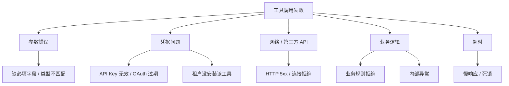
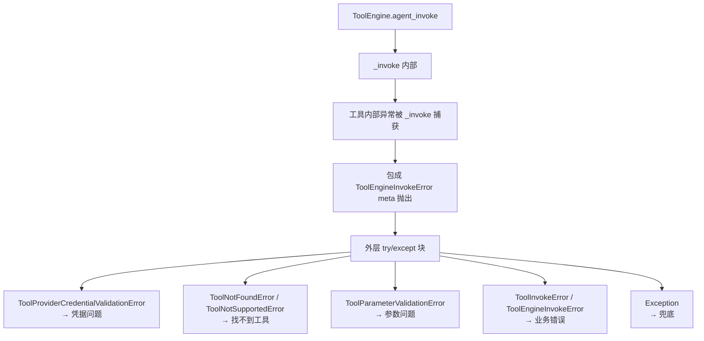
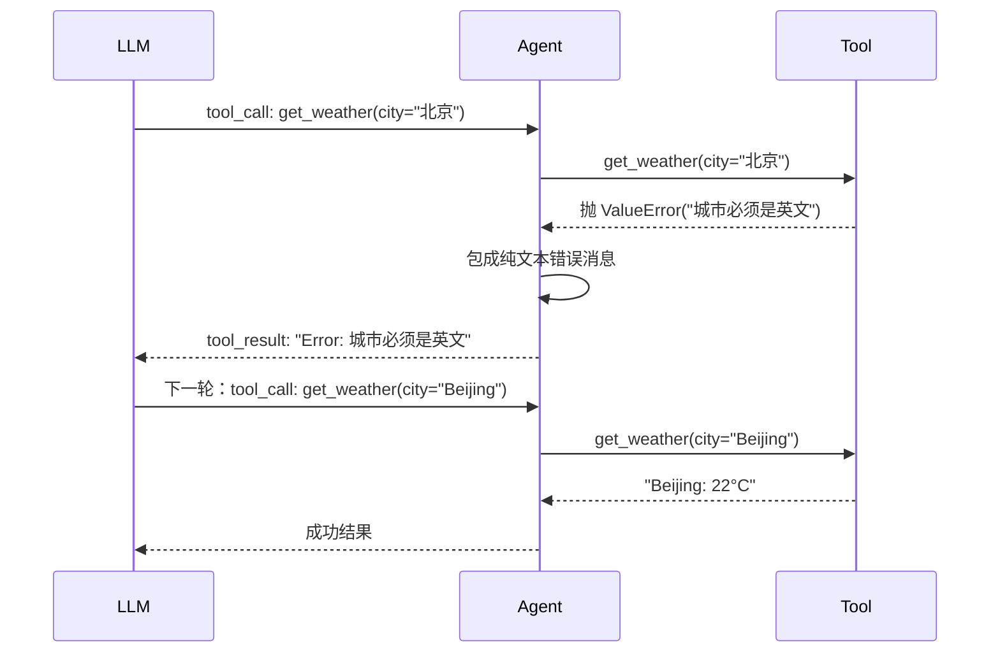

# 6.17 工具错误处理：失败与重试

> 理解工具调用失败的常见原因和 dify 的错误处理模式，能写出鲁棒的 tool-use 循环。

## 🎯 学习目标

完成本文文档后，你将能够：
- 列出工具调用失败的 5 类典型错误
- 区分"业务异常"、"参数错误"、"凭据过期"等不同失败模式的处理方式
- 理解 dify 的 `ToolInvokeMeta.error_instance` 和 `ToolEngine` 异常分支
- 设计工具调用重试与降级策略

## 📚 前置知识

- [Function Calling](./14-function-calling.md)
- [多工具路由](./16-multi-tool-routing.md)
- Python 异常处理（详见 [异常](../01-fundamentals/06-python-exceptions.md)）

## 1. 核心概念

### 1.1 工具调用失败的 5 类典型错误



每类的处理策略不同：

| 类别 | 失败时机 | 是否可重试 | 处理方式 |
| --- | --- | --- | --- |
| 参数错误 | 模型产出 | 否 | 让 LLM 看到错误消息后自我修正 |
| 凭据问题 | 调用前/调用中 | 部分可（OAuth 刷新） | 提示用户更新凭据 |
| 网络/5xx | 调用中 | **是**（指数退避） | 立即重试 2-3 次 |
| 业务逻辑 | 调用中 | 视情况 | 返回错误让 LLM 调整策略 |
| 超时 | 等待响应 | 视情况 | 短超时重试；长超时改异步 |

### 1.2 dify 的两层错误捕获

dify 在 `core/tools/tool_engine.py` 的 `agent_invoke` 方法里有 **两层** 异常处理：



- **内层 `_invoke`**：记录元数据（耗时、错误信息），把异常包装为 `ToolEngineInvokeError`
- **外层 `agent_invoke`**：把异常翻译成"自然语言错误消息"回传给 LLM（不是直接崩溃）

### 1.3 "让 LLM 自我修正"的回路

最关键的设计：把错误变成**纯文本消息**塞回 `tool_result`，让 LLM 在下一轮看到错误后调整参数：



**核心洞察**：错误消息**对 LLM 可见**才能触发自我修正，所以错误描述要"对模型友好"（说清楚什么字段错了、应该怎么改），而非堆栈或 errno。

## 2. 代码示例

### 2.1 工具结果 vs 工具错误的统一处理

```python
# 文件：example_tool_error.py
import json
import time
from typing import Callable, Any
from dataclasses import dataclass, field


@dataclass
class ToolResult:
    """统一的工具结果封装"""
    content: str
    is_error: bool = False
    meta: dict = field(default_factory=dict)


def safe_invoke(name: str, args: dict, impl: Callable, *, max_retries: int = 2) -> ToolResult:
    """统一处理：参数校验 + 重试 + 错误包装"""
    # 1. 业务层参数校验
    if "city" not in args:
        return ToolResult(
            content=f"Error: missing required parameter 'city'. "
                    f"Please provide it as a string.",
            is_error=True,
            meta={"tool_name": name, "error_type": "missing_param"},
        )

    # 2. 业务层带重试的执行
    last_err = None
    for attempt in range(max_retries + 1):
        try:
            start = time.time()
            result = impl(**args)
            return ToolResult(
                content=json.dumps(result, ensure_ascii=False),
                is_error=False,
                meta={"tool_name": name, "elapsed": time.time() - start, "attempt": attempt + 1},
            )
        except (ConnectionError, TimeoutError) as e:
            # 网络/超时——可重试
            last_err = e
            time.sleep(0.1 * (2 ** attempt))  # 指数退避
            continue
        except ValueError as e:
            # 业务校验错误——直接返回，不要重试
            return ToolResult(
                content=f"Error: {e}",
                is_error=True,
                meta={"tool_name": name, "error_type": "validation"},
            )

    # 重试耗尽
    return ToolResult(
        content=f"Error: failed after {max_retries + 1} attempts: {last_err}",
        is_error=True,
        meta={"tool_name": name, "error_type": "network", "attempts": max_retries + 1},
    )


# 模拟一个不稳定的工具
def get_weather(city: str) -> str:
    if city == "Beijing":
        return {"city": city, "temp": 22, "unit": "C"}
    if city == "broken":
        raise ConnectionError("network failed")
    raise ValueError(f"unknown city: {city}. please use an English city name.")


# 模拟 LLM 的多次调用
calls = [
    {"name": "get_weather", "args": {}},                    # 缺参数
    {"name": "get_weather", "args": {"city": "北京"}},     # 业务校验失败
    {"name": "get_weather", "args": {"city": "broken"}},   # 网络失败（会重试）
    {"name": "get_weather", "args": {"city": "Beijing"}},  # 成功
]
for c in calls:
    r = safe_invoke(c["name"], c["args"], get_weather)
    tag = "OK  " if not r.is_error else "ERR "
    print(f"{tag} {c['args']} -> {r.content}  meta={r.meta}")
```

**说明**：
- 第 18-25 行：**业务层参数校验在工具调用前完成**——尽早失败，避免重试浪费
- 第 31-37 行：网络/超时异常自动重试，使用指数退避
- 第 38-43 行：业务校验错误（`ValueError`）**不重试**——重试无意义，直接返回
- 第 47-50 行：重试耗尽后返回带 attempt 计数的错误消息，方便上层判断
- 第 67-69 行：4 个测试场景覆盖了"缺参数 / 业务失败 / 网络失败重试 / 成功"四种情况

### 2.2 常见错误：凭据过期时无限重试

```python
# ❌ 错误：把所有错误都当网络错误重试
def safe_invoke(name, args, impl):
    for attempt in range(5):
        try:
            return impl(**args)
        except Exception:  # 凭据错误也被重试
            time.sleep(2 ** attempt)
            continue
# 问题：凭据错误重试 5 次浪费 30 秒

# ✅ 正确：区分可重试与不可重试
RETRYABLE = (ConnectionError, TimeoutError)
NON_RETRYABLE = (ValueError, PermissionError, KeyError)

def safe_invoke(name, args, impl, max_retries=2):
    for attempt in range(max_retries + 1):
        try:
            return impl(**args)
        except NON_RETRYABLE as e:
            # 立即返回
            return {"error": str(e), "retryable": False}
        except RETRYABLE as e:
            time.sleep(0.1 * 2 ** attempt)
    return {"error": "max retries", "retryable": True}
```

## 3. dify 仓库源码解读

### 3.1 ToolEngine 的完整异常分支

**文件位置**：`/Users/xu/code/github/dify/api/core/tools/tool_engine.py`
**核心代码**（行 81-156）：

```python
try:
    agent_tool_callback.on_tool_start(tool_name=tool.entity.identity.name, tool_inputs=tool_parameters)

    messages = ToolEngine._invoke(session, tool, tool_parameters, user_id, conversation_id, app_id, message_id)
    invocation_meta_dict: dict[str, ToolInvokeMeta] = {}

    def message_callback(...): ...

    messages = ToolFileMessageTransformer.transform_tool_invoke_messages(...)

    message_list = list(messages)
    binary_files = ToolEngine._extract_tool_response_binary_and_text(message_list)
    message_files = ToolEngine._create_message_files(...)

    plain_text = ToolEngine.tool_response_to_str(message_list)
    meta = invocation_meta_dict["meta"]

    agent_tool_callback.on_tool_end(...)
    return plain_text, message_files, meta
except ToolProviderCredentialValidationError as e:
    logger.error(e, exc_info=True)
    error_response = "Please check your tool provider credentials"
    agent_tool_callback.on_tool_error(e)
except (ToolNotFoundError, ToolNotSupportedError, ToolProviderNotFoundError) as e:
    error_response = f"there is not a tool named {tool.entity.identity.name}"
    logger.error(e, exc_info=True)
    agent_tool_callback.on_tool_error(e)
except ToolParameterValidationError as e:
    error_response = f"tool parameters validation error: {e}, please check your tool parameters"
    agent_tool_callback.on_tool_error(e)
    logger.error(e, exc_info=True)
except ToolInvokeError as e:
    error_response = f"tool invoke error: {e}"
    agent_tool_callback.on_tool_error(e)
    logger.error(e, exc_info=True)
except ToolEngineInvokeError as e:
    meta = e.meta
    error_response = f"tool invoke error: {meta.error}"
    agent_tool_callback.on_tool_error(e)
    logger.error(e, exc_info=True)
    return error_response, [], meta
except Exception as e:
    error_response = f"unknown error: {e}"
    agent_tool_callback.on_tool_error(e)
    logger.error(e, exc_info=True)

return error_response, [], ToolInvokeMeta.error_instance(error_response)
```

**解读**：
- 第 2-26 行：正常执行路径——callback 通知 + 文件转换 + meta 收集
- 第 27-30 行：**凭据错误**——返回"请检查凭据"，不暴露细节
- 第 31-34 行：**找不到工具**——返回通用错误消息（不会泄露工具配置细节）
- 第 35-38 行：**参数校验错误**——把 `e` 拼接进错误消息，让 LLM 看到具体哪里错
- 第 39-42 行：**工具调用错误**——泛化的业务错误
- 第 43-47 行：**引擎层错误**——取出 `e.meta`（含完整错误信息）
- 第 48-51 行：**兜底**——任何未捕获的异常都被转成 `unknown error`
- 第 54 行：**统一返回**——错误也走 `ToolInvokeMeta.error_instance`，让上层"看不出是成功还是失败"，都从同一个 meta 结构取
- **整体设计意图**：dify 的错误处理哲学是**"把异常翻译成自然语言给 LLM 看"**——LLM 拿到错误消息后能调整参数，agent 循环不会中断

### 3.2 ToolInvokeMeta 错误实例

**文件位置**：`/Users/xu/code/github/dify/api/core/tools/entities/tool_entities.py`
**核心代码**（行 458-488）：

```python
class ToolInvokeMeta(BaseModel):
    """
    Tool invoke meta
    """

    time_cost: float = Field(..., description="The time cost of the tool invoke")
    error: str | None = None
    tool_config: dict[str, Any] | None = None

    @classmethod
    def empty(cls) -> ToolInvokeMeta:
        """
        Get an empty instance of ToolInvokeMeta
        """
        return cls(time_cost=0.0, error=None, tool_config={})

    @classmethod
    def error_instance(cls, error: str) -> ToolInvokeMeta:
        """
        Get an instance of ToolInvokeMeta with error
        """
        return cls(time_cost=0.0, error=error, tool_config={})

    def to_dict(self) -> ToolInvokeMetaDict:
        result: ToolInvokeMetaDict = {
            "time_cost": self.time_cost,
            "error": self.error,
            "tool_config": self.tool_config,
        }
        return result
```

**解读**：
- 第 7-9 行：核心字段——`time_cost`（耗时）、`error`（错误消息）、`tool_config`（调用配置）
- 第 16-18 行：`empty()` 用于"没有错误但也没有结果"的占位
- 第 22-25 行：`error_instance(error)` 工厂方法快速构造错误实例
- 第 27-32 行：`to_dict` 序列化为 dict 存进数据库
- **整体设计意图**：错误和成功**共享同一数据结构**——上层处理逻辑不用分两个分支；区分只靠 `error` 字段是否非空

### 3.3 异常类型集中定义

**文件位置**：`/Users/xu/code/github/dify/api/core/tools/errors.py`
**核心代码**（行 1-30）：

```python
from core.tools.entities.tool_entities import ToolInvokeMeta
from libs.exception import BaseHTTPException


class ToolProviderNotFoundError(ValueError):
    pass


class ToolNotFoundError(ValueError):
    pass


class ToolParameterValidationError(ValueError):
    pass


class ToolProviderCredentialValidationError(ValueError):
    pass


class ToolNotSupportedError(ValueError):
    pass


class ToolInvokeError(ValueError):
    pass


class ToolApiSchemaError(ValueError):
    pass


class ToolSSRFError(ValueError):
    pass


class ToolCredentialPolicyViolationError(ValueError):
    pass
```

**解读**：
- 第 4-29 行：dify 用**领域异常**（domain-specific exception）区分不同错误类别——比 `ValueError` / `RuntimeError` 等内置异常更精确
- 第 6 行 `ToolProviderNotFoundError` / 第 8 行 `ToolNotFoundError` / 第 18 行 `ToolNotSupportedError`——对应"找不到"的三种粒度
- 第 12 行 `ToolProviderCredentialValidationError`——凭据问题
- 第 14 行 `ToolParameterValidationError`——参数校验
- 第 20 行 `ToolApiSchemaError`——OpenAPI 解析失败
- 第 24 行 `ToolSSRFError`——SSRF 安全防护
- 第 28 行 `ToolCredentialPolicyViolationError`——租户级策略违规
- **整体设计意图**：每个错误类别都有**专门的异常类**，让 `tool_engine` 的 `except` 分支能精确分流

## 4. 关键要点总结

- 工具失败分 5 类：参数错误、凭据、网络、业务、超时——处理策略不同
- **关键设计**：把异常翻译成自然语言错误消息回传给 LLM，让 LLM 自我修正
- 重试只对**可重试错误**（网络/超时）有意义，凭据和参数错误重试无意义
- dify 用 `ToolInvokeMeta` 统一封装成功/失败结果，上层用 `error` 字段是否非空判断
- 用**领域异常类**（如 `ToolParameterValidationError`）区分错误类别，而非通用 `ValueError`

## 5. 练习题

### 练习 1：基础（必做）

为练习 2.1 的 `safe_invoke` 加上以下能力：
- 区分 `RetryableError` 和 `FatalError` 两种异常
- 失败时记录到 `meta["errors"]` 列表（每次失败追加一条）
- 超过最大重试次数后，**返回最后一次的错误消息**（不是 "max retries"）

### 练习 2：进阶

阅读 `core/tools/tool_engine.py` 第 48-156 行 `agent_invoke` 方法：
- `ToolEngineInvokeError` 和 `ToolInvokeError` 的差异是什么？
- 为什么 `ToolEngineInvokeError` 路径要单独 `return error_response, [], meta`（不是走最后的统一 return）？
- `agent_tool_callback.on_tool_error(e)` 的作用是什么？谁能订阅这个回调？

### 练习 3：挑战（选做）

设计一个"指数退避 + 熔断"机制：
- 同一工具连续 N 次失败后，**暂时**拒绝调用（熔断），返回 `CircuitOpenError`
- M 秒后进入"半开"状态：放一个请求探活，成功则恢复，失败则再次熔断
- 用伪代码写出状态机：`CLOSED → OPEN → HALF_OPEN → (CLOSED|OPEN)`

## 6. 参考资料

- `/Users/xu/code/github/dify/api/core/tools/tool_engine.py`
- `/Users/xu/code/github/dify/api/core/tools/entities/tool_entities.py`
- `/Users/xu/code/github/dify/api/core/tools/errors.py`
- `/Users/xu/code/github/dify/api/core/agent/fc_agent_runner.py`
- AWS 熔断器模式：https://docs.aws.amazon.com/prescriptive-guidance/latest/cloud-design-patterns/circuit-breaker-pattern.html

---

**文档版本**：v1.0
**最后更新**：2026-07-13
