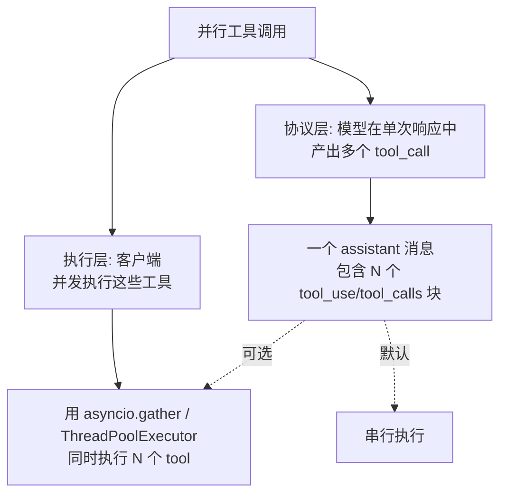
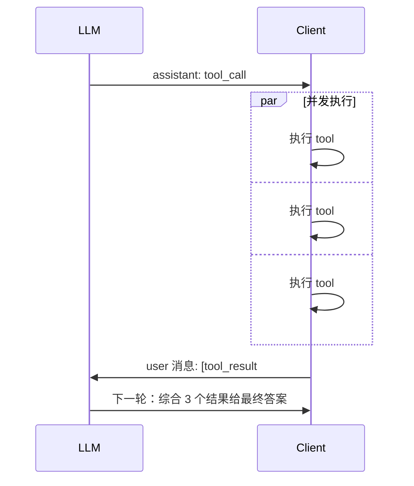

# 6.18 并行工具调用

> 理解 LLM 并行工具调用的原理和边界条件，能区分"协议层并行"和"客户端并发执行"。

## 🎯 学习目标

完成本文档后，你将能够：
- 解释 LLM 一次响应中产生多个 tool_call 的机制
- 区分"协议层并行"和"客户端执行层并发"
- 知道什么时候该并发执行多个工具、什么时候应该串行
- 读懂 dify 的 fc_agent_runner 中"for-loop 串行分发"的实现及原因

## 📚 前置知识

- [Function Calling](./14-function-calling.md)
- [多工具路由](./16-multi-tool-routing.md)
- [工具错误处理](./17-tool-error-handling.md)
- Python `asyncio` / `concurrent.futures`（详见 [async/asyncio](../01-fundamentals/12-async-asyncio.md)、[并发模型](../01-fundamentals/23-concurrency.md)）

## 1. 核心概念

### 1.1 "并行工具调用" 的两层含义



**关键洞察**：协议层并行 ≠ 执行层并发。LLM **可以**在一次响应里产出 N 个 tool_call，但**是否并发执行**完全由客户端决定。

### 1.2 为什么需要并行调用

考虑一个用户问题："查询北京和上海的天气"：

- **串行**：模型返回 `get_weather(Beijing)` → 执行 → 拿到结果 → 模型再返回 `get_weather(Shanghai)` → 执行 → 总耗时 2×T
- **并行**（单次响应双 tool_call）：模型在一次响应里同时产出两个 call → 客户端并发执行 → 总耗时 ~1×T

**节省的不是 LLM 时间**（模型仍要算两次）**，而是工具执行时间**——尤其是网络 I/O。

### 1.3 哪些工具适合并发

| 场景 | 是否适合并发 | 原因 |
| --- | --- | --- |
| 多个独立的查询（如查两个城市天气） | **是** | 无依赖、可并行 |
| 多个写入操作（如批量发邮件） | 视情况 | 需要确认无副作用冲突 |
| 有依赖的工具（A 的结果作为 B 的参数） | **否** | 严格串行 |
| 修改共享状态（如写同一个文件） | **否** | 并发不安全 |
| 不可重入的工具（如消耗配额） | 视情况 | 可能被风控 |

### 1.4 协议层并行的关键约束

OpenAI / Anthropic 都要求：
- 一次 assistant 消息里**可以**有 N 个 tool_call
- 客户端必须**一次**回填 N 个 tool_result 消息（不能拆成 N 个 user 消息）
- 一个 tool_result 必须包含对应的 `tool_call_id`



如果把 N 个 tool_result **拆成 N 个 user 消息**分别发送，模型会"失忆"前面的 tool_call——协议被破坏。

## 2. 代码示例

### 2.1 并发执行多个 tool_call

```python
# 文件：example_parallel_tools.py
import asyncio
import time
import json


async def get_weather(city: str) -> str:
    """模拟一个 1 秒的网络调用"""
    await asyncio.sleep(1)
    return f"{city}: 22°C"


async def dispatch_one(call: dict) -> dict:
    """执行单个 tool_call，按 name 路由"""
    name = call["function"]["name"]
    args = json.loads(call["function"]["arguments"])
    if name == "get_weather":
        content = await get_weather(**args)
    else:
        content = f"unknown tool: {name}"
    return {
        "tool_call_id": call["id"],
        "role": "tool",
        "content": content,
    }


async def run_agent(calls: list[dict]) -> list[dict]:
    """并发执行所有 tool_call，返回 [tool_result, ...]"""
    # asyncio.gather 自动并发，N 个 1 秒的请求总耗时 ~1 秒
    return await asyncio.gather(*(dispatch_one(c) for c in calls))


# 模拟 LLM 在一次响应里产出 3 个 tool_call
model_calls = [
    {"id": "c1", "function": {"name": "get_weather", "arguments": '{"city":"Beijing"}'}},
    {"id": "c2", "function": {"name": "get_weather", "arguments": '{"city":"Shanghai"}'}},
    {"id": "c3", "function": {"name": "get_weather", "arguments": '{"city":"Tokyo"}'}},
]

start = time.time()
results = asyncio.run(run_agent(model_calls))
print(f"并发耗时: {time.time() - start:.2f}秒")  # ~1.0 秒
for r in results:
    print(f"  {r['tool_call_id']}: {r['content']}")
```

**说明**：
- 第 7-10 行：每个 `get_weather` 是 1 秒的 I/O 模拟
- 第 30 行：`asyncio.gather` 把 3 个调用并发执行——总耗时从 3 秒降到 ~1 秒
- 第 35-37 行：模型在**单次响应**里同时产出 3 个 call，dify 风格的协议要求回填时也用**单条 user 消息**（多 content block）

### 2.2 常见错误：把并发结果拆成多个 user 消息

```python
# ❌ 错误：并发执行后，错误地把 N 个结果拆成 N 条消息
results = await asyncio.gather(*(dispatch_one(c) for c in calls))
messages.append({"role": "assistant", "content": ..., "tool_calls": [...]})
for r in results:  # ❌ 拆成 N 条 user 消息
    messages.append({"role": "user", "content": [{"type":"tool_result", ...}]})
# 问题：协议要求同一轮的 N 个 tool_result 在一条 user 消息里；拆开后模型看不到自己上一轮的 tool_call

# ✅ 正确：合并到一条 user 消息
results = await asyncio.gather(*(dispatch_one(c) for c in calls))
messages.append({"role": "assistant", "content": ..., "tool_calls": [...]})
messages.append({
    "role": "user",
    "content": [  # ✅ 一个 content 列表包含 N 个 tool_result block
        {"type": "tool_result", "tool_use_id": r["tool_call_id"], "content": r["content"]}
        for r in results
    ],
})
```

## 3. dify 仓库源码解读

### 3.1 fc_agent_runner 的串行 dispatch（默认实现）

**文件位置**：`/Users/xu/code/github/dify/api/core/agent/fc_agent_runner.py`
**核心代码**（行 232-237）：

```python
# call tools
tool_responses = []
for tool_call_id, tool_call_name, tool_call_args in tool_calls:
    tool_instance = tool_instances.get(tool_call_name)
    if not tool_instance:
        tool_response = {
            "tool_call_id": tool_call_id,
            "tool_call_name": tool_call_name,
            "tool_response": f"there is not a tool named {tool_call_name}",
            "meta": ToolInvokeMeta.error_instance(f"there is not a tool named {tool_call_name}").to_dict(),
        }
```

**解读**：
- 第 3 行：dify 当前实现是**串行 for 循环**——一个接一个执行 tool_call
- 这是**保守实现**：保证语义确定性，方便追踪日志
- **改进方向**：可以替换为 `asyncio.gather` 真正并发执行；dify 团队显然选择了"先正确，再快"
- **协议层依然支持并行**：模型完全可能在一次响应中产出多个 call；dify 也**能**正确处理多个结果（见下一段）

### 3.2 协议层并行——一个 assistant 消息里多个 tool_calls

**文件位置**：`/Users/xu/code/github/dify/api/core/agent/fc_agent_runner.py`
**核心代码**（行 195-208）：

```python
assistant_message = AssistantPromptMessage(content=response, tool_calls=[])
if tool_calls:
    assistant_message.tool_calls = [
        AssistantPromptMessage.ToolCall(
            id=tool_call[0],
            type="function",
            function=AssistantPromptMessage.ToolCall.ToolCallFunction(
                name=tool_call[1], arguments=json.dumps(tool_call[2], ensure_ascii=False)
            ),
        )
        for tool_call in tool_calls
    ]
```

**解读**：
- 第 1-2 行：默认 `tool_calls=[]`
- 第 3-11 行：**所有 tool_call 都被组装到同一条 `assistant_message.tool_calls` 列表里**——这正是协议层并行的关键
- 列表里的每个 ToolCall 都有自己的 `id`——后续 `tool_result` 用这个 id 配对
- **关键洞察**：dify 内部用一个 `list[ToolCall]` 而非 N 个独立 message 来表示"模型同时调了 N 个工具"——这是 OpenAI 协议的自然映射

### 3.3 把 tool_result 合并到 agent 的 thoughts

**文件位置**：`/Users/xu/code/github/dify/api/core/agent/fc_agent_runner.py`
**核心代码**（行 274-283）：

```python
    tool_responses.append(tool_response)
    if tool_response["tool_response"] is not None:
        self._current_thoughts.append(
            ToolPromptMessage(
                content=str(tool_response["tool_response"]),
                tool_call_id=tool_call_id,
                name=tool_call_name,
            )
        )
```

**解读**：
- 第 2-3 行：每个 tool 响应都追加到 `_current_thoughts` 列表
- 第 4-9 行：用 `ToolPromptMessage` 包装，含 `tool_call_id` 配对锚点
- 下一轮模型请求时，整个 `_current_thoughts` 会被发回——**所有 N 个 tool_result 都在同一轮 history 里**，符合"一次响应 N 个 result 在一条 user 消息"的协议要求

### 3.4 tool_instances 是 dict[str, Tool] 的"按名查实现"

**文件位置**：`/Users/xu/code/github/dify/api/core/agent/base_agent_runner.py`
**核心代码**（行 188-214）：

```python
def _init_prompt_tools(self) -> tuple[dict[str, Tool], list[PromptMessageTool]]:
    """
    Init tools
    """
    tool_instances = {}
    prompt_messages_tools = []

    for tool in self.app_config.agent.tools or [] if self.app_config.agent else []:
        try:
            prompt_tool, tool_entity = self._convert_tool_to_prompt_message_tool(tool)
        except Exception:
            # api tool may be deleted
            continue
        # save tool entity
        tool_instances[tool.tool_name] = tool_entity
        # save prompt tool
        prompt_messages_tools.append(prompt_tool)

    # convert dataset tools into ModelRuntime Tool format
    for dataset_tool in self.dataset_tools:
        prompt_tool = self._convert_dataset_retriever_tool_to_prompt_message_tool(dataset_tool)
        # save prompt tool
        prompt_messages_tools.append(prompt_tool)
        # save tool entity
        tool_instances[dataset_tool.entity.identity.name] = dataset_tool

    return tool_instances, prompt_messages_tools
```

**解读**：
- 第 7 行：声明 `tool_instances = {}` 字典
- 第 10-17 行：遍历 agent 配置的工具列表，把每个工具注册到字典：`tool_instances[name] = entity`
- 第 20-26 行：dataset retriever 工具也按同样方式注册
- 第 28 行：返回 `(tool_instances, prompt_messages_tools)` 两个东西——前者是路由表，后者是发给模型的 schema 列表
- **整体设计意图**：构造期一次性建好路由表，运行期 `dict.get(name)` 即可 O(1) 查实现

## 4. 关键要点总结

- "并行工具调用"分两层：协议层（模型一次响应产出 N 个 call）和执行层（客户端并发执行）
- 协议层并行 ≠ 执行层并发——LLM 完全可以一次产出 N 个 call，由客户端决定串行还是并发
- **协议关键约束**：N 个 tool_result 必须**合并到一条 user 消息**（多 content block），不能拆成 N 条
- dify 当前实现是**协议层并行 + 执行层串行**——保守但语义确定
- 适合并发的场景：独立的 I/O 密集操作；不适合：有依赖、共享写状态、不可重入

## 5. 练习题

### 练习 1：基础（必做）

把练习 2.1 的 `run_agent` 改造为"串行版" `run_agent_serial`，对比 3 个 tool 的总耗时，理解"并发 vs 串行"的实际收益。

### 练习 2：进阶

阅读 `core/agent/fc_agent_runner.py` 第 232-283 行的 for 循环，把它**改写为 `asyncio.gather` 并发版**：
- 提示：把 `ToolEngine.agent_invoke` 改成 async（或者用 `asyncio.to_thread`）
- 思考：哪些工具**不能**并发？为什么？（提示：考虑 `api_provider` 写操作、`mcptool` 长连接）

### 练习 3：挑战（选做）

设计一个"自动决定串行/并发"的策略：
- 分析每个 tool_call 的"类型标签"（如 `read` / `write` / `compute`）
- 规则：所有 `read` 之间并发；`write` 之间串行；`read` 和 `write` 之间看依赖关系
- 用伪代码写出决策函数 `should_parallel(call1, call2) -> bool`

## 6. 参考资料

- `/Users/xu/code/github/dify/api/core/agent/fc_agent_runner.py`
- `/Users/xu/code/github/dify/api/core/agent/base_agent_runner.py`
- OpenAI Parallel Function Calling：https://platform.openai.com/docs/guides/function-calling/parallel-function-calling
- Anthropic Tool Use 文档：https://docs.anthropic.com/en/docs/agents-and-tools/tool-use/overview

---

**文档版本**：v1.0
**最后更新**：2026-07-13
