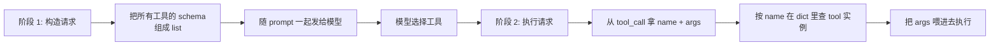

# 6.16 多工具路由与编排

> 理解当 LLM 一次会话挂载多个工具时，业务侧如何做工具选择、参数注入和按名分发。

## 🎯 学习目标

完成本文档后，你将能够：
- 解释 dify Agent Runner 的"按名分发"模式
- 追踪一个 tool_call 从产生到执行的完整路径
- 区分 CoT（Chain-of-Thought）和 FC（Function-Calling）两种 agent 策略的差异
- 理解 `ToolManager.get_agent_tool_runtime` 在路由中的作用

## 📚 前置知识

- [Function Calling](./17-function-calling.md)
- [Tool Schema](./18-tool-schema.md)
- dify LLM 抽象层（详见 [主流大模型对比](./01-llm-overview.md)）
- CoT / ReAct 背景（详见 [CoT](./10-cot.md)、[ReAct](./11-react.md)）

## 1. 核心概念

### 1.1 多工具路由的两个阶段

当 LLM 一次会话挂载 N 个工具时，整个流程分两阶段：



- **阶段 1（构造）**：把所有工具的 `name + description + schema` 拼成数组发给模型。模型只看到"我能调哪些函数"
- **阶段 2（路由）**：模型返回 `tool_call: (id, name, args)`，业务代码用 `name` 在本地 dict 里查对应的实现

关键：**模型不做"路由"决策**——它只是"声明要调哪个"。真正的 if-else / 字典查找在业务侧。

### 1.2 工具选择 = 字典查找

业务侧通常维护一个 `dict[str, Tool]`：

```python
tool_instances = {
    "get_weather": weather_impl,
    "query_db": db_impl,
    "send_email": email_impl,
}

# 模型返回: tool_call.name = "send_email"
# 路由:
tool = tool_instances.get("send_email")
if not tool:
    return error_response(f"unknown tool: send_email")
result = tool(**args)
```

**为什么不用 if-else 链**？
- 工具列表可能动态变化（插件加载、热更新）
- 工具可能多达几十个，if-else 链维护成本高
- 字典查找 O(1)，扩展性好

### 1.3 dify 的两种 agent 策略

dify 在 `core/agent/entities.py` 第 72-79 行定义了两种策略：

```python
class Strategy(StrEnum):
    CHAIN_OF_THOUGHT = "chain-of-thought"
    FUNCTION_CALLING = "function-calling"
```

| 策略 | 文件 | 工具调用协议 | 适用场景 |
| --- | --- | --- | --- |
| `FUNCTION_CALLING` | `fc_agent_runner.py` | 标准 `tool_calls` 字段 | 支持原生 FC 的模型（GPT-4o、Claude 3.5+） |
| `CHAIN_OF_THOUGHT` | `cot_agent_runner.py` | 让模型输出 `Action: ...` 文本再用正则解析 | 不支持 FC 的老模型、想兼容多种协议 |

CoT 策略的兼容性强，但解析鲁棒性差；FC 策略更现代、行为更可预期。

### 1.4 路由失败的常见场景

- 模型"幻觉"了一个不存在的工具名（业务侧要返回 "unknown tool" 而非崩溃）
- 工具被用户禁用（要查租户级开关）
- 工具依赖的凭据过期（要触发 OAuth 刷新或报错）
- 工具参数与 schema 不匹配（要用 JSON Schema 校验）

## 2. 代码示例

### 2.1 多工具路由器

```python
# 文件：example_router.py
import json
from typing import Callable, Any

class ToolRouter:
    """维护 tool_name -> implementation 的字典，按模型返回值分发"""

    def __init__(self):
        self._tools: dict[str, Callable[..., Any]] = {}
        self._schemas: list[dict] = []

    def register(self, name: str, description: str, parameters: dict, impl: Callable):
        self._tools[name] = impl
        self._schemas.append({
            "name": name,
            "description": description,
            "parameters": parameters,
        })

    @property
    def schemas(self) -> list[dict]:
        return self._schemas

    def dispatch(self, tool_call: dict) -> dict:
        """根据 tool_call 路由到对应实现；找不到时返回错误而不是崩溃"""
        name = tool_call["function"]["name"]
        args = json.loads(tool_call["function"]["arguments"])

        impl = self._tools.get(name)
        if not impl:
            return {
                "tool_call_id": tool_call["id"],
                "role": "tool",
                "content": f"Error: unknown tool '{name}'",
            }
        try:
            result = impl(**args)
            return {
                "tool_call_id": tool_call["id"],
                "role": "tool",
                "content": json.dumps(result, ensure_ascii=False),
            }
        except Exception as e:
            return {
                "tool_call_id": tool_call["id"],
                "role": "tool",
                "content": f"Error: {e}",
            }


# 使用
router = ToolRouter()
router.register(
    name="get_weather",
    description="查询城市天气",
    parameters={
        "type": "object",
        "properties": {"city": {"type": "string"}},
        "required": ["city"],
    },
    impl=lambda city: f"{city}: 22°C",
)
router.register(
    name="add",
    description="两个整数相加",
    parameters={
        "type": "object",
        "properties": {
            "a": {"type": "integer"},
            "b": {"type": "integer"},
        },
        "required": ["a", "b"],
    },
    impl=lambda a, b: a + b,
)

# 模拟模型返回的多工具调用
calls = [
    {"id": "c1", "function": {"name": "get_weather", "arguments": '{"city":"Beijing"}'}},
    {"id": "c2", "function": {"name": "add", "arguments": '{"a":3,"b":5}'}},
    {"id": "c3", "function": {"name": "delete_user", "arguments": '{"user_id":1}'}},  # 没注册
]

for c in calls:
    print(router.dispatch(c))
```

**说明**：
- 第 11-15 行：注册时同时记录 `name/description/parameters/impl` 四元组
- 第 19 行：暴露 `schemas` 属性给上层构造 LLM 请求
- 第 28 行：找不到工具时返回错误结果（让模型看到后能换个思路），**不抛异常**
- 第 35-40 行：业务函数自身异常也被捕获并转成错误消息

### 2.2 常见错误：未注册的 dict 没有错误兜底

```python
# ❌ 错误：直接用 dict["name"] 访问
def dispatch(tool_call):
    return self._tools[tool_call["function"]["name"]](**args)
# 模型幻觉出 "delete_user" 时 → KeyError，agent 整体崩溃

# ✅ 正确：用 .get() + 错误兜底
def dispatch(tool_call):
    impl = self._tools.get(tool_call["function"]["name"])
    if impl is None:
        return {"role": "tool", "content": "unknown tool"}
    return impl(**args)
```

## 3. 关键要点总结

- 多工具路由 = 字典查找 `dict[name] -> impl`
- 找不到工具时**返回错误结果而非抛异常**，让 LLM 自我修正
- dify 的 agent 策略分 `FUNCTION_CALLING` 和 `CHAIN_OF_THOUGHT` 两种
- `ToolManager.get_tool_runtime` 用 (provider_type, provider_id, tool_name) 三元组唯一定位
- 工具结果必须**追加回** agent 的 thoughts 列表，agent 才能在下一轮"记住"调过什么

---

**文档版本**：v1.0
**最后更新**：2026-07-13
