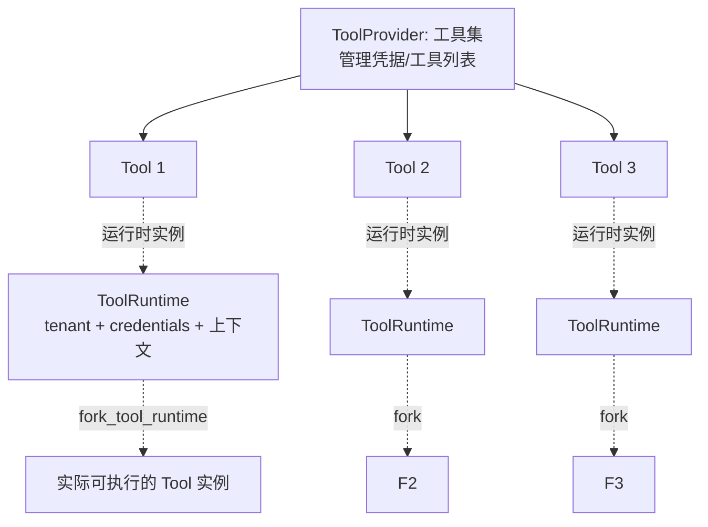
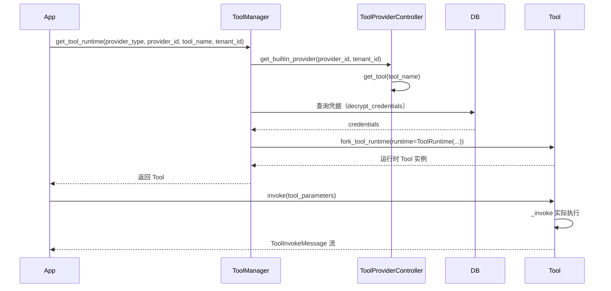

# 6.19 dify 工具系统：Tool 与 ToolProvider

> 全面理解 dify 的 Tool/ToolProvider 架构，能追踪一个工具从注册到执行的完整生命周期。

## 🎯 学习目标

完成本文档后，你将能够：
- 说出 `Tool` 和 `ToolProvider` 在 dify 中各自的职责
- 列出 7 种 `ToolProviderType` 的差异
- 追踪一次工具调用从 `ToolManager.get_tool_runtime` 到 `Tool.invoke` 的完整路径
- 区分 `BuiltinTool`、`ApiTool`、`PluginTool`、`WorkflowTool`、`MCPTool` 的应用场景

## 📚 前置知识

- [Function Calling](./14-function-calling.md)、[Tool Schema](./15-tool-schema.md)、[多工具路由](./16-multi-tool-routing.md)
- DDD 基础（详见 [DDD 概念](../02-backend/01-ddd-concepts.md)）
- ABC 抽象基类、Pydantic（详见 [ABC](../01-fundamentals/35-abc.md)、[Pydantic 基础](../02-backend/15-pydantic-basics.md)）

## 1. 核心概念

### 1.1 Tool 与 ToolProvider 的关系



- **ToolProvider**（工具集）：一组相关工具的容器，负责管理凭据、列出可用工具、校验参数
- **Tool**（工具）：单个具体动作（搜索、发邮件、查 DB）
- **ToolRuntime**（运行时）：把 tenant_id / user_id / credentials 注入到工具里——"带状态的工具实例"
- `fork_tool_runtime` 从模板 Tool 复制出一个绑定具体上下文的实例

### 1.2 7 种 ToolProviderType

`core/tools/entities/tool_entities.py` 第 64-75 行：

```python
class ToolProviderType(StrEnum):
    PLUGIN = auto()
    BUILT_IN = "builtin"
    WORKFLOW = auto()
    API = auto()
    APP = auto()
    DATASET_RETRIEVAL = "dataset-retrieval"
    MCP = auto()
```

| 类型 | 来源 | 典型场景 |
| --- | --- | --- |
| `BUILT_IN` | dify 内置工具（Google 搜索、Time 等） | 开箱即用的通用工具 |
| `API` | 用户上传 OpenAPI/Swagger schema | 把任意 REST API 包成工具 |
| `WORKFLOW` | 把已有工作流发布为工具 | 复用工作流逻辑 |
| `PLUGIN` | dify 插件市场安装的工具 | 扩展生态 |
| `MCP` | Model Context Protocol 服务 | 接入 MCP 生态 |
| `DATASET_RETRIEVAL` | 知识库检索 | 内部 RAG 调用 |
| `APP` | 把其他 App 作为工具 | App 嵌套（暂未实现） |

### 1.3 工具调用的完整生命周期



关键点：
- **ToolManager 是统一入口**——所有工具类型都通过它获取
- **Provider 负责"管理"**（凭据、列表），**Tool 负责"执行"**
- **ToolRuntime 把上下文注入**（tenant / user / credentials）——同一份 Tool 模板可以被不同租户 fork 出不同实例

## 2. 代码示例

### 2.1 实现一个自定义 ToolProvider

```python
# 文件：example_provider.py
from abc import ABC, abstractmethod
from dataclasses import dataclass
from typing import Any, Generator


@dataclass
class ToolInvokeMessage:
    """工具执行结果"""
    type: str  # "text", "json", "image"...
    message: Any


class ToolProviderController[ToolT](ABC):
    """所有 ToolProvider 的基类"""
    def __init__(self, entity):
        self.entity = entity

    @abstractmethod
    def get_tool(self, tool_name: str) -> "Tool":
        """根据名称拿工具实例"""
        raise NotImplementedError


class Tool(ABC):
    """所有 Tool 的基类"""
    def __init__(self, entity, runtime):
        self.entity = entity
        self.runtime = runtime  # 包含 tenant/credentials/上下文

    def fork_tool_runtime(self, runtime):
        """用新 runtime 复制一份（同一工具不同租户/用户）"""
        return self.__class__(entity=self.entity, runtime=runtime)

    @abstractmethod
    def _invoke(self, tool_parameters: dict) -> Generator[ToolInvokeMessage, None, None]:
        """真正执行业务逻辑"""
        raise NotImplementedError


# 1. 自定义一个"当前时间"工具
class CurrentTimeTool(Tool):
    def _invoke(self, tool_parameters):
        from datetime import datetime
        yield ToolInvokeMessage(
            type="text",
            message=f"current time: {datetime.now().isoformat()}",
        )


# 2. 自定义 Provider
class TimeProviderController(ToolProviderController):
    def get_tool(self, tool_name: str) -> Tool:
        if tool_name == "current_time":
            return CurrentTimeTool(entity=None, runtime=None)
        raise KeyError(tool_name)


# 3. 使用
provider = TimeProviderController(entity=None)
tool_template = provider.get_tool("current_time")

# 4. 给不同租户 fork 不同实例
tool_for_tenant_a = tool_template.fork_tool_runtime(runtime={"tenant_id": "A"})
tool_for_tenant_b = tool_template.fork_tool_runtime(runtime={"tenant_id": "B"})

# 5. 执行
for msg in tool_for_tenant_a._invoke({}):
    print(f"[Tenant A] {msg.message}")
for msg in tool_for_tenant_b._invoke({}):
    print(f"[Tenant B] {msg.message}")
```

**说明**：
- 第 17-22 行：`ToolProviderController` 是基类，子类实现 `get_tool`
- 第 25-37 行：`Tool` 抽象基类，`fork_tool_runtime` 是关键 API——同一份模板 fork 出多份带不同 runtime 的实例
- 第 40-50 行：自定义一个具体 `CurrentTimeTool`
- 第 53-65 行：典型用法——先取模板，再 fork，再执行
- **核心模式**：模板 + fork = 多个租户共享同一份工具逻辑，状态隔离

### 2.2 常见错误：忘记 fork 共享了状态

```python
# ❌ 错误：所有租户共享同一个 Tool 实例
tool = provider.get_tool("current_time")
for tenant in tenants:
    tool.runtime = {"tenant_id": tenant}  # 覆盖 runtime
    run(tool)
# 问题：并发执行时多个租户互相覆盖 runtime；竞态条件

# ✅ 正确：每个租户 fork 一份
tool_template = provider.get_tool("current_time")
for tenant in tenants:
    tool = tool_template.fork_tool_runtime(runtime={"tenant_id": tenant})
    run(tool)  # 每个 tool 独立的 runtime
```

## 3. dify 仓库源码解读

### 3.1 Tool 抽象基类

**文件位置**：`/Users/xu/code/github/dify/api/core/tools/__base/tool.py`
**核心代码**（行 21-86）：

```python
class Tool(ABC):
    """
    The base class of a tool
    """

    def __init__(self, entity: ToolEntity, runtime: ToolRuntime):
        self.entity = entity
        self.runtime = runtime

    def fork_tool_runtime(self, runtime: ToolRuntime) -> Tool:
        """
        fork a new tool with metadata
        :return: the new tool
        """
        return self.__class__(
            entity=self.entity.model_copy(),
            runtime=runtime,
        )

    @abstractmethod
    def tool_provider_type(self) -> ToolProviderType:
        """
        get the tool provider type

        :return: the tool provider type
        """
        raise NotImplementedError

    def invoke(
        self,
        session: Session,
        user_id: str,
        tool_parameters: dict[str, Any],
        conversation_id: str | None = None,
        app_id: str | None = None,
        message_id: str | None = None,
    ) -> Generator[ToolInvokeMessage]:
        if self.runtime and self.runtime.runtime_parameters:
            tool_parameters.update(self.runtime.runtime_parameters)

        # try parse tool parameters into the correct type
        tool_parameters = self._transform_tool_parameters_type(tool_parameters)

        result = self._invoke(
            session=session,
            user_id=user_id,
            tool_parameters=tool_parameters,
            conversation_id=conversation_id,
            app_id=app_id,
            message_id=message_id,
        )

        match result:
            case ToolInvokeMessage():

                def single_generator() -> Generator[ToolInvokeMessage, None, None]:
                    yield result

                return single_generator()
            case list():

                def generator() -> Generator[ToolInvokeMessage, None, None]:
                    yield from result

                return generator()
            case _:
                return result
```

**解读**：
- 第 6-9 行：基类构造方法接受 `entity`（工具元数据）和 `runtime`（运行时上下文）
- 第 11-17 行：**`fork_tool_runtime` 是核心 API**——用新的 `runtime` 复制一个 Tool 实例；`entity` 用 `model_copy()` 深拷贝避免共享可变状态
- 第 19-27 行：抽象方法 `tool_provider_type` 让每个 Tool 标识自己属于哪类 Provider
- 第 29-49 行：`invoke` 是公开入口——**先合并 runtime_parameters → 再做类型转换 → 再调子类 `_invoke`**
- 第 39-43 行：`runtime_parameters` 是用户在 UI 配的固定参数（API key 等），**优先级低于** `tool_parameters`——避免运行时凭据被覆盖
- 第 51-66 行：`invoke` 支持三种返回类型——单个 message、message 列表、Generator；用 `match-case` 归一化为 Generator
- **整体设计意图**：`invoke` 是"有状态、有校验"的入口，`_invoke` 是子类实现"无状态业务逻辑"的钩子

### 3.2 ToolProviderController 基类

**文件位置**：`/Users/xu/code/github/dify/api/core/tools/__base/tool_provider.py`
**核心代码**（行 13-44）：

```python
class ToolProviderController[ToolProviderEntityT: ToolProviderEntity, ToolProviderToolT: Tool | None](ABC):
    entity: ToolProviderEntityT

    def __init__(self, entity: ToolProviderEntityT):
        self.entity = entity

    def get_credentials_schema(self) -> list[ProviderConfig]:
        """
        returns the credentials schema of the provider

        :return: the credentials schema
        """
        return deepcopy(self.entity.credentials_schema)

    @abstractmethod
    def get_tool(self, tool_name: str) -> ToolProviderToolT:
        """
        returns a tool that the provider can provide

        :return: tool
        """
        pass

    @property
    def provider_type(self) -> ToolProviderType:
        """
        returns the type of the provider

        :return: type of the provider
        """
        return ToolProviderType.BUILT_IN
```

**解读**：
- 第 1 行：基类用 Python 3.12+ 泛型语法——`ToolProviderEntityT` 限定为 `ToolProviderEntity` 子类，`ToolProviderToolT` 限定为 `Tool | None`
- 第 6-7 行：基类只保存 `entity`（provider 元数据）
- 第 9-15 行：`get_credentials_schema` 是非抽象方法——返回凭据 schema 用于前端展示
- 第 17-23 行：抽象方法 `get_tool`——子类必须实现"根据 name 拿具体 Tool"
- 第 25-34 行：`provider_type` 默认是 `BUILT_IN`——子类可重写
- **整体设计意图**：Provider 是"管理类"——管理凭据、列出工具；不直接执行。`get_tool` 返回的 Tool 才是"执行类"

### 3.3 ToolManager.get_tool_runtime 统一入口

**文件位置**：`/Users/xu/code/github/dify/api/core/tools/tool_manager.py`
**核心代码**（行 176-205）：

```python
@classmethod
def get_tool_runtime(
    cls,
    provider_type: ToolProviderType,
    provider_id: str,
    tool_name: str,
    tenant_id: str,
    user_id: str | None = None,
    invoke_from: InvokeFrom = InvokeFrom.DEBUGGER,
    tool_invoke_from: ToolInvokeFrom = ToolInvokeFrom.AGENT,
    credential_id: str | None = None,
) -> BuiltinTool | PluginTool | ApiTool | WorkflowTool | MCPTool:
    """
    get the tool runtime
    ...

    :return: the tool
    """
    match provider_type:
        case ToolProviderType.BUILT_IN:
            provider_controller = cls.get_builtin_provider(provider_id, tenant_id)
            builtin_tool = provider_controller.get_tool(tool_name)
            if not builtin_tool:
                raise ToolProviderNotFoundError(f"builtin tool {tool_name} not found")
            # ...
```

**解读**：
- 第 1-15 行：`get_tool_runtime` 是 dify 工具系统的**统一入口**——任何业务代码想拿"可执行的 Tool 实例"都调这个方法
- 第 17-19 行：用 `match-case` 按 `provider_type` 分发到不同的获取逻辑
- 第 20-23 行：`BUILT_IN` 分支：先拿 provider_controller，再 `controller.get_tool(tool_name)` 拿具体工具，找不到抛 `ToolProviderNotFoundError`
- **整体设计意图**：把 7 种 Provider 的差异收敛到一个 `match-case` 里，调用方完全不用关心工具属于哪类

### 3.4 ToolProviderType 枚举集中定义

**文件位置**：`/Users/xu/code/github/dify/api/core/tools/entities/tool_entities.py`
**核心代码**（行 64-88）：

```python
class ToolProviderType(StrEnum):
    """
    Enum class for tool provider
    """

    PLUGIN = auto()
    BUILT_IN = "builtin"
    WORKFLOW = auto()
    API = auto()
    APP = auto()
    DATASET_RETRIEVAL = "dataset-retrieval"
    MCP = auto()

    @classmethod
    def value_of(cls, value: str) -> ToolProviderType:
        """
        Get value of given mode.

        :param value: mode value
        :return: mode
        """
        for mode in cls:
            if mode.value == value:
                return mode
        raise ValueError(f"invalid mode value {value}")
```

**解读**：
- 第 1-13 行：7 种 provider 类型的枚举——`StrEnum` 既是字符串又是枚举
- 第 15-24 行：`value_of` 工厂方法——通过字符串值查枚举（处理 JSON 解析后的字符串）
- **整体设计意图**：用 `StrEnum` 让枚举可以直接序列化进 JSON/数据库，无需额外转换

## 4. 关键要点总结

- `Tool`（执行单元）+ `ToolProvider`（管理单元）= dify 工具系统的两层抽象
- **核心模式**：`Tool` 模板 + `fork_tool_runtime(runtime)` = 多租户共享同一份逻辑、状态隔离
- `ToolManager.get_tool_runtime` 是统一入口，按 `provider_type` 走 7 种分支
- 7 种 `ToolProviderType`：BUILT_IN / API / WORKFLOW / PLUGIN / MCP / DATASET_RETRIEVAL / APP
- `Tool.invoke` 是"带状态入口"（合并 runtime_parameters + 类型转换）；`_invoke` 是"纯业务逻辑"（子类实现）
- 用 `match-case` 收敛多态逻辑——`provider_type` 不同走不同分支，但调用方完全无感

## 5. 练习题

### 练习 1：基础（必做）

为练习 2.1 增加 `fork_tool_runtime` 的简单测试：
- 创建 3 个租户（tenant_id: A/B/C），每个 fork 一份 `CurrentTimeTool`
- 验证每个 tool 的 runtime 是独立的（修改 tenant A 的 runtime 不影响 B/C）
- 思考：为什么 `entity` 要 `model_copy()`？直接共享会出什么问题？

### 练习 2：进阶

阅读 `core/tools/tool_manager.py` 第 176-385 行 `get_tool_runtime`：
- 7 种 provider_type 各走什么分支？
- `BUILT_IN` 分支里为什么要在 `if not provider_controller.need_credentials` 提前返回？（提示：节省凭据查询）
- `BUILT_IN` 分支里 `builtin_provider.expires_at != -1` 的检查是什么逻辑？为什么要提前 60 秒就触发刷新？

### 练习 3：挑战（选做）

设计一个 `CircuitOpenError`（熔断）`ToolProviderType`：
- 当某 Provider 在 60 秒内失败超过 10 次，标记为 `circuit_open`
- `get_tool_runtime` 在 circuit_open 时直接抛错（节省 DB 查询）
- 30 秒后自动进入"半开"状态——放一个请求探活
- 用伪代码写出状态机：`CLOSED → OPEN → HALF_OPEN → (CLOSED|OPEN)`

## 6. 参考资料

- `/Users/xu/code/github/dify/api/core/tools/__base/tool.py`
- `/Users/xu/code/github/dify/api/core/tools/__base/tool_provider.py`
- `/Users/xu/code/github/dify/api/core/tools/tool_manager.py`
- `/Users/xu/code/github/dify/api/core/tools/entities/tool_entities.py`
- `/Users/xu/code/github/dify/api/core/tools/errors.py`
- `/Users/xu/code/github/dify/api/core/tools/tool_engine.py`
- Dify 官方文档：https://docs.dify.ai/

---

**文档版本**：v1.0
**最后更新**：2026-07-13
