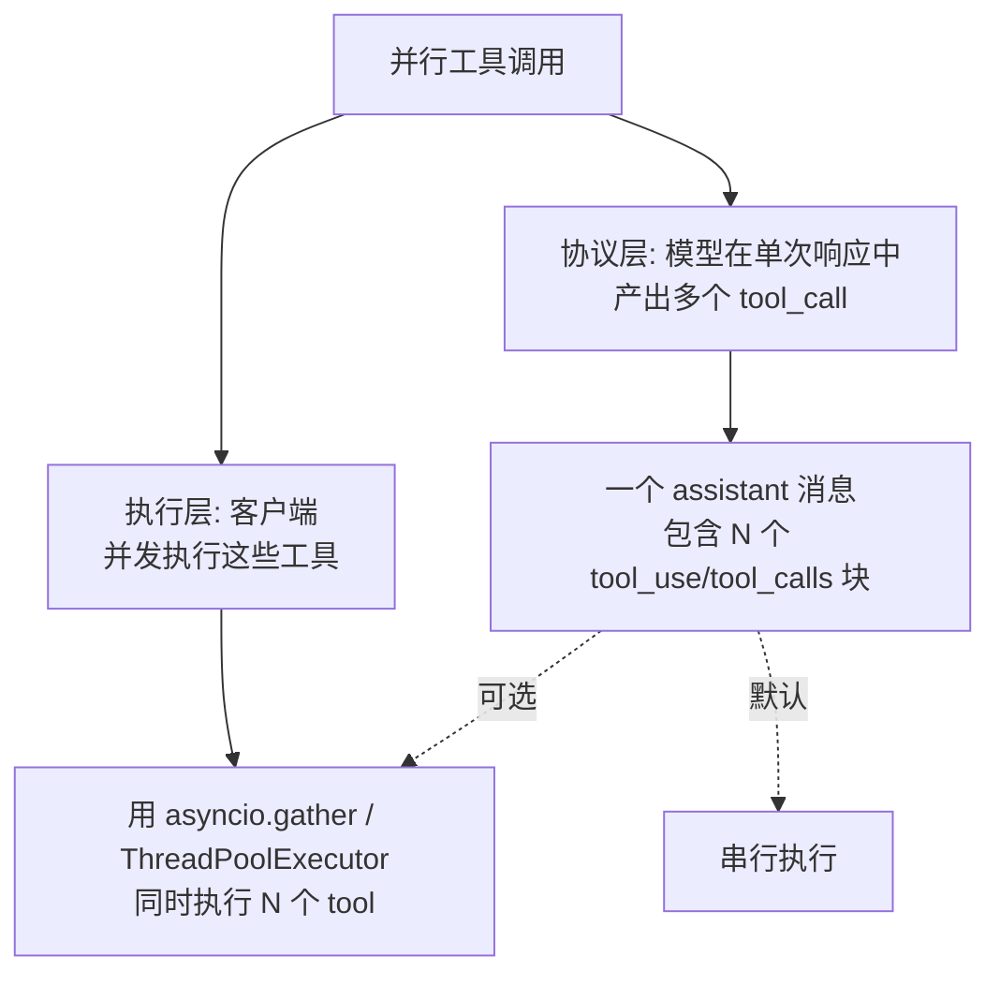
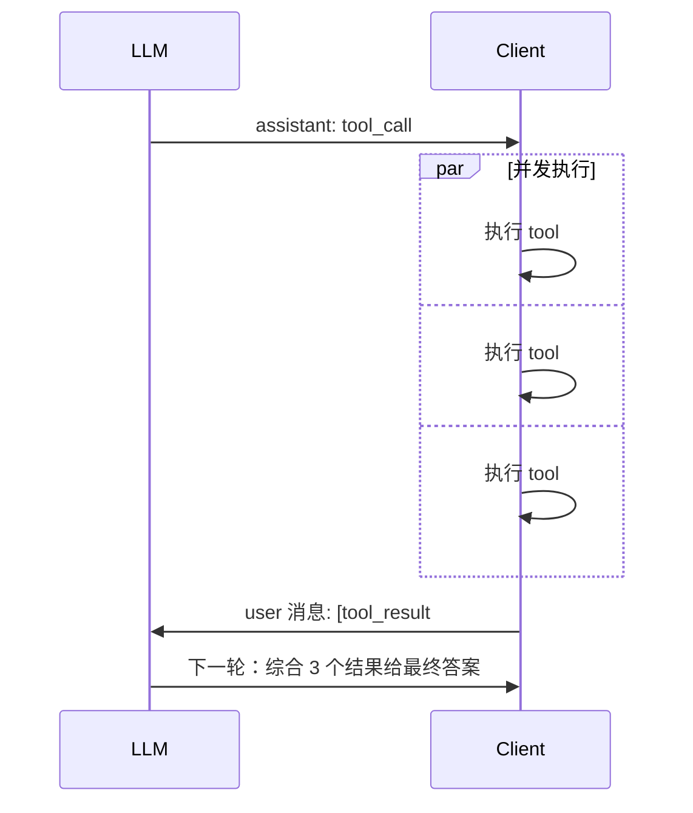

# 6.18 并行工具调用

> 理解 LLM 并行工具调用的原理和边界条件，能区分"协议层并行"和"客户端并发执行"。

## 🎯 学习目标

完成本文档后，你将能够：
- 解释 LLM 一次响应中产生多个 tool_call 的机制
- 区分"协议层并行"和"客户端执行层并发"
- 知道什么时候该并发执行多个工具、什么时候应该串行
- 读懂 dify 的 fc_agent_runner 中"for-loop 串行分发"的实现及原因

## 📚 前置知识

- [Function Calling](./17-function-calling.md)
- [多工具路由](./19-multi-tool-routing.md)
- [工具错误处理](./20-tool-error-handling.md)
- Python `asyncio` / `concurrent.futures`（详见 [async/asyncio](../01-fundamentals/14-async-asyncio.md)、[并发模型](../01-fundamentals/30-concurrency.md)）

## 1. 核心概念

### 1.1 "并行工具调用" 的两层含义



**关键洞察**：协议层并行 ≠ 执行层并发。LLM **可以**在一次响应里产出 N 个 tool_call，但**是否并发执行**完全由客户端决定。

### 1.2 为什么需要并行调用

考虑一个用户问题："查询北京和上海的天气"：

- **串行**：模型返回 `get_weather(Beijing)` → 执行 → 拿到结果 → 模型再返回 `get_weather(Shanghai)` → 执行 → 总耗时 2×T
- **并行**（单次响应双 tool_call）：模型在一次响应里同时产出两个 call → 客户端并发执行 → 总耗时 ~1×T

**节省的不是 LLM 时间**（模型仍要算两次）**，而是工具执行时间**——尤其是网络 I/O。

### 1.3 哪些工具适合并发

| 场景 | 是否适合并发 | 原因 |
| --- | --- | --- |
| 多个独立的查询（如查两个城市天气） | **是** | 无依赖、可并行 |
| 多个写入操作（如批量发邮件） | 视情况 | 需要确认无副作用冲突 |
| 有依赖的工具（A 的结果作为 B 的参数） | **否** | 严格串行 |
| 修改共享状态（如写同一个文件） | **否** | 并发不安全 |
| 不可重入的工具（如消耗配额） | 视情况 | 可能被风控 |

### 1.4 协议层并行的关键约束

OpenAI / Anthropic 都要求：
- 一次 assistant 消息里**可以**有 N 个 tool_call
- 客户端必须**一次**回填 N 个 tool_result 消息（不能拆成 N 个 user 消息）
- 一个 tool_result 必须包含对应的 `tool_call_id`



如果把 N 个 tool_result **拆成 N 个 user 消息**分别发送，模型会"失忆"前面的 tool_call——协议被破坏。

## 2. 代码示例

### 2.1 并发执行多个 tool_call

```python
# 文件：example_parallel_tools.py
import asyncio
import time
import json


async def get_weather(city: str) -> str:
    """模拟一个 1 秒的网络调用"""
    await asyncio.sleep(1)
    return f"{city}: 22°C"


async def dispatch_one(call: dict) -> dict:
    """执行单个 tool_call，按 name 路由"""
    name = call["function"]["name"]
    args = json.loads(call["function"]["arguments"])
    if name == "get_weather":
        content = await get_weather(**args)
    else:
        content = f"unknown tool: {name}"
    return {
        "tool_call_id": call["id"],
        "role": "tool",
        "content": content,
    }


async def run_agent(calls: list[dict]) -> list[dict]:
    """并发执行所有 tool_call，返回 [tool_result, ...]"""
    # asyncio.gather 自动并发，N 个 1 秒的请求总耗时 ~1 秒
    return await asyncio.gather(*(dispatch_one(c) for c in calls))


# 模拟 LLM 在一次响应里产出 3 个 tool_call
model_calls = [
    {"id": "c1", "function": {"name": "get_weather", "arguments": '{"city":"Beijing"}'}},
    {"id": "c2", "function": {"name": "get_weather", "arguments": '{"city":"Shanghai"}'}},
    {"id": "c3", "function": {"name": "get_weather", "arguments": '{"city":"Tokyo"}'}},
]

start = time.time()
results = asyncio.run(run_agent(model_calls))
print(f"并发耗时: {time.time() - start:.2f}秒")  # ~1.0 秒
for r in results:
    print(f"  {r['tool_call_id']}: {r['content']}")
```

**说明**：
- 第 7-10 行：每个 `get_weather` 是 1 秒的 I/O 模拟
- 第 30 行：`asyncio.gather` 把 3 个调用并发执行——总耗时从 3 秒降到 ~1 秒
- 第 35-37 行：模型在**单次响应**里同时产出 3 个 call，dify 风格的协议要求回填时也用**单条 user 消息**（多 content block）

### 2.2 常见错误：把并发结果拆成多个 user 消息

```python
# ❌ 错误：并发执行后，错误地把 N 个结果拆成 N 条消息
results = await asyncio.gather(*(dispatch_one(c) for c in calls))
messages.append({"role": "assistant", "content": ..., "tool_calls": [...]})
for r in results:  # ❌ 拆成 N 条 user 消息
    messages.append({"role": "user", "content": [{"type":"tool_result", ...}]})
# 问题：协议要求同一轮的 N 个 tool_result 在一条 user 消息里；拆开后模型看不到自己上一轮的 tool_call

# ✅ 正确：合并到一条 user 消息
results = await asyncio.gather(*(dispatch_one(c) for c in calls))
messages.append({"role": "assistant", "content": ..., "tool_calls": [...]})
messages.append({
    "role": "user",
    "content": [  # ✅ 一个 content 列表包含 N 个 tool_result block
        {"type": "tool_result", "tool_use_id": r["tool_call_id"], "content": r["content"]}
        for r in results
    ],
})
```

## 3. 关键要点总结

- "并行工具调用"分两层：协议层（模型一次响应产出 N 个 call）和执行层（客户端并发执行）
- 协议层并行 ≠ 执行层并发——LLM 完全可以一次产出 N 个 call，由客户端决定串行还是并发
- **协议关键约束**：N 个 tool_result 必须**合并到一条 user 消息**（多 content block），不能拆成 N 条
- dify 当前实现是**协议层并行 + 执行层串行**——保守但语义确定
- 适合并发的场景：独立的 I/O 密集操作；不适合：有依赖、共享写状态、不可重入

---

**文档版本**：v1.0
**最后更新**：2026-07-13
