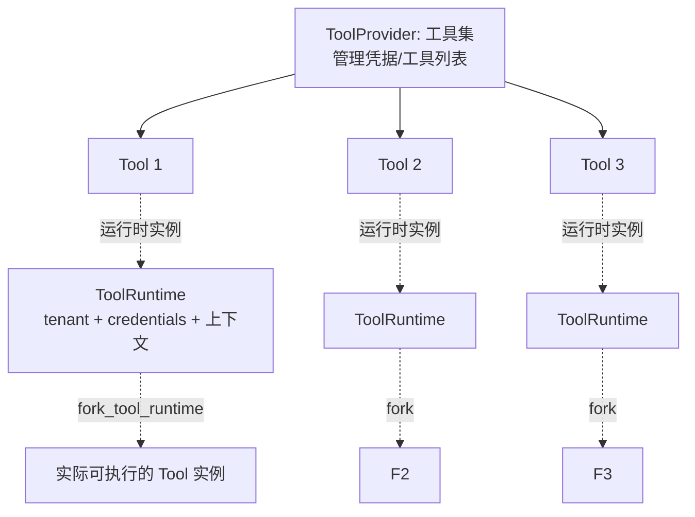
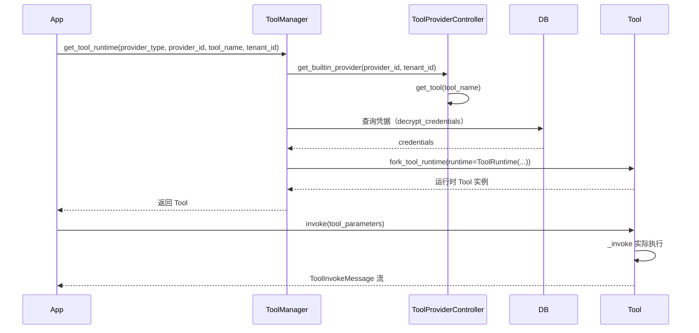

# 6.19 dify 工具系统：Tool 与 ToolProvider

> 全面理解 dify 的 Tool/ToolProvider 架构，能追踪一个工具从注册到执行的完整生命周期。

## 🎯 学习目标

完成本文档后，你将能够：
- 说出 `Tool` 和 `ToolProvider` 在 dify 中各自的职责
- 列出 7 种 `ToolProviderType` 的差异
- 追踪一次工具调用从 `ToolManager.get_tool_runtime` 到 `Tool.invoke` 的完整路径
- 区分 `BuiltinTool`、`ApiTool`、`PluginTool`、`WorkflowTool`、`MCPTool` 的应用场景

## 📚 前置知识

- [Function Calling](./17-function-calling.md)、[Tool Schema](./18-tool-schema.md)、[多工具路由](./19-multi-tool-routing.md)
- DDD 基础（详见 [DDD 概念](../../_common/22-architecture/01-ddd-concepts.md)）
- ABC 抽象基类、Pydantic（详见 [ABC](../01-fundamentals/25-abc.md)、[Pydantic 基础](../02-backend/12-pydantic-basics.md)）

## 1. 核心概念

### 1.1 Tool 与 ToolProvider 的关系



- **ToolProvider**（工具集）：一组相关工具的容器，负责管理凭据、列出可用工具、校验参数
- **Tool**（工具）：单个具体动作（搜索、发邮件、查 DB）
- **ToolRuntime**（运行时）：把 tenant_id / user_id / credentials 注入到工具里——"带状态的工具实例"
- `fork_tool_runtime` 从模板 Tool 复制出一个绑定具体上下文的实例

### 1.2 7 种 ToolProviderType

`core/tools/entities/tool_entities.py` 第 64-75 行：

```python
class ToolProviderType(StrEnum):
    PLUGIN = auto()
    BUILT_IN = "builtin"
    WORKFLOW = auto()
    API = auto()
    APP = auto()
    DATASET_RETRIEVAL = "dataset-retrieval"
    MCP = auto()
```

| 类型 | 来源 | 典型场景 |
| --- | --- | --- |
| `BUILT_IN` | dify 内置工具（Google 搜索、Time 等） | 开箱即用的通用工具 |
| `API` | 用户上传 OpenAPI/Swagger schema | 把任意 REST API 包成工具 |
| `WORKFLOW` | 把已有工作流发布为工具 | 复用工作流逻辑 |
| `PLUGIN` | dify 插件市场安装的工具 | 扩展生态 |
| `MCP` | Model Context Protocol 服务 | 接入 MCP 生态 |
| `DATASET_RETRIEVAL` | 知识库检索 | 内部 RAG 调用 |
| `APP` | 把其他 App 作为工具 | App 嵌套（暂未实现） |

### 1.3 工具调用的完整生命周期



关键点：
- **ToolManager 是统一入口**——所有工具类型都通过它获取
- **Provider 负责"管理"**（凭据、列表），**Tool 负责"执行"**
- **ToolRuntime 把上下文注入**（tenant / user / credentials）——同一份 Tool 模板可以被不同租户 fork 出不同实例

## 2. 代码示例

### 2.1 实现一个自定义 ToolProvider

```python
# 文件：example_provider.py
from abc import ABC, abstractmethod
from dataclasses import dataclass
from typing import Any, Generator


@dataclass
class ToolInvokeMessage:
    """工具执行结果"""
    type: str  # "text", "json", "image"...
    message: Any


class ToolProviderController[ToolT](ABC):
    """所有 ToolProvider 的基类"""
    def __init__(self, entity):
        self.entity = entity

    @abstractmethod
    def get_tool(self, tool_name: str) -> "Tool":
        """根据名称拿工具实例"""
        raise NotImplementedError


class Tool(ABC):
    """所有 Tool 的基类"""
    def __init__(self, entity, runtime):
        self.entity = entity
        self.runtime = runtime  # 包含 tenant/credentials/上下文

    def fork_tool_runtime(self, runtime):
        """用新 runtime 复制一份（同一工具不同租户/用户）"""
        return self.__class__(entity=self.entity, runtime=runtime)

    @abstractmethod
    def _invoke(self, tool_parameters: dict) -> Generator[ToolInvokeMessage, None, None]:
        """真正执行业务逻辑"""
        raise NotImplementedError


# 1. 自定义一个"当前时间"工具
class CurrentTimeTool(Tool):
    def _invoke(self, tool_parameters):
        from datetime import datetime
        yield ToolInvokeMessage(
            type="text",
            message=f"current time: {datetime.now().isoformat()}",
        )


# 2. 自定义 Provider
class TimeProviderController(ToolProviderController):
    def get_tool(self, tool_name: str) -> Tool:
        if tool_name == "current_time":
            return CurrentTimeTool(entity=None, runtime=None)
        raise KeyError(tool_name)


# 3. 使用
provider = TimeProviderController(entity=None)
tool_template = provider.get_tool("current_time")

# 4. 给不同租户 fork 不同实例
tool_for_tenant_a = tool_template.fork_tool_runtime(runtime={"tenant_id": "A"})
tool_for_tenant_b = tool_template.fork_tool_runtime(runtime={"tenant_id": "B"})

# 5. 执行
for msg in tool_for_tenant_a._invoke({}):
    print(f"[Tenant A] {msg.message}")
for msg in tool_for_tenant_b._invoke({}):
    print(f"[Tenant B] {msg.message}")
```

**说明**：
- 第 17-22 行：`ToolProviderController` 是基类，子类实现 `get_tool`
- 第 25-37 行：`Tool` 抽象基类，`fork_tool_runtime` 是关键 API——同一份模板 fork 出多份带不同 runtime 的实例
- 第 40-50 行：自定义一个具体 `CurrentTimeTool`
- 第 53-65 行：典型用法——先取模板，再 fork，再执行
- **核心模式**：模板 + fork = 多个租户共享同一份工具逻辑，状态隔离

### 2.2 常见错误：忘记 fork 共享了状态

```python
# ❌ 错误：所有租户共享同一个 Tool 实例
tool = provider.get_tool("current_time")
for tenant in tenants:
    tool.runtime = {"tenant_id": tenant}  # 覆盖 runtime
    run(tool)
# 问题：并发执行时多个租户互相覆盖 runtime；竞态条件

# ✅ 正确：每个租户 fork 一份
tool_template = provider.get_tool("current_time")
for tenant in tenants:
    tool = tool_template.fork_tool_runtime(runtime={"tenant_id": tenant})
    run(tool)  # 每个 tool 独立的 runtime
```

## 3. 关键要点总结

- `Tool`（执行单元）+ `ToolProvider`（管理单元）= dify 工具系统的两层抽象
- **核心模式**：`Tool` 模板 + `fork_tool_runtime(runtime)` = 多租户共享同一份逻辑、状态隔离
- `ToolManager.get_tool_runtime` 是统一入口，按 `provider_type` 走 7 种分支
- 7 种 `ToolProviderType`：BUILT_IN / API / WORKFLOW / PLUGIN / MCP / DATASET_RETRIEVAL / APP
- `Tool.invoke` 是"带状态入口"（合并 runtime_parameters + 类型转换）；`_invoke` 是"纯业务逻辑"（子类实现）
- 用 `match-case` 收敛多态逻辑——`provider_type` 不同走不同分支，但调用方完全无感

---

**文档版本**：v1.0
**最后更新**：2026-07-13
