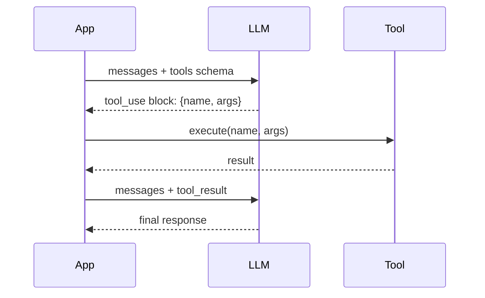
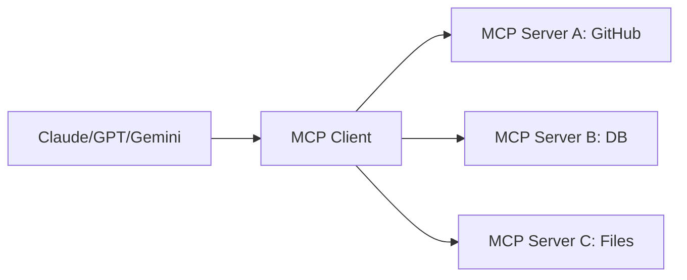

# 6.23 MCP vs Function Calling 对比

> 深入对比 MCP 和传统 Function Calling 的设计差异、各自的适用场景，以及 dify 在工程实现上的选择。

## 🎯 学习目标

完成本文档后，你将能够：
- 说清楚 Function Calling 和 MCP 在协议层面的本质差异
- 列出 MCP 相对 Function Calling 的 5 大优势与 3 大局限
- 理解 dify 为什么同时支持两种方式（工具内置 / MCP 接入）
- 能根据业务场景选择合适的方案

## 📚 前置知识

- Function Calling / Tool Use（详见 [Function Calling](./14-function-calling.md)、[主流大模型对比](./01-llm-overview.md)）
- JSON-RPC 2.0 基础（JSON 详见 [JSON](../01-fundamentals/17-json-processing.md)）
- MCP 协议概述（详见 [MCP 概述](./20-mcp-overview.md)）

## 1. 核心概念

### 1.1 什么是 Function Calling？

Function Calling 是 LLM 厂商在 API 里内置的"工具调用能力"——模型可以**在生成 response 时**输出结构化的函数调用参数。



**关键特点**：
- 协议由**厂商定义**（OpenAI / Anthropic / Google 各自不同）
- 工具 schema 在每次请求时随消息发送
- LLM 决定调用，**应用执行**——这是 LLM 的"指令"，不是 LLM 的"能力"

### 1.2 什么是 MCP？

MCP 是**工具提供方和 LLM 应用之间的标准协议**，把"如何调用工具"这件事从 LLM 厂商手里剥离出来。



**关键特点**：
- 协议由**社区定义**（modelcontextprotocol.io）
- 工具由**外部 Server 进程**提供，**独立部署、独立升级**
- LLM 厂商只需实现 MCP Client 就能接入所有 MCP Server

### 1.3 协议层 vs 应用层

| 维度 | Function Calling | MCP |
| --- | --- | --- |
| **所在层** | LLM API 层 | 应用层（LLM 无关） |
| **协议所有权** | LLM 厂商 | 社区开源 |
| **工具执行** | 应用进程内 | 独立 Server 进程 |
| **跨 LLM 兼容** | 不兼容（OpenAI ≠ Anthropic） | 一次实现，所有 LLM 可用 |
| **生态复用** | 每个 App 重写 | 共享 MCP Server |

### 1.4 MCP 的 5 大优势

1. **生态复用**：写一个 MCP Server，Claude / GPT / Gemini / Cursor / dify 都能用
2. **独立部署**：Server 可以用任何语言、任何框架，不需要 Python
3. **能力可组合**：Server 可以同时提供 Tools + Resources + Prompts
4. **状态管理**：Server 可以保持长连接、维护会话状态
5. **安全隔离**：Server 在独立进程，崩溃不会拖垮 Host；权限边界清晰

### 1.5 MCP 的 3 大局限

1. **首次握手延迟**：要建 stream 连接、`initialize` 握手、`tools/list` 拉 schema
2. **调试链路长**：跨进程、跨语言，问题可能出在协议层 / 序列化层 / 业务层
3. **不适合一次性工具**：如果只是想传个 prompt 给 LLM 用 `add(a,b)`，直接 Function Calling 更简单

## 2. 代码示例

### 2.1 Function Calling（Anthropic 风格）

```python
# 文件：function_calling.py
import anthropic

client = anthropic.Anthropic()

tools = [
    {
        "name": "get_weather",
        "description": "查询天气",
        "input_schema": {
            "type": "object",
            "properties": {"city": {"type": "string"}},
            "required": ["city"],
        },
    }
]

# 每次请求都要带 tools schema（请求体变大）
response = client.messages.create(
    model="claude-sonnet-5-20251001",
    max_tokens=1024,
    tools=tools,
    messages=[{"role": "user", "content": "北京今天天气怎么样？"}],
)

# LLM 决定调用工具，应用执行
for block in response.content:
    if block.type == "tool_use":
        print(f"LLM 想调 {block.name}, 参数={block.input}")
        # 应用自己执行（这里只是个示意）
        tool_result = {"temp": 25, "unit": "celsius"}
        # 把结果回传给 LLM 让它生成最终回答
```

### 2.2 MCP 风格

```python
# 文件：mcp_calling.py
import asyncio
from mcp import ClientSession, StdioServerParameters
from mcp.client.stdio import stdio_client

async def main():
    params = StdioServerParameters(command="python", args=["weather_server.py"])

    async with stdio_client(params) as (read, write):
        async with ClientSession(read, write) as session:
            await session.initialize()
            # 一次性拿到所有工具，后续每次请求不用带 schema
            tools = (await session.list_tools()).tools

            # 然后把 tools 转成 LLM 的 function calling 格式
            llm_tools = [
                {"name": t.name, "description": t.description, "input_schema": t.inputSchema}
                for t in tools
            ]
            # 调 LLM（省略）...
            # LLM 返回 tool_use 后调 MCP
            result = await session.call_tool("get_weather", {"city": "北京"})

asyncio.run(main())
```

**对比**：
- Function Calling：每次请求都要重发 100~10000 字的 tools schema
- MCP：握手一次拿 schema，后续只发请求 ID 和参数
- **MCP 优势**：对长 context / 多工具场景，省 token、省延迟

### 2.3 常见错误：混用概念

```python
# ❌ 错误：以为 MCP 替代了 LLM 的 function calling
# 其实 MCP 只解决了"工具如何暴露"，
# LLM 仍然要用 function calling 的机制告诉 Host "我要调什么"

# ✅ 正确：MCP + Function Calling 配合使用
# MCP 负责：Host → Server 的协议
# Function Calling 负责：LLM → Host 的协议
# 两者通过 tool name 关联：
#   LLM function call.name == MCP tool.name
```

## 3. dify 仓库源码解读

### 3.1 ToolInvokeMessage 抽象——统一两种工具来源

**文件位置**：`/Users/xu/code/github/dify/api/core/tools/entities/tool_entities.py`
**核心代码**（搜索 `ToolInvokeMessage`）：

```python
class ToolInvokeMessage(BaseModel):
    """工具调用结果的统一消息格式。
    不管工具是内置 Function、MCP、HTTP、还是 Plugin，
    都用同一套 ToolInvokeMessage 表达结果。
    """
    type: Literal["text", "image", "json", "variable", "blob"] = "text"
    message: ToolInvokeMessageText | ToolInvokeMessageJson | ...
    meta: dict[str, Any] = {}
    ...
```

**解读**：
- dify 的 `ToolInvokeMessage` 把"内置工具"和"MCP 工具"的输出统一成同一种结构
- 这样 Agent/Workflow 节点不用关心工具来源，调用的代码完全相同
- 在 `api/core/tools/mcp_tool/tool.py` 第 82-109 行，`MCPTool._invoke` 用 `match content` 把 MCP 协议里的 `TextContent` / `ImageContent` / `EmbeddedResource` 翻译成 `ToolInvokeMessage`
- **整体设计意图**：MCP 是"工具提供协议"，dify 的 `ToolInvokeMessage` 是"工具消费协议"，两者解耦使得上层不用关心协议差异

### 3.2 MCPTool 的 invoke 实现

**文件位置**：`/Users/xu/code/github/dify/api/core/tools/mcp_tool/tool.py`
**核心代码**（行 82-110）：

```python
# handle dify tool output
for content in result.content:
    match content:
        case TextContent():
            yield from self._process_text_content(content)
        case ImageContent() | AudioContent():
            yield self.create_blob_message(
                blob=base64.b64decode(content.data), meta={"mime_type": content.mimeType}
            )
        case EmbeddedResource():
            resource = content.resource
            match resource:
                case TextResourceContents():
                    yield self.create_text_message(resource.text)
                case BlobResourceContents():
                    mime_type = resource.mimeType or "application/octet-stream"
                    yield self.create_blob_message(
                        blob=base64.b64decode(resource.blob), meta={"mime_type": mime_type}
                    )
                case _:
                    raise ToolInvokeError(f"Unsupported embedded resource type: {type(resource)}")
        case _:
            logger.warning("Unsupported content type=%s", type(content))

# handle MCP structured output
if self.entity.output_schema and result.structuredContent:
    for k, v in result.structuredContent.items():
        yield self.create_variable_message(k, v)
```

**解读**：
- 第 84-105 行：MCP 协议的 `CallToolResult.content` 是一个多态列表（TextContent / ImageContent / AudioContent / EmbeddedResource），用 `match-case` 模式匹配分发
- 第 88-90 行：图片/音频内容是 base64 编码的，需要 `base64.b64decode` 解码并以 `Blob` 类型上报
- 第 107-109 行：如果协议版本 ≥ `2025-06-18`，且 MCP Server 返回了 `structuredContent`，dify 会把每个键值对翻译成 `Variable` 类型的消息（Workflow 节点可以直接引用）
- **整体设计意图**：MCP 的内容类型比 Function Calling 丰富（支持图片、音频、嵌入式资源），dify 通过 `match-case` 把这些类型无差别地转成自己的内部消息，让 LLM 拿到的是标准化的结果

## 4. 关键要点总结

- **Function Calling** 是 LLM API 层的协议，决定"LLM 想调什么"
- **MCP** 是应用层的协议，决定"工具如何提供"
- 两者通过 tool name 关联，配合使用：MCP 提供工具 → Function Calling 让 LLM 选择
- MCP 优势：生态复用、独立部署、状态管理、安全隔离、节省 token
- MCP 局限：握手延迟、调试复杂、不适合一次性简单工具
- dify 用 `ToolInvokeMessage` 统一所有工具来源的输出，Agent/Workflow 代码不用关心工具是内置还是 MCP

## 5. 练习题

### 练习 1：基础（必做）

写一个对比表格：左边是 Function Calling 的 4 个特征（协议层、Schema 传输、生态、状态），右边是 MCP 的对应特征。每行 2-3 句话总结差异。

### 练习 2：进阶

阅读 `/Users/xu/code/github/dify/api/core/tools/mcp_tool/tool.py` 第 111-146 行的 `_process_text_content` / `_process_json_content` / `_process_json_list`，理解 dify 如何处理 MCP Server 返回的字符串——它为什么要先 `json.loads()` 试一下？直接当文本返回有什么问题？

### 练习 3：挑战（选做）

设计一个"智能工具路由"模块：根据工具描述自动判断应该用 Function Calling 还是 MCP 接入。
- 内置工具（如 `current_time`）→ Function Calling（更快）
- 外部系统工具（如 GitHub API）→ MCP（更标准）

提示：可以用工具名前缀、tags、或一个 LLM 做分类。画出架构图并写伪代码。

## 6. 参考资料

- `/Users/xu/code/github/dify/api/core/tools/mcp_tool/tool.py`
- `/Users/xu/code/github/dify/api/core/tools/entities/tool_entities.py`
- Anthropic Tool Use 文档：https://docs.anthropic.com/en/docs/agents-and-tools/tool-use/overview
- OpenAI Function Calling 文档：https://platform.openai.com/docs/guides/function-calling
- MCP vs Function Calling 讨论：https://modelcontextprotocol.io/blog/articles/server-vs-functions

---

**文档版本**：v1.0
**最后更新**：2026-07-13