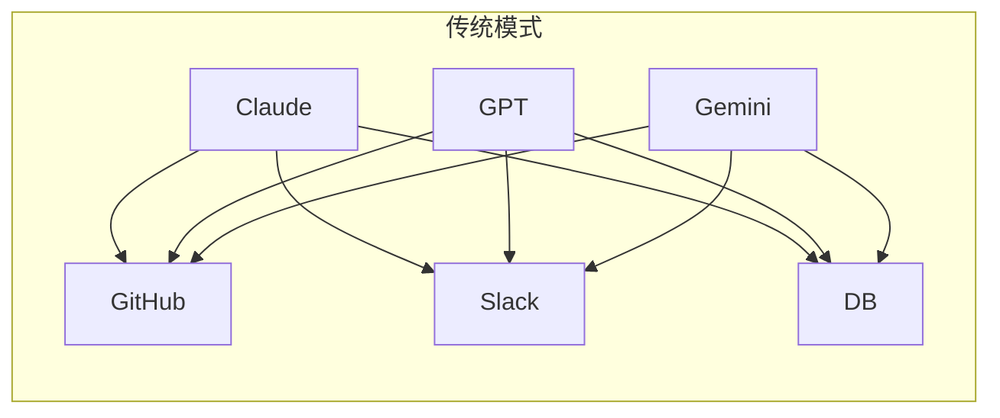
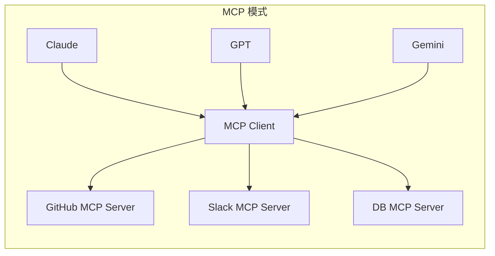
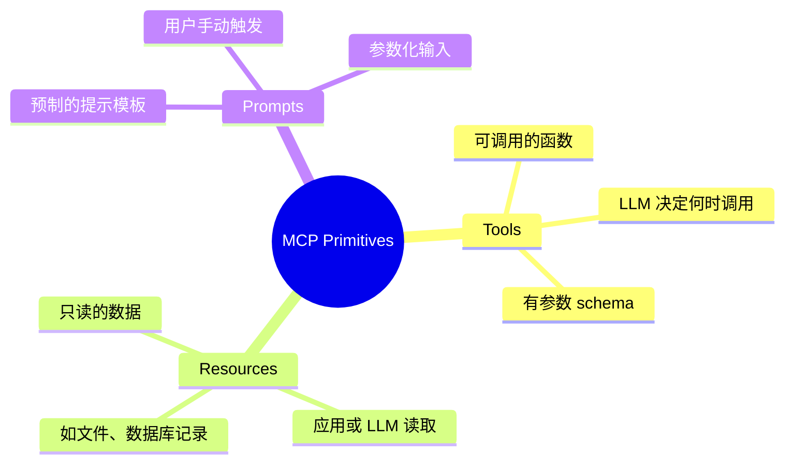

# 6.20 MCP 协议概述与架构

> 理解 Model Context Protocol（MCP）的设计理念、核心组件、与 LLM 的协作方式，掌握 dify 中 MCP 集成的整体架构。

## 🎯 学习目标

完成本文档后，你将能够：
- 说出 MCP 协议的定位和解决的问题（替代 N×M 集成问题）
- 理解 MCP 三大核心组件：Host、Client、Server 的关系
- 区分 MCP 提供的三种原语（Tools / Resources / Prompts）
- 掌握 MCP 传输层（stdio / SSE / Streamable HTTP）的差异
- 能看懂 dify `api/core/mcp/` 目录下任意模块的职责

## 📚 前置知识

- JSON-RPC 2.0 协议基础（JSON 处理详见 [JSON](../01-fundamentals/20-json-processing.md)）
- HTTP 长连接 / SSE（详见 [SSE](../../_common/14-api-protocols/04-sse.md)；HTTP 见 [HTTP 协议](../../_common/14-api-protocols/01-http-protocol.md)）
- LLM Function Calling / Tool Use（详见 [Function Calling](./17-function-calling.md)）
- Python 异步编程（详见 [async/asyncio](../01-fundamentals/14-async-asyncio.md)）

## 1. 核心概念

### 1.1 什么是 MCP？

**Model Context Protocol（MCP）** 是由 Anthropic 于 2024 年底开源的开放协议，目标是为 LLM 提供一个**标准化的"工具/数据接入层"**，类比为 LLM 时代的"USB-C 接口"。

传统方式下，每个 LLM 应用都要为每个工具单独写适配器——形成 **N × M 集成矩阵**（N 个 LLM × M 个工具）：



引入 MCP 后，每个工具只需要实现一次 MCP Server 接口，所有 LLM 应用通过 MCP Client 复用：



### 1.2 MCP 三大角色

| 角色 | 职责 | 例子 |
| --- | --- | --- |
| **Host** | 用户直接交互的 LLM 应用 | Claude Desktop、Cursor、dify |
| **Client** | 在 Host 内、负责与 Server 维持 1:1 连接 | dify 的 `MCPClient` |
| **Server** | 把某个工具/数据源包装成 MCP 协议 | GitHub MCP Server、dify 自身的 App MCP Server |

一个 Host 通常管理多个 Client，每个 Client 连接一个 Server，形成"多客户端-多服务器"网状结构。

### 1.3 MCP 三大原语（Primitives）

MCP 把"工具/数据/提示模板"三类能力抽象成统一原语：



**dify 主要用 Tools**：把 MCP Server 注册成"工具供应商（Tool Provider）"，让 Agent/Workflow 节点调用。Resources/Prompts 在 dify 中尚未深度集成。

### 1.4 传输层（Transport）

MCP 协议本身与传输解耦，规范定义了多种传输方式：

| 传输 | 适用场景 | 特点 |
| --- | --- | --- |
| **stdio** | 本地进程间通信 | 启动 Server 子进程、通过 stdin/stdout 收发 JSON-RPC |
| **SSE** | 远程 HTTP（旧） | 单向服务器推送，POST 发请求 |
| **Streamable HTTP** | 远程 HTTP（新，2025-03-26+） | 单个端点支持 POST 请求 + 双向 SSE 流 |

dify 同时实现了 **SSE Client**（`api/core/mcp/client/sse_client.py`）和 **Streamable HTTP Client**（`api/core/mcp/client/streamable_client.py`），并根据 URL 路径自动选择：URL 末尾是 `/mcp` 用 Streamable，末尾是 `/sse` 用 SSE。

### 1.5 MCP 协议版本

dify 客户端支持三个版本，按时间排序：

```python
# 来自 api/core/mcp/types.py 第 26-32 行
LATEST_PROTOCOL_VERSION = "2025-06-18"
SERVER_LATEST_PROTOCOL_VERSION = "2025-06-18"
SERVER_SUPPORTED_PROTOCOL_VERSIONS: frozenset[str] = frozenset(
    {"2024-11-05", "2025-03-26", "2025-06-18"}
)
DEFAULT_NEGOTIATED_VERSION = "2025-03-26"
```

`2025-06-18` 版本引入了**结构化输出（outputSchema + structuredContent）**——dify 在 `api/core/mcp/server/streamable_http.py` 第 19 行显式判断：

```python
STRUCTURED_OUTPUT_MIN_VERSION = "2025-06-18"
```

## 2. 代码示例

### 2.1 JSON-RPC 消息格式

MCP 基于 JSON-RPC 2.0，下面是一次 `tools/list` 请求的原始结构：

```json
{
  "jsonrpc": "2.0",
  "id": 1,
  "method": "tools/list",
  "params": { "cursor": null }
}
```

Server 响应：

```json
{
  "jsonrpc": "2.0",
  "id": 1,
  "result": {
    "tools": [
      {
        "name": "get_weather",
        "description": "Get current weather for a city",
        "inputSchema": {
          "type": "object",
          "properties": { "city": { "type": "string" } },
          "required": ["city"]
        }
      }
    ],
    "nextCursor": null
  }
}
```

### 2.2 用 Python MCP SDK 实现最小 Server

```python
# 文件：minimal_server.py
# 用官方 mcp SDK 写一个最简 MCP Server（pip install mcp）
from mcp.server.fastmcp import FastMCP

mcp = FastMCP("hello-mcp")

@mcp.tool()
def add(a: int, b: int) -> int:
    """返回两个整数的和"""
    return a + b

@mcp.tool()
def greet(name: str) -> str:
    """生成问候语"""
    return f"Hello, {name}!"

if __name__ == "__main__":
    # 默认用 stdio 传输，启动后会从 stdin 读 JSON-RPC
    mcp.run()
```

**说明**：
- `FastMCP("hello-mcp")` 创建 server 实例，名称会出现在客户端工具列表里
- `@mcp.tool()` 装饰器把 Python 函数变成 MCP 工具（自动提取类型注解生成 inputSchema）
- `mcp.run()` 默认走 stdio，可加 `transport="streamable-http"` 改成 HTTP

### 2.3 常见错误：忘记返回结构化内容

```python
# ❌ 错误：Tool 返回字符串，但客户端期望 JSON 对象
@mcp.tool()
def get_user(user_id: str) -> str:
    return f"name=Alice,age=30"  # 客户端解析失败

# ✅ 正确：返回 dict（FastMCP 自动序列化为 JSON）
@mcp.tool()
def get_user(user_id: str) -> dict:
    return {"name": "Alice", "age": 30}
```

## 3. 关键要点总结

- MCP 解决"N × M 集成问题"，把工具/数据接入统一成协议
- 三大角色：Host（应用）、Client（连接器）、Server（工具暴露）
- 三大原语：Tools（可调用）、Resources（只读数据）、Prompts（提示模板）
- 传输层有 stdio / SSE / Streamable HTTP 三种，dify 支持后两种
- 协议版本是日期字符串（如 `2025-06-18`），支持版本协商降级
- dify 主要把 MCP Server 当 Tool Provider 用，复用现有 Agent/Workflow 的工具调用机制

---

**文档版本**：v1.0
**最后更新**：2026-07-13
