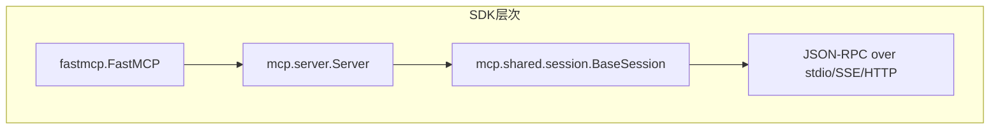

# 6.21 MCP Server 开发（Python）

> 学习如何用 Python 实现一个 MCP Server（暴露 Tools / Resources / Prompts），并理解 dify 中"把 Dify App 暴露为 MCP Server"的实现思路。

## 🎯 学习目标

完成本文档后，你将能够：
- 用 `mcp` Python SDK 快速搭建一个 MCP Server
- 区分 stdio / SSE / Streamable HTTP 三种传输的启动方式
- 实现带参数 schema、错误处理、异步逻辑的 Tool
- 理解 dify 中 `api/core/mcp/server/streamable_http.py` 如何把 Dify App 暴露为 MCP Server

## 📚 前置知识

- Python 异步编程（详见 [async/asyncio](../01-fundamentals/14-async-asyncio.md)）
- Pydantic 模型基础（详见 [Pydantic 基础](../02-backend/12-pydantic-basics.md)）
- MCP 协议概述（详见 [MCP 概述](./24-mcp-overview.md)）

## 1. 核心概念

### 1.1 MCP Server 的两种开发视角

| 视角 | 工具 | 适用 |
| --- | --- | --- |
| **作为工具提供方** | `mcp.server.fastmcp.FastMCP` | 把已有 Python 函数/服务包装成 MCP 工具 |
| **作为应用暴露方** | 自己实现 JSON-RPC handler | dify 的方案——把 Dify App 当成"工具集"对外暴露 |

### 1.2 FastMCP vs 低层 SDK



- **FastMCP**：装饰器风格，3 行代码起一个 server
- **Server**：低层 API，需要手动注册 `list_tools` / `call_tool` handler
- **BaseSession**：负责 JSON-RPC 收发、请求 ID 关联、并发控制

dify 用的是**低层 API**（自己写 handler），因为要把 Dify App 的工作流动态映射成工具。

### 1.3 dify 作为 MCP Server 的实现要点

dify 的 `/api/core/mcp/server/streamable_http.py` 把每个 Dify App 当成"一个 MCP Server"：

1. 把 App 的"用户输入字段（user_input_form）"转成 Tools 的 `inputSchema`
2. 接收到 `tools/call` 请求后调用 `AppGenerateService` 异步执行 App
3. 把执行结果包装成 `CallToolResult`（TextContent / ImageContent / EmbeddedResource）
4. 支持流式进度通知（progress notification）

```python
# 来自 api/core/mcp/server/streamable_http.py 第 18-19 行
STRUCTURED_OUTPUT_MIN_VERSION = "2025-06-18"

def _supports_structured_output(protocol_version: str) -> bool:
    """协议版本 ≥ 2025-06-18 才支持 structuredContent 输出"""
    return protocol_version >= STRUCTURED_OUTPUT_MIN_VERSION
```

## 2. 代码示例

### 2.1 用 FastMCP 暴露多个工具

```python
# 文件：weather_server.py
from mcp.server.fastmcp import FastMCP
import httpx

mcp = FastMCP("weather-server", version="1.0.0")

@mcp.tool()
async def get_weather(city: str, unit: str = "celsius") -> dict:
    """查询指定城市的天气"""
    async with httpx.AsyncClient() as client:
        resp = await client.get(f"https://wttr.in/{city}?format=j1")
        data = resp.json()
    current = data["current_condition"][0]
    return {
        "city": city,
        "temperature_C": current["temp_C"],
        "humidity": current["humidity"],
        "description": current["weatherDesc"][0]["value"],
    }

@mcp.resource("config://rate-limit")
def rate_limit() -> str:
    """暴露只读配置"""
    return "100 req/min"

if __name__ == "__main__":
    # 默认 stdio；想用 HTTP 改为：
    # mcp.run(transport="streamable-http", host="127.0.0.1", port=8000)
    mcp.run()
```

**说明**：
- `async def` 函数自动被识别为异步工具
- 类型注解（`city: str`）自动生成 JSON Schema
- `mcp.resource()` 暴露只读数据，客户端通过 `resources/read` 读取

### 2.2 用低层 API 实现一个 Server

```python
# 文件：lowlevel_server.py
import asyncio
from mcp.server import Server
from mcp.server.stdio import stdio_server
from mcp.types import Tool, TextContent, CallToolResult

app = Server("lowlevel-server")

@app.list_tools()
async def list_tools() -> list[Tool]:
    return [
        Tool(
            name="echo",
            description="回显输入",
            inputSchema={
                "type": "object",
                "properties": {"text": {"type": "string"}},
                "required": ["text"],
            },
        )
    ]

@app.call_tool()
async def call_tool(name: str, arguments: dict) -> list[TextContent]:
    if name == "echo":
        return [TextContent(type="text", text=arguments["text"])]
    raise ValueError(f"Unknown tool: {name}")

async def main():
    async with stdio_server() as (read, write):
        await app.run(read, write, app.create_initialization_options())

asyncio.run(main())
```

**说明**：
- `Server` 是低层 API，所有 handler 都是 `async def` 函数
- `stdio_server()` 是个 async context manager，把 stdin/stdout 包装成 read/write stream
- `app.run()` 启动 JSON-RPC 收发循环

### 2.3 常见错误：handler 没抛标准异常

```python
# ❌ 错误：抛普通 Exception，客户端收到不明确的错误
@app.call_tool()
async def call_tool(name, arguments):
    raise RuntimeError("tool failed")

# ✅ 正确：抛 McpError，客户端收到结构化错误码
from mcp import McpError
from mcp.types import ErrorData

@app.call_tool()
async def call_tool(name, arguments):
    raise McpError(ErrorData(code=-32603, message="tool failed"))
```

## 3. 关键要点总结

- 用 `FastMCP` 装饰器风格开发最快；用 `Server` 低层 API 更灵活
- 工具函数可以是 `async def` 也可是普通函数，type hint 自动转 JSON Schema
- 资源（Resources）只读，由 `mcp.resource()` 装饰；提示（Prompts）由 `mcp.prompt()` 装饰
- 启动方式决定传输：`mcp.run()` 默认 stdio，加参数可改 SSE/HTTP
- dify 把 Dify App 暴露成 MCP Server，通过 `streamable_http.py` 把 App 输入字段映射成 Tool 入参
- 协议版本协商在 initialize 请求的 body 里，header 只是 hint

---

**文档版本**：v1.0
**最后更新**：2026-07-13
