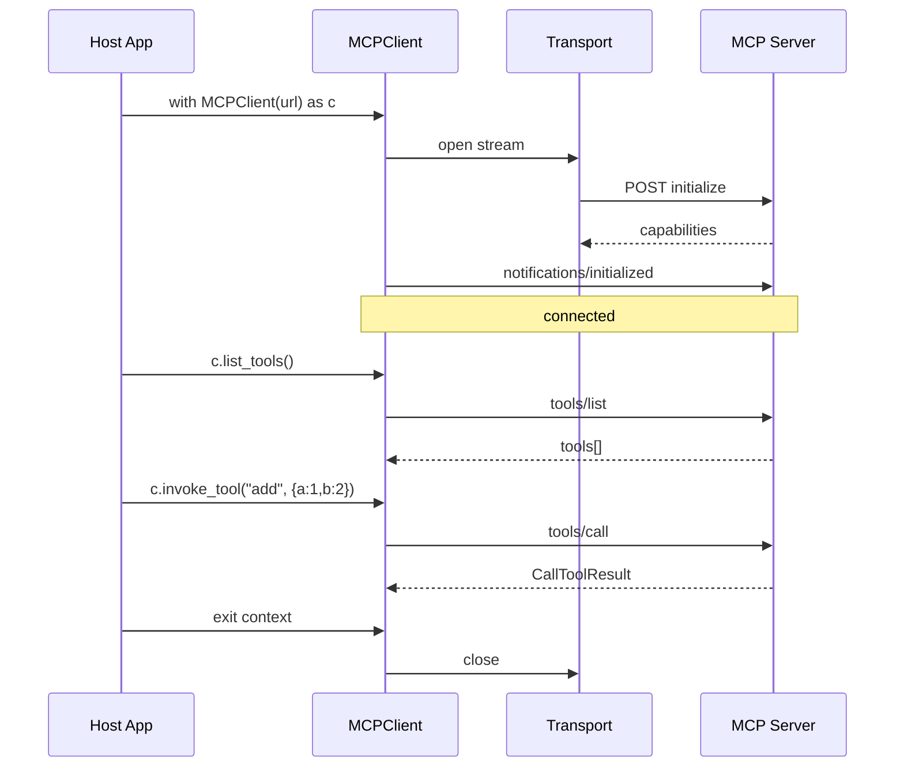

# 6.22 MCP Client 集成

> 学习如何用 Python 集成 MCP Client，理解 dify 中 `MCPClient` / `MCPClientWithAuthRetry` 的设计，掌握 OAuth 401 自动重试机制。

## 🎯 学习目标

完成本文档后，你将能够：
- 用 Python MCP SDK 写一个 Client 连接远程 MCP Server
- 理解 dify `MCPClient` 上下文管理器模式和 SSE/Streamable HTTP 自动选择
- 理解 OAuth 401 时的自动 token 刷新重试机制
- 掌握 `tools/list` 和 `tools/call` 的请求/响应结构

## 📚 前置知识

- Python 异步编程（详见 [async/asyncio](../01-fundamentals/14-async-asyncio.md)）
- OAuth 2.0 基础（access token / refresh token；详见 [OAuth 2.0](../../_common/07-authentication/05-oauth2.md)、[Token 刷新](../../_common/07-authentication/04-token-refresh.md)）
- MCP 协议与 Server（详见 [MCP 概述](./24-mcp-overview.md)、[MCP Server](./25-mcp-server.md)）

## 1. 核心概念

### 1.1 MCP Client 的生命周期



### 1.2 dify 的双层 Client 设计

dify 把 Client 拆成两层：

| 类 | 文件 | 职责 |
| --- | --- | --- |
| `MCPClient` | `api/core/mcp/mcp_client.py` | 基础连接、`list_tools` / `invoke_tool` |
| `MCPClientWithAuthRetry` | `api/core/mcp/auth_client.py` | 继承 `MCPClient`，拦截 `MCPAuthError`，刷新 token 后重试 |

这种"装饰器式继承"让 OAuth 重试逻辑独立可测，基础 Client 不依赖数据库。

### 1.3 SSRF 防护

MCP 客户端要请求外部 URL，存在 SSRF（服务端请求伪造）风险。dify 在 `api/core/mcp/utils.py` 用 `create_ssrf_proxy_mcp_http_client` 包装 httpx 客户端，让所有出站请求经过 SSRF 代理：

```python
# 来自 api/core/mcp/client/streamable_client.py 第 34 行
from core.mcp.utils import create_ssrf_proxy_mcp_http_client, ssrf_proxy_sse_connect
```

## 2. 代码示例

### 2.1 用官方 SDK 写 MCP Client

```python
# 文件：simple_client.py
import asyncio
from mcp import ClientSession, StdioServerParameters
from mcp.client.stdio import stdio_client

async def main():
    # 用 stdio 启动 "python weather_server.py" 作为子进程
    params = StdioServerParameters(command="python", args=["weather_server.py"])

    async with stdio_client(params) as (read, write):
        async with ClientSession(read, write) as session:
            await session.initialize()  # 1) 握手

            tools = await session.list_tools()  # 2) 列工具
            print("Available tools:", [t.name for t in tools.tools])

            # 3) 调工具
            result = await session.call_tool(
                "get_weather",
                {"city": "Tokyo"},
            )
            for content in result.content:
                print(content.text)

asyncio.run(main())
```

**说明**：
- `stdio_client` 启动子进程并接管其 stdin/stdout
- `ClientSession` 负责 JSON-RPC 收发，必须先 `initialize()`
- `list_tools()` 和 `call_tool()` 是高频 API

### 2.2 用 dify 风格的 MCPClient

```python
# 文件：dify_style_client.py
import asyncio
from core.mcp.mcp_client import MCPClient  # 实际路径省略

async def main():
    headers = {"Authorization": "Bearer xxx"}
    # URL 以 /mcp 结尾走 Streamable HTTP，以 /sse 结尾走 SSE
    with MCPClient(
        server_url="https://example.com/mcp",
        headers=headers,
        timeout=30.0,
        sse_read_timeout=60.0,
    ) as client:
        tools = client.list_tools()
        for tool in tools:
            print(f"- {tool.name}: {tool.description}")
        result = client.invoke_tool("get_weather", {"city": "Tokyo"})
        for content in result.content:
            if hasattr(content, "text"):
                print(content.text)

asyncio.run(main())
```

**说明**：
- `MCPClient` 实现了 `__enter__` / `__exit__`，可以用 `with` 语句
- `list_tools()` 返回 `list[Tool]`（dify 的 MCP 类型，不是官方 SDK 的）
- URL 末尾的 `/mcp` / `/sse` 决定传输方式（参见 `mcp_client.py` 第 67-72 行的逻辑）

### 2.3 常见错误：忘记调 initialize

```python
# ❌ 错误：直接调 list_tools，会抛 "Session not initialized"
async with ClientSession(read, write) as session:
    tools = await session.list_tools()  # RuntimeError

# ✅ 正确：先握手
async with ClientSession(read, write) as session:
    await session.initialize()
    tools = await session.list_tools()
```

## 3. 关键要点总结

- MCP Client 用 `async with` 管理连接生命周期，必须先 `initialize()`
- URL 末尾的 `/mcp` / `/sse` 是传输方式约定（也可省略，自动 fallback）
- dify 的 `MCPClient` 是同步上下文管理器（`with` 而非 `async with`），内部把 stream 包装成 async
- OAuth 401 重试通过异常对象传递 metadata hints（resource_metadata / scope），遵循 RFC 9728
- `MCPClientWithAuthRetry` 用"装饰器式继承"扩展基础 Client，重试只在真出错时占数据库连接

---

**文档版本**：v1.0
**最后更新**：2026-07-13
