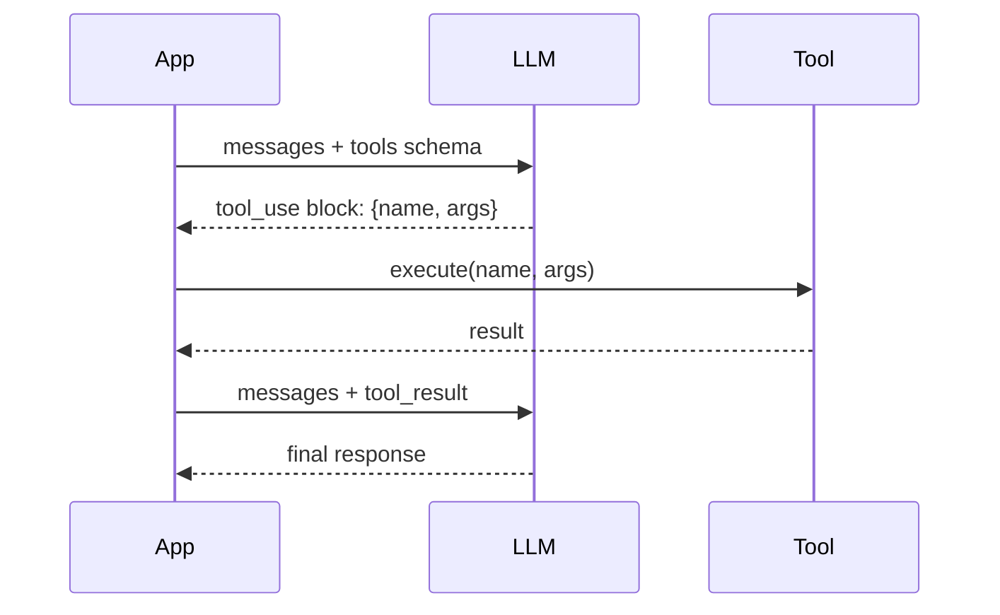
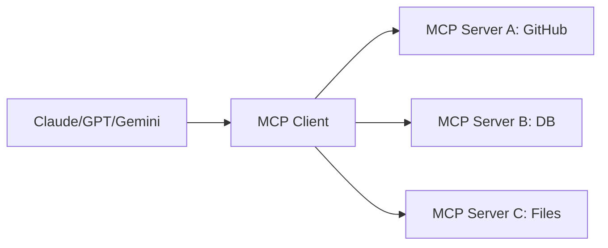

# 6.23 MCP vs Function Calling 对比

> 深入对比 MCP 和传统 Function Calling 的设计差异、各自的适用场景，以及 dify 在工程实现上的选择。

## 🎯 学习目标

完成本文档后，你将能够：
- 说清楚 Function Calling 和 MCP 在协议层面的本质差异
- 列出 MCP 相对 Function Calling 的 5 大优势与 3 大局限
- 理解 dify 为什么同时支持两种方式（工具内置 / MCP 接入）
- 能根据业务场景选择合适的方案

## 📚 前置知识

- Function Calling / Tool Use（详见 [Function Calling](./17-function-calling.md)、[主流大模型对比](./01-llm-overview.md)）
- JSON-RPC 2.0 基础（JSON 详见 [JSON](../01-fundamentals/20-json-processing.md)）
- MCP 协议概述（详见 [MCP 概述](./24-mcp-overview.md)）

## 1. 核心概念

### 1.1 什么是 Function Calling？

Function Calling 是 LLM 厂商在 API 里内置的"工具调用能力"——模型可以**在生成 response 时**输出结构化的函数调用参数。



**关键特点**：
- 协议由**厂商定义**（OpenAI / Anthropic / Google 各自不同）
- 工具 schema 在每次请求时随消息发送
- LLM 决定调用，**应用执行**——这是 LLM 的"指令"，不是 LLM 的"能力"

### 1.2 什么是 MCP？

MCP 是**工具提供方和 LLM 应用之间的标准协议**，把"如何调用工具"这件事从 LLM 厂商手里剥离出来。



**关键特点**：
- 协议由**社区定义**（modelcontextprotocol.io）
- 工具由**外部 Server 进程**提供，**独立部署、独立升级**
- LLM 厂商只需实现 MCP Client 就能接入所有 MCP Server

### 1.3 协议层 vs 应用层

| 维度 | Function Calling | MCP |
| --- | --- | --- |
| **所在层** | LLM API 层 | 应用层（LLM 无关） |
| **协议所有权** | LLM 厂商 | 社区开源 |
| **工具执行** | 应用进程内 | 独立 Server 进程 |
| **跨 LLM 兼容** | 不兼容（OpenAI ≠ Anthropic） | 一次实现，所有 LLM 可用 |
| **生态复用** | 每个 App 重写 | 共享 MCP Server |

### 1.4 MCP 的 5 大优势

1. **生态复用**：写一个 MCP Server，Claude / GPT / Gemini / Cursor / dify 都能用
2. **独立部署**：Server 可以用任何语言、任何框架，不需要 Python
3. **能力可组合**：Server 可以同时提供 Tools + Resources + Prompts
4. **状态管理**：Server 可以保持长连接、维护会话状态
5. **安全隔离**：Server 在独立进程，崩溃不会拖垮 Host；权限边界清晰

### 1.5 MCP 的 3 大局限

1. **首次握手延迟**：要建 stream 连接、`initialize` 握手、`tools/list` 拉 schema
2. **调试链路长**：跨进程、跨语言，问题可能出在协议层 / 序列化层 / 业务层
3. **不适合一次性工具**：如果只是想传个 prompt 给 LLM 用 `add(a,b)`，直接 Function Calling 更简单

## 2. 代码示例

### 2.1 Function Calling（Anthropic 风格）

```python
# 文件：function_calling.py
import anthropic

client = anthropic.Anthropic()

tools = [
    {
        "name": "get_weather",
        "description": "查询天气",
        "input_schema": {
            "type": "object",
            "properties": {"city": {"type": "string"}},
            "required": ["city"],
        },
    }
]

# 每次请求都要带 tools schema（请求体变大）
response = client.messages.create(
    model="claude-sonnet-5-20251001",
    max_tokens=1024,
    tools=tools,
    messages=[{"role": "user", "content": "北京今天天气怎么样？"}],
)

# LLM 决定调用工具，应用执行
for block in response.content:
    if block.type == "tool_use":
        print(f"LLM 想调 {block.name}, 参数={block.input}")
        # 应用自己执行（这里只是个示意）
        tool_result = {"temp": 25, "unit": "celsius"}
        # 把结果回传给 LLM 让它生成最终回答
```

### 2.2 MCP 风格

```python
# 文件：mcp_calling.py
import asyncio
from mcp import ClientSession, StdioServerParameters
from mcp.client.stdio import stdio_client

async def main():
    params = StdioServerParameters(command="python", args=["weather_server.py"])

    async with stdio_client(params) as (read, write):
        async with ClientSession(read, write) as session:
            await session.initialize()
            # 一次性拿到所有工具，后续每次请求不用带 schema
            tools = (await session.list_tools()).tools

            # 然后把 tools 转成 LLM 的 function calling 格式
            llm_tools = [
                {"name": t.name, "description": t.description, "input_schema": t.inputSchema}
                for t in tools
            ]
            # 调 LLM（省略）...
            # LLM 返回 tool_use 后调 MCP
            result = await session.call_tool("get_weather", {"city": "北京"})

asyncio.run(main())
```

**对比**：
- Function Calling：每次请求都要重发 100~10000 字的 tools schema
- MCP：握手一次拿 schema，后续只发请求 ID 和参数
- **MCP 优势**：对长 context / 多工具场景，省 token、省延迟

### 2.3 常见错误：混用概念

```python
# ❌ 错误：以为 MCP 替代了 LLM 的 function calling
# 其实 MCP 只解决了"工具如何暴露"，
# LLM 仍然要用 function calling 的机制告诉 Host "我要调什么"

# ✅ 正确：MCP + Function Calling 配合使用
# MCP 负责：Host → Server 的协议
# Function Calling 负责：LLM → Host 的协议
# 两者通过 tool name 关联：
#   LLM function call.name == MCP tool.name
```

## 3. 关键要点总结

- **Function Calling** 是 LLM API 层的协议，决定"LLM 想调什么"
- **MCP** 是应用层的协议，决定"工具如何提供"
- 两者通过 tool name 关联，配合使用：MCP 提供工具 → Function Calling 让 LLM 选择
- MCP 优势：生态复用、独立部署、状态管理、安全隔离、节省 token
- MCP 局限：握手延迟、调试复杂、不适合一次性简单工具
- dify 用 `ToolInvokeMessage` 统一所有工具来源的输出，Agent/Workflow 代码不用关心工具是内置还是 MCP

---

**文档版本**：v1.0
**最后更新**：2026-07-13
