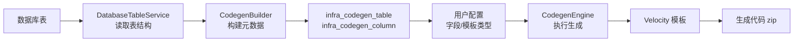

# 1.1 ruoyi 代码生成器概述

> 认识 ruoyi-vue-pro 代码生成器：把数据库表一键变成可运行的 CRUD 模块。

## 🎯 学习目标

完成本文档后，你将能够：
- 说出 ruoyi 代码生成器的核心价值与适用场景
- 理解代码生成的 4 大阶段：导入表 → 配置字段 → 选择模板 → 生成代码
- 掌握 `yudao-module-infra` 中代码生成模块的整体结构
- 在 IDEA 中定位代码生成相关的 Java 类和 Velocity 模板

## 📚 前置知识

- Java 基础（注解、泛型）
- Spring Boot 基础（`@Service`、`@Resource`，详见 [IoC](../02-spring-boot/01-ioc.md)）
- MyBatis-Plus 基础（`TableInfo`、`TableField`，详见 [MyBatis-Plus](../03-spring-boot-starters/07-mybatis-plus.md)）
- 业务模块结构（详见 [模块结构](../07-business-modules/01-module-structure.md)）

## 1. 核心概念

### 1.1 什么是代码生成器

代码生成器（Code Generator）是一种"**表 → 代码**"的自动化工具：你给它一张数据库表，它自动产出：
- 后端：`Controller` / `Service` / `ServiceImpl` / `Mapper` / `DO` / VO 类
- 前端：列表页 `index.vue` / 表单页 `form.vue` / API 调用 `api.ts`
- 数据库：`CREATE TABLE` 脚本 + 字典数据 + 菜单 SQL

ruoyi-vue-pro 的代码生成器是**国内最完善的开源实现**之一，它在前代 ruoyi 基础上加入了：
- 多数据库支持（MySQL / Oracle / PostgreSQL / SQL Server / 达梦 / 人大金仓）
- 多前端支持（Vue2 / Vue3 Element Plus / Vue3 Vben5 Antd / Vue3 Vben5 Element Plus / Uniapp）
- 多种生成场景（单表 CRUD、树表、主子表-普通/ERP/内嵌）

### 1.2 整体架构



### 1.3 模块所在位置

代码生成器是 **infra 模块**（基础设施模块）的一个子系统，**所有用户都能使用**（不需要额外授权）。

| 路径 | 作用 |
|------|------|
| `yudao-module-infra/src/main/java/.../dal/dataobject/codegen/` | `CodegenTableDO` / `CodegenColumnDO` 元数据 |
| `yudao-module-infra/src/main/java/.../service/codegen/` | `CodegenService` / `CodegenBuilder` / `CodegenEngine` |
| `yudao-module-infra/src/main/java/.../controller/admin/codegen/` | 管理后台的 REST 接口 |
| `yudao-module-infra/src/main/resources/codegen/` | 全部 Velocity 模板 |
| `yudao-ui-admin-vue3/src/views/infra/codegen/` | 前端配置界面 |

## 2. 代码示例

### 2.1 一次"生成"调用的简化流程

```java
// 简化的"一键生成"调用（实际是 Controller 调用 Service）
Long tableId = codegenService.createCodegenList("芋道源码", createReqVO).get(0);

// 预览（不下载）
Map<String, String> files = codegenService.generateCode(tableId);
// files.key = 文件路径, files.value = 文件内容

// 下载
byte[] zip = codegenService.downloadCode(tableId);
```

### 2.2 生成的产物长什么样

对一张 `system_dict_type` 表，生成器会输出 20+ 个文件：

```
yudao-module-system/
├── yudao-module-system-server/
│   └── src/main/java/cn/iocoder/yudao/module/system/
│       ├── controller/admin/dict/
│       │   ├── DictTypeController.java
│       │   └── vo/DictTypePageReqVO.java
│       │   └── vo/DictTypeRespVO.java
│       │   └── vo/DictTypeSaveReqVO.java
│       ├── service/dict/DictTypeService.java
│       ├── service/dict/DictTypeServiceImpl.java
│       ├── dal/mysql/dict/DictTypeMapper.java
│       └── dal/dataobject/dict/DictTypeDO.java
└── yudao-ui-admin-vue3/src/views/system/dict/
    ├── dictType/index.vue
    └── dictType/DictTypeForm.vue
```

## 3. ruoyi 仓库源码解读

### 3.1 CodegenService 接口

**文件位置**：`/Users/xu/code/github/ruoyi-vue-pro/yudao-module-infra/src/main/java/cn/iocoder/yudao/module/infra/service/codegen/CodegenService.java`

```java
public interface CodegenService {
    /** 创建代码生成（导入表） */
    List<Long> createCodegenList(String author, CodegenCreateListReqVO reqVO);

    /** 更新代码生成配置 */
    void updateCodegen(CodegenUpdateReqVO updateReqVO);

    /** 删除代码生成 */
    void deleteCodegenList(List<Long> ids);

    /** 获得代码生成表 */
    CodegenTableDO getCodegenTable(Long id);

    /** 获得代码生成表分页 */
    PageResult<CodegenTableDO> getCodegenTablePage(CodegenTablePageReqVO pageReqVO);

    /** 执行代码生成（预览） */
    Map<String, String> generateCode(Long tableId);

    /** 下载代码生成（zip） */
    byte[] downloadCode(Long tableId);
}
```

**解读**：
- 整个 Service 接口非常薄，只暴露**业务用例**（CRUD + 生成）
- 真正的"模板执行"逻辑委托给 `CodegenEngine`
- "表结构 → 元数据"逻辑委托给 `CodegenBuilder`

### 3.2 CodegenTableDO：表定义元数据

**文件位置**：`/Users/xu/code/github/ruoyi-vue-pro/yudao-module-infra/src/main/java/cn/iocoder/yudao/module/infra/dal/dataobject/codegen/CodegenTableDO.java`
**核心代码**（行 23-100）：

```java
@TableName(value = "infra_codegen_table", autoResultMap = true)
@KeySequence("infra_codegen_table_seq")
@Data
@TenantIgnore // 注意：代码生成器忽略多租户
public class CodegenTableDO extends BaseDO {

    @TableId
    private Long id;
    private Long dataSourceConfigId; // 关联数据源
    private Integer scene;           // ADMIN / APP

    // ========== 表相关字段 ==========
    private String tableName;        // 数据库表名
    private String tableComment;     // 表注释

    // ========== 类相关字段 ==========
    private String moduleName;       // 一级目录：system
    private String businessName;     // 二级目录：dict
    private String className;        // 类名：DictType
    private String classComment;     // 类描述
    private String author;           // 作者

    // ========== 生成相关字段 ==========
    private Integer templateType;    // ONE/TREE/MASTER_NORMAL/MASTER_ERP/MASTER_INNER/SUB
    private Integer frontType;       // 前端类型

    // ========== 主子表相关字段 ==========
    private Long masterTableId;      // 主表 ID（子表才有）
    private Long subJoinColumnId;    // 子表关联主表的字段
    private Boolean subJoinMany;     // 一对多 / 一对一
}
```

**解读**：
- `@TenantIgnore` 是关键注解——**代码生成器不参与多租户隔离**，所有租户共用同一份生成配置
- `templateType` 决定走"单表 / 树表 / 主子表"哪个分支
- `masterTableId` + `subJoinColumnId` + `subJoinMany` 三件套唯一确定主子表结构

### 3.3 模板资源目录

**文件位置**：`/Users/xu/code/github/ruoyi-vue-pro/yudao-module-infra/src/main/resources/codegen/`

```
codegen/
├── java/                       # Java 模板（核心）
│   ├── controller/
│   │   ├── controller.vm
│   │   └── vo/{pageReqVO,listReqVO,respVO,saveReqVO,importExcelVO,importRespVO}.vm
│   ├── service/{service,serviceImpl}.vm
│   ├── dal/{do,do_sub,mapper,mapper_sub,mapper.xml}.vm
│   ├── enums/errorcode.vm
│   └── test/serviceTest.vm
├── sql/{sql,h2}.vm
├── vue/                        # Vue2 Element UI
├── vue3/                       # Vue3 Element Plus
├── vue3_vben/                  # Vue3 Vben2
├── vue3_vben5_antd/            # Vue3 Vben5 Antd
├── vue3_vben5_antdv_next/      # Vue3 Vben5 Antdv Next
├── vue3_vben5_ele/             # Vue3 Vben5 Element Plus
└── vue3_admin_uniapp/          # 移动端 Uniapp
```

**解读**：
- 模板按**前端技术栈**分目录，但 Java 模板只有一份（前后端解耦）
- `*_sub.vm` 后缀的模板是**主子表专属**（如 `do_sub.vm`、`form_sub_normal.vue.vm`）
- `_normal` / `_erp` / `_inner` 三种后缀对应 `MASTER_NORMAL` / `MASTER_ERP` / `MASTER_INNER` 模式

## 4. 关键要点总结

- ruoyi 代码生成器是**可视化 + 模板驱动**的代码生产工具
- 4 步流程：**导入表** → **配置字段** → **选择模板类型** → **预览/下载**
- 核心 3 件套：`CodegenService`（业务） + `CodegenBuilder`（表→元数据） + `CodegenEngine`（执行模板）
- 模板统一存放在 `yudao-module-infra/src/main/resources/codegen/`
- **代码生成器本身忽略多租户**（`@TenantIgnore`），是平台级基础能力

## 5. 练习题

### 练习 1：基础（必做）

在 IDEA 中打开 `yudao-module-infra`，依次找到以下类并记录它们的**绝对路径**和**类注释**：
1. `CodegenServiceImpl`
2. `CodegenBuilder`
3. `CodegenEngine`
4. `CodegenTableDO`

### 练习 2：进阶

阅读 `CodegenServiceImpl` 的 `generateCode` 方法，**画出**它内部调用关系（哪个方法调用哪个），并标注每一步的职责。

### 练习 3：挑战（选做）

在数据库中模拟新建一张表 `system_test_demo(id, name, status, create_time)`，**不依赖代码生成器**手动写出对应的 `Controller` 4 个接口（create/update/delete/get），与生成器输出对比，感受模板能节省多少工作量。

## 6. 参考资料

- `/Users/xu/code/github/ruoyi-vue-pro/yudao-module-infra/src/main/java/cn/iocoder/yudao/module/infra/service/codegen/CodegenService.java`
- `/Users/xu/code/github/ruoyi-vue-pro/yudao-module-infra/src/main/java/cn/iocoder/yudao/module/infra/dal/dataobject/codegen/CodegenTableDO.java`
- `/Users/xu/code/github/ruoyi-vue-pro/yudao-module-infra/src/main/java/cn/iocoder/yudao/module/infra/dal/dataobject/codegen/CodegenColumnDO.java`
- `/Users/xu/code/github/ruoyi-vue-pro/yudao-module-infra/src/main/java/cn/iocoder/yudao/module/infra/service/codegen/inner/CodegenBuilder.java`
- `/Users/xu/code/github/ruoyi-vue-pro/yudao-module-infra/src/main/java/cn/iocoder/yudao/module/infra/service/codegen/inner/CodegenEngine.java`
- 官方文档：https://doc.iocoder.cn/codegen/

---

**文档版本**：v1.0
**最后更新**：2026-07-13
