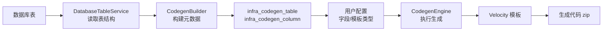

# 1.1 ruoyi 代码生成器概述

> 认识 ruoyi-vue-pro 代码生成器：把数据库表一键变成可运行的 CRUD 模块。

## 🎯 学习目标

完成本文档后，你将能够：
- 说出 ruoyi 代码生成器的核心价值与适用场景
- 理解代码生成的 4 大阶段：导入表 → 配置字段 → 选择模板 → 生成代码
- 掌握 `yudao-module-infra` 中代码生成模块的整体结构
- 在 IDEA 中定位代码生成相关的 Java 类和 Velocity 模板

## 📚 前置知识

- Java 基础（注解、泛型）
- Spring Boot 基础（`@Service`、`@Resource`，详见 [IoC](../02-spring-boot/01-ioc.md)）
- MyBatis-Plus 基础（`TableInfo`、`TableField`，详见 [MyBatis-Plus](../03-spring-boot-starters/08-mybatis-plus.md)）
- 业务模块结构（详见 [模块结构](../07-business-modules/01-module-structure.md)）

## 1. 核心概念

### 1.1 什么是代码生成器

代码生成器（Code Generator）是一种"**表 → 代码**"的自动化工具：你给它一张数据库表，它自动产出：
- 后端：`Controller` / `Service` / `ServiceImpl` / `Mapper` / `DO` / VO 类
- 前端：列表页 `index.vue` / 表单页 `form.vue` / API 调用 `api.ts`
- 数据库：`CREATE TABLE` 脚本 + 字典数据 + 菜单 SQL

ruoyi-vue-pro 的代码生成器是**国内最完善的开源实现**之一，它在前代 ruoyi 基础上加入了：
- 多数据库支持（MySQL / Oracle / PostgreSQL / SQL Server / 达梦 / 人大金仓）
- 多前端支持（Vue2 / Vue3 Element Plus / Vue3 Vben5 Antd / Vue3 Vben5 Element Plus / Uniapp）
- 多种生成场景（单表 CRUD、树表、主子表-普通/ERP/内嵌）

### 1.2 整体架构



### 1.3 模块所在位置

代码生成器是 **infra 模块**（基础设施模块）的一个子系统，**所有用户都能使用**（不需要额外授权）。

| 路径 | 作用 |
|------|------|
| `yudao-module-infra/src/main/java/.../dal/dataobject/codegen/` | `CodegenTableDO` / `CodegenColumnDO` 元数据 |
| `yudao-module-infra/src/main/java/.../service/codegen/` | `CodegenService` / `CodegenBuilder` / `CodegenEngine` |
| `yudao-module-infra/src/main/java/.../controller/admin/codegen/` | 管理后台的 REST 接口 |
| `yudao-module-infra/src/main/resources/codegen/` | 全部 Velocity 模板 |
| `yudao-ui-admin-vue3/src/views/infra/codegen/` | 前端配置界面 |

## 2. 代码示例

### 2.1 一次"生成"调用的简化流程

```java
// 简化的"一键生成"调用（实际是 Controller 调用 Service）
Long tableId = codegenService.createCodegenList("芋道源码", createReqVO).get(0);

// 预览（不下载）
Map<String, String> files = codegenService.generateCode(tableId);
// files.key = 文件路径, files.value = 文件内容

// 下载
byte[] zip = codegenService.downloadCode(tableId);
```

### 2.2 生成的产物长什么样

对一张 `system_dict_type` 表，生成器会输出 20+ 个文件：

```
yudao-module-system/
├── yudao-module-system-server/
│   └── src/main/java/cn/iocoder/yudao/module/system/
│       ├── controller/admin/dict/
│       │   ├── DictTypeController.java
│       │   └── vo/DictTypePageReqVO.java
│       │   └── vo/DictTypeRespVO.java
│       │   └── vo/DictTypeSaveReqVO.java
│       ├── service/dict/DictTypeService.java
│       ├── service/dict/DictTypeServiceImpl.java
│       ├── dal/mysql/dict/DictTypeMapper.java
│       └── dal/dataobject/dict/DictTypeDO.java
└── yudao-ui-admin-vue3/src/views/system/dict/
    ├── dictType/index.vue
    └── dictType/DictTypeForm.vue
```

## 3. 关键要点总结

- ruoyi 代码生成器是**可视化 + 模板驱动**的代码生产工具
- 4 步流程：**导入表** → **配置字段** → **选择模板类型** → **预览/下载**
- 核心 3 件套：`CodegenService`（业务） + `CodegenBuilder`（表→元数据） + `CodegenEngine`（执行模板）
- 模板统一存放在 `yudao-module-infra/src/main/resources/codegen/`
- **代码生成器本身忽略多租户**（`@TenantIgnore`），是平台级基础能力

---

**文档版本**：v1.0
**最后更新**：2026-07-13
