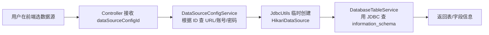

# 1.2 数据源配置

> 学习代码生成器如何连接不同的业务数据库，理解多数据源架构。

## 🎯 学习目标

完成本文档后，你将能够：
- 解释 ruoyi 数据源管理的核心表 `infra_data_source_config`
- 理解 `DatabaseTableService` 如何从任意数据源读取表结构
- 在自己项目中扩展一个新的数据源类型
- 区分"框架数据源"与"业务数据源"

## 📚 前置知识

- JDBC 基础
- Spring Boot 多数据源（`HikariDataSource`）
- 阅读过 `01-overview.md`

## 1. 核心概念

### 1.1 为什么需要数据源管理？

代码生成器要扫描**任意业务库**的表结构，而不是系统库（默认 `ruoyi-vue-pro`）。所以需要一个**数据源注册表**，让用户能"在线添加 MySQL/Oracle/PG 连接"。

### 1.2 核心实体：`DataSourceConfigDO`

```sql
CREATE TABLE infra_data_source_config (
    id           BIGINT PRIMARY KEY,
    name         VARCHAR(100),   -- 连接名（如 "订单库"）
    url          VARCHAR(500),   -- JDBC URL
    username     VARCHAR(100),
    password     VARCHAR(200),   -- 加密存储
    create_time  DATETIME,
    update_time  DATETIME,
    creator      VARCHAR(64),
    updater      VARCHAR(64),
    remark       VARCHAR(500)
);
```

### 1.3 数据源获取流程



## 2. 代码示例

### 2.1 添加一个 MySQL 数据源（前端表单）

```json
{
  "name": "订单库（测试）",
  "url": "jdbc:mysql://127.0.0.1:3306/order_db?useSSL=false",
  "username": "root",
  "password": "123456"
}
```

### 2.2 通过 ID 获取数据源配置

```java
// 由 DataSourceConfigServiceImpl 实现
public DataSourceConfigDO getDataSourceConfig(Long id) {
    return dataSourceConfigMapper.selectById(id);
}
```

## 3. ruoyi 仓库源码解读

### 3.1 数据源配置表

**文件位置**：`/Users/xu/code/github/ruoyi-vue-pro/yudao-module-infra/src/main/java/cn/iocoder/yudao/module/infra/dal/dataobject/db/DataSourceConfigDO.java`
**核心代码**（行 1-50）：

```java
@TableName(value = "infra_data_source_config")
@KeySequence("infra_data_source_config_seq")
@Data
public class DataSourceConfigDO extends BaseDO {

    @TableId
    private Long id;

    /** 连接名 */
    private String name;

    /** JDBC URL */
    private String url;

    /** 用户名 */
    private String username;

    /** 密码（加密） */
    private String password;

    /** 备注 */
    private String remark;
}
```

**解读**：
- 简单到极致——只有 5 个业务字段 + 6 个 `BaseDO` 审计字段
- `password` 在保存时会被 `encryptUtils` 加密（AES）
- 不会保存真实的 `HikariDataSource` 对象，**每次按需创建**

### 3.2 临时创建数据源

**文件位置**：`/Users/xu/code/github/ruoyi-vue-pro/`
**核心类**：`JdbcUtils`（在 `framework/mybatis/core/util/JdbcUtils.java`）
**关键方法**（简化）：

```java
public static Connection getConnection(DataSourceConfigDO config) throws SQLException {
    // 1. 根据 url 推断数据库类型
    DbType dbType = getDbType(config.getUrl());
    // 2. 加载对应驱动（MySQL/Oracle/PG/...）
    loadDriver(dbType);
    // 3. 直接用 DriverManager 获取连接（不用连接池！）
    return DriverManager.getConnection(config.getUrl(), config.getUsername(),
            decryptPassword(config.getPassword()));
}
```

**解读**：
- 临时数据源**不引入连接池**——只是单纯 `DriverManager`，因为只在"读取表结构"时短暂使用
- 避免 HikariCP 维护一堆不常使用的连接，浪费内存
- `loadDriver` 内部会做 `Class.forName("com.mysql.cj.jdbc.Driver")`，所以**必须引入对应驱动依赖**

### 3.3 读取表信息

**文件位置**：`/Users/xu/code/github/ruoyi-vue-pro/yudao-module-infra/src/main/java/cn/iocoder/yudao/module/infra/service/db/DatabaseTableServiceImpl.java`
**核心代码**（行 80-130，简化）：

```java
public TableInfo getTable(Long dataSourceConfigId, String tableName) {
    // 1. 获取数据源配置
    DataSourceConfigDO config = dataSourceConfigService.getDataSourceConfig(dataSourceConfigId);
    DbType dbType = JdbcUtils.getDbType(config.getUrl());

    // 2. 根据数据库类型，使用不同的 SQL
    String sql = switch (dbType) {
        case MYSQL -> "SELECT * FROM information_schema.tables " +
                      "WHERE table_schema = ? AND table_name = ?";
        case ORACLE -> "SELECT * FROM all_tables WHERE owner = ? AND table_name = ?";
        case POSTGRE_SQL -> "SELECT * FROM information_schema.tables " +
                            "WHERE table_schema = ? AND table_name = ?";
        // ... 其他
        default -> throw exception(DB_TYPE_NOT_SUPPORTED);
    };

    // 3. 执行 SQL，封装成 MyBatis-Plus 的 TableInfo
    try (Connection conn = JdbcUtils.getConnection(config)) {
        // ... 查询 + 映射
    }
}
```

**解读**：
- 每种数据库的 `information_schema` 结构不同，**必须分支处理**
- 最终都封装为 MyBatis-Plus 的 `TableInfo`（这样后续 `CodegenBuilder` 不用关心数据库类型）

## 4. 关键要点总结

- 数据源信息存在 `infra_data_source_config` 表中，运行时**按需创建连接**
- 不使用连接池，直接用 `DriverManager.getConnection` 临时连接
- 不同的数据库（MySQL/Oracle/PG/...）需要**不同的 SQL** 查询 `information_schema`
- 所有数据库差异在 `DatabaseTableService` 内部被消化，对外统一返回 `TableInfo`

## 5. 练习题

### 练习 1：基础（必做）

打开 `/Users/xu/code/github/ruoyi-vue-pro/sql/` 找到 `mysql` 初始化脚本，定位 `infra_data_source_config` 的建表语句，标注每个字段的类型和注释。

### 练习 2：进阶

阅读 `JdbcUtils.getDbType(String url)` 方法（简化代码如下），自己写一个**判断达梦数据库**的 URL 正则：

```java
public static DbType getDbType(String url) {
    if (url.contains("mysql")) return DbType.MYSQL;
    if (url.contains("oracle")) return DbType.ORACLE;
    if (url.contains("postgresql")) return DbType.POSTGRE_SQL;
    // TODO: 添加达梦 DM 的判断（jdbc:dm://...）
    return DbType.OTHER;
}
```

### 练习 3：挑战（选做）

扩展 `DatabaseTableService`：给"获取数据库表列表"接口加一个**分页参数**，让用户在前端能滚动加载 1000+ 张表（提示：MySQL 用 `LIMIT ? OFFSET ?`）。

## 6. 参考资料

- `/Users/xu/code/github/ruoyi-vue-pro/yudao-module-infra/src/main/java/cn/iocoder/yudao/module/infra/dal/dataobject/db/DataSourceConfigDO.java`
- `/Users/xu/code/github/ruoyi-vue-pro/`
- `/Users/xu/code/github/ruoyi-vue-pro/yudao-module-infra/src/main/java/cn/iocoder/yudao/module/infra/service/db/DatabaseTableServiceImpl.java`
- 官方文档：https://doc.iocoder.cn/codegen/

---

**文档版本**：v1.0
**最后更新**：2026-07-13
