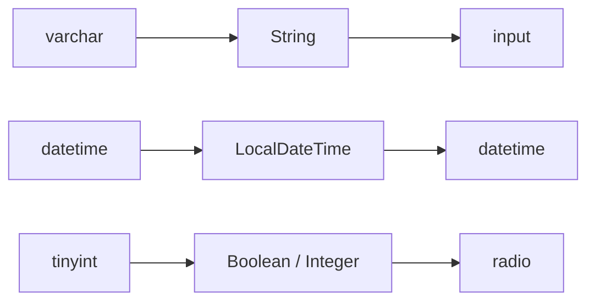

# 1.4 字段类型映射

> 学习数据库类型 → Java 类型 → HTML 控件 的三层映射规则。

## 🎯 学习目标

完成本文档后，你将能够：
- 解释"数据库类型 → Java 类型"的转换表
- 解释"Java 类型 → 默认 HTML 控件"的规则
- 掌握 `CodegenColumnListConditionEnum`（查询条件枚举）
- 自定义一条新的类型映射规则

## 📚 前置知识

- 阅读过 `01-overview.md`、`03-table-import.md`
- MySQL / Java 基本类型（`VARCHAR` / `INT` / `DATETIME`）

## 1. 核心概念

### 1.1 三层映射链路



每层映射规则：
1. **数据库类型 → Java 类型**：在 `CodegenBuilder` 硬编码（参考 MyBatis-Plus）
2. **Java 类型 → HTML 控件**：在 `CodegenBuilder.COLUMN_HTML_TYPE_MAPPINGS` 配置
3. **字段名 → 查询条件**：在 `CodegenBuilder.COLUMN_LIST_OPERATION_CONDITION_MAPPINGS` 配置

### 1.2 默认 HTML 控件映射

| 字段名后缀 | 默认 HTML 控件 | 说明 |
|----------|--------------|------|
| `status` | RADIO | 单选 |
| `sex` | RADIO | 单选 |
| `type` | SELECT | 下拉 |
| `image` | IMAGE_UPLOAD | 图片 |
| `file` | FILE_UPLOAD | 文件 |
| `content` / `description` / `demo` | EDITOR | 富文本 |
| `time` / `date` | DATETIME | 时间选择器 |
| 其他 | INPUT | 文本框（默认） |

## 2. 代码示例

### 2.1 查询条件映射示例

```java
// 在 CodegenBuilder 中
private static final Map<String, CodegenColumnListConditionEnum>
    COLUMN_LIST_OPERATION_CONDITION_MAPPINGS = MapUtil.builder()
    .put("name", CodegenColumnListConditionEnum.LIKE)   // name 结尾 → 模糊查询
    .put("time", CodegenColumnListConditionEnum.BETWEEN) // time 结尾 → 区间
    .put("date", CodegenColumnListConditionEnum.BETWEEN) // date 结尾 → 区间
    .build();
```

**举例**：
- `username` → 匹配 `name` → `LIKE '%xxx%'`
- `create_time` → 匹配 `time` → `BETWEEN '2025-01-01' AND '2025-12-31'`
- `id` → 无匹配 → 默认 `EQ`

## 3. ruoyi 仓库源码解读

### 3.1 数据库类型 → Java 类型

**位置**：`/Users/xu/code/github/ruoyi-vue-pro/yudao-module-infra/src/main/java/cn/iocoder/yudao/module/infra/service/codegen/inner/CodegenBuilder.java`
**说明**：这部分映射由 **MyBatis-Plus 的 `TableField` 内部处理**，ruoyi 复用即可。

```java
// CodegenBuilder.buildColumns 中只做了"特殊处理"
for (CodegenColumnDO column : columns) {
    // ...
    // 特殊处理：Byte => Integer（MySQL 的 tinyint(1) 会被识别成 Byte）
    if (Byte.class.getSimpleName().equals(column.getJavaType())) {
        column.setJavaType(Integer.class.getSimpleName());
    }
}
```

**MyBatis-Plus 默认映射**（参考 `JdbcTypeForJava`）：

| MySQL 类型 | Java 类型 |
|----------|---------|
| `varchar` / `char` / `text` | `String` |
| `int` / `integer` | `Integer` |
| `bigint` | `Long` |
| `tinyint(1)` | `Boolean` / `Byte`（项目改为 Integer） |
| `decimal` | `BigDecimal` |
| `datetime` / `timestamp` | `LocalDateTime` |
| `date` | `LocalDate` |
| `time` | `LocalTime` |

### 3.2 字段名 → 查询条件

**文件位置**：`/Users/xu/code/github/ruoyi-vue-pro/yudao-module-infra/src/main/java/cn/iocoder/yudao/module/infra/service/codegen/inner/CodegenBuilder.java`
**核心代码**（行 36-44）：

```java
private static final Map<String, CodegenColumnListConditionEnum>
    COLUMN_LIST_OPERATION_CONDITION_MAPPINGS = MapUtil.builder()
    .put("name", CodegenColumnListConditionEnum.LIKE)
    .put("time", CodegenColumnListConditionEnum.BETWEEN)
    .put("date", CodegenColumnListConditionEnum.BETWEEN)
    .build();
```

**匹配逻辑**（后续代码中）：

```java
// CodegenBuilder.processColumnOperation() 内
for (Map.Entry<String, CodegenColumnListConditionEnum> entry :
        COLUMN_LIST_OPERATION_CONDITION_MAPPINGS.entrySet()) {
    if (column.getJavaField().endsWith(entry.getKey())) {
        column.setListOperationCondition(entry.getValue().getCondition());
        break;
    }
}
```

### 3.3 字段名 → HTML 控件

**文件位置**：`/Users/xu/code/github/ruoyi-vue-pro/yudao-module-infra/src/main/java/cn/iocoder/yudao/module/infra/service/codegen/inner/CodegenBuilder.java`
**核心代码**（行 48-61）：

```java
private static final Map<String, CodegenColumnHtmlTypeEnum>
    COLUMN_HTML_TYPE_MAPPINGS = MapUtil.builder()
    .put("status", CodegenColumnHtmlTypeEnum.RADIO)
    .put("sex", CodegenColumnHtmlTypeEnum.RADIO)
    .put("type", CodegenColumnHtmlTypeEnum.SELECT)
    .put("image", CodegenColumnHtmlTypeEnum.IMAGE_UPLOAD)
    .put("file", CodegenColumnHtmlTypeEnum.FILE_UPLOAD)
    .put("content", CodegenColumnHtmlTypeEnum.EDITOR)
    .put("description", CodegenColumnHtmlTypeEnum.EDITOR)
    .put("demo", CodegenColumnHtmlTypeEnum.EDITOR)
    .put("time", CodegenColumnHtmlTypeEnum.DATETIME)
    .put("date", CodegenColumnHtmlTypeEnum.DATETIME)
    .build();
```

### 3.4 查询条件枚举

**文件位置**：`/Users/xu/code/github/ruoyi-vue-pro/yudao-module-infra/src/main/java/cn/iocoder/yudao/module/infra/enums/codegen/CodegenColumnListConditionEnum.java`
**核心代码**：

```java
@Getter
@AllArgsConstructor
public enum CodegenColumnListConditionEnum {
    EQ("=", "="),                                  // 等于
    NE("!=", "!="),                                // 不等于
    GT(">", ">"),                                  // 大于
    GTE(">=", ">="),                               // 大于等于
    LT("<", "<"),                                  // 小于
    LTE("<=", "<="),                               // 小于等于
    LIKE("LIKE", "LIKE '%?%'"),                    // 模糊
    BETWEEN("BETWEEN", "BETWEEN ? AND ?"),         // 区间
    ;

    private final String condition;     // SQL 中的条件符号
    private final String sqlTemplate;   // 用于 SQL 拼接的模板
}
```

## 4. 关键要点总结

- 三层映射：**数据库类型 → Java 类型 → HTML 控件**
- 字段名后缀驱动默认推断（`name`→LIKE, `time`→BETWEEN, `status`→RADIO）
- 用户可在编辑页**手动覆盖**自动推断的结果
- 特殊处理：`Byte` → `Integer`（避免 `tinyint(1)` 出现奇怪的 `Boolean` 转换）
- 查询条件枚举用 `equals` / `LIKE` / `BETWEEN` 等覆盖大部分常见场景

## 5. 练习题

### 练习 1：基础（必做）

为以下字段名写出"自动推断结果"：
- `nickname` → 查询条件 = ?, HTML 控件 = ?
- `create_time` → 查询条件 = ?, HTML 控件 = ?
- `avatar` → 查询条件 = ?, HTML 控件 = ?
- `gender` → 查询条件 = ?, HTML 控件 = ?

### 练习 2：进阶

修改 `COLUMN_HTML_TYPE_MAPPINGS`，让所有以 `phone` 结尾的字段默认是 `INPUT` 类型，**但附带正则校验**（提示：HTML 控件类型不会校验，需要前端额外加 `:rules`）。

### 练习 3：挑战（选做）

新增一个 `IN`（集合）查询条件，需要修改哪些文件？

## 6. 参考资料

- `/Users/xu/code/github/ruoyi-vue-pro/yudao-module-infra/src/main/java/cn/iocoder/yudao/module/infra/service/codegen/inner/CodegenBuilder.java`
- `/Users/xu/code/github/ruoyi-vue-pro/yudao-module-infra/src/main/java/cn/iocoder/yudao/module/infra/enums/codegen/CodegenColumnListConditionEnum.java`
- `/Users/xu/code/github/ruoyi-vue-pro/yudao-module-infra/src/main/java/cn/iocoder/yudao/module/infra/enums/codegen/CodegenColumnHtmlTypeEnum.java`
- 官方文档：https://doc.iocoder.cn/codegen/

---

**文档版本**：v1.0
**最后更新**：2026-07-13
