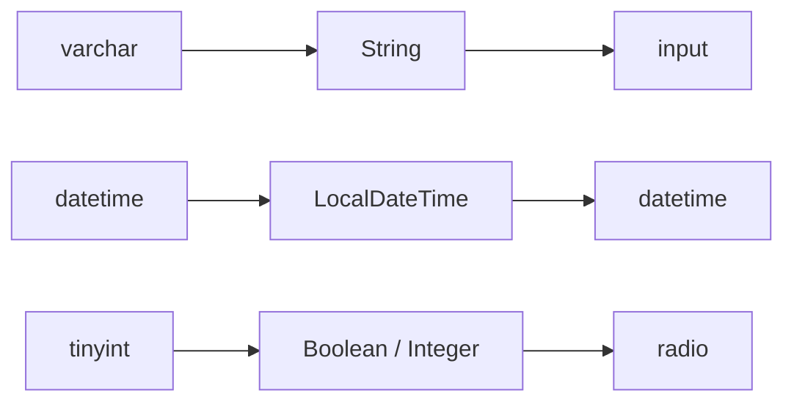

# 1.4 字段类型映射

> 学习数据库类型 → Java 类型 → HTML 控件 的三层映射规则。

## 🎯 学习目标

完成本文档后，你将能够：
- 解释"数据库类型 → Java 类型"的转换表
- 解释"Java 类型 → 默认 HTML 控件"的规则
- 掌握 `CodegenColumnListConditionEnum`（查询条件枚举）
- 自定义一条新的类型映射规则

## 📚 前置知识

- 总览与导入表（详见 [总览](./01-overview.md)、[导入表](./03-table-import.md)）
- MySQL / Java 基本类型（`VARCHAR` / `INT` / `DATETIME`）

## 1. 核心概念

### 1.1 三层映射链路



每层映射规则：
1. **数据库类型 → Java 类型**：在 `CodegenBuilder` 硬编码（参考 MyBatis-Plus）
2. **Java 类型 → HTML 控件**：在 `CodegenBuilder.COLUMN_HTML_TYPE_MAPPINGS` 配置
3. **字段名 → 查询条件**：在 `CodegenBuilder.COLUMN_LIST_OPERATION_CONDITION_MAPPINGS` 配置

### 1.2 默认 HTML 控件映射

| 字段名后缀 | 默认 HTML 控件 | 说明 |
|----------|--------------|------|
| `status` | RADIO | 单选 |
| `sex` | RADIO | 单选 |
| `type` | SELECT | 下拉 |
| `image` | IMAGE_UPLOAD | 图片 |
| `file` | FILE_UPLOAD | 文件 |
| `content` / `description` / `demo` | EDITOR | 富文本 |
| `time` / `date` | DATETIME | 时间选择器 |
| 其他 | INPUT | 文本框（默认） |

## 2. 代码示例

### 2.1 查询条件映射示例

```java
// 在 CodegenBuilder 中
private static final Map<String, CodegenColumnListConditionEnum>
    COLUMN_LIST_OPERATION_CONDITION_MAPPINGS = MapUtil.builder()
    .put("name", CodegenColumnListConditionEnum.LIKE)   // name 结尾 → 模糊查询
    .put("time", CodegenColumnListConditionEnum.BETWEEN) // time 结尾 → 区间
    .put("date", CodegenColumnListConditionEnum.BETWEEN) // date 结尾 → 区间
    .build();
```

**举例**：
- `username` → 匹配 `name` → `LIKE '%xxx%'`
- `create_time` → 匹配 `time` → `BETWEEN '2025-01-01' AND '2025-12-31'`
- `id` → 无匹配 → 默认 `EQ`

## 3. 关键要点总结

- 三层映射：**数据库类型 → Java 类型 → HTML 控件**
- 字段名后缀驱动默认推断（`name`→LIKE, `time`→BETWEEN, `status`→RADIO）
- 用户可在编辑页**手动覆盖**自动推断的结果
- 特殊处理：`Byte` → `Integer`（避免 `tinyint(1)` 出现奇怪的 `Boolean` 转换）
- 查询条件枚举用 `equals` / `LIKE` / `BETWEEN` 等覆盖大部分常见场景

---

**文档版本**：v1.0
**最后更新**：2026-07-13
