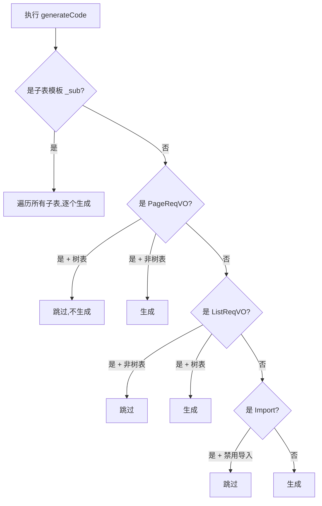

# 2.1 模板分组：CRUD/树/主子表

> 学习 ruoyi 的 6 种模板类型，以及它们在生成阶段的分支处理。

## 🎯 学习目标

完成本文档后，你将能够：
- 列出 `CodegenTemplateTypeEnum` 的 6 个值
- 区分"单表"和"树表"在 Service 接口上的差异
- 区分"主子表-普通/ERP/内嵌"三种模式的适用场景
- 在 `CodegenEngine` 中找到模板分发的关键代码

## 📚 前置知识

- 阅读过 `01-overview.md`
- 了解基本的 CRUD 业务

## 1. 核心概念

### 1.1 6 种模板类型

```java
public enum CodegenTemplateTypeEnum {
    ONE(1),                // 单表（增删改查）
    TREE(2),               // 树表（增删改查）

    MASTER_NORMAL(10),     // 主子表 - 主表 - 普通模式
    MASTER_ERP(11),        // 主子表 - 主表 - ERP 模式
    MASTER_INNER(12),      // 主子表 - 主表 - 内嵌模式
    SUB(15),               // 主子表 - 子表
}
```

### 1.2 三种主子表模式对比

| 模式 | 子表操作 | 典型场景 |
|------|---------|---------|
| **NORMAL** | 在主表单中**整体提交**子表数组 | 评论 + 评论图片 |
| **ERP** | 主表表单 + **独立增删改查**子表 | 销售订单 + 销售明细 |
| **INNER** | **内嵌子表**作为 JSON 字段 | 配置项 + 配置值 |

### 1.3 模板分发流程



## 2. 代码示例

### 2.1 单表 vs 树表 Controller 差异

```java
// ONE / MASTER_*：分页接口
@GetMapping("/page")
public CommonResult<PageResult<XXXRespVO>> getXXXPage(PageReqVO reqVO) { ... }

// TREE：列表接口（无分页）
@GetMapping("/list")
public CommonResult<List<XXXRespVO>> getXXXList(ListReqVO reqVO) { ... }
```

### 2.2 主子表 - NORMAL 模式的 Service

```java
// 创建主表 + 子表
public Long createXXX(XXXSaveReqVO reqVO) {
    // 1. 保存主表
    XXXDO main = BeanUtils.toBean(reqVO, XXXDO.class);
    mainMapper.insert(main);
    // 2. 批量保存子表
    List<SubDO> subList = reqVO.getSubs().stream()
        .map(s -> { s.setMainId(main.getId()); return s; })
        .toList();
    subMapper.insertBatch(subList);
    return main.getId();
}
```

## 3. ruoyi 仓库源码解读

### 3.1 模板类型枚举

**文件位置**：`/Users/xu/code/github/ruoyi-vue-pro/yudao-module-infra/src/main/java/cn/iocoder/yudao/module/infra/enums/codegen/CodegenTemplateTypeEnum.java`
**完整代码**：

```java
@Getter
@AllArgsConstructor
public enum CodegenTemplateTypeEnum {

    ONE(1),          // 单表（增删改查）
    TREE(2),         // 树表（增删改查）

    MASTER_NORMAL(10), // 主子表 - 主表 - 普通模式
    MASTER_ERP(11),    // 主子表 - 主表 - ERP 模式
    MASTER_INNER(12),  // 主子表 - 主表 - 内嵌模式
    SUB(15),           // 主子表 - 子表
    ;

    private final Integer type;

    /** 是否主表 */
    public static boolean isMaster(Integer type) {
        return Objects.equals(type, MASTER_NORMAL.type)
            || Objects.equals(type, MASTER_ERP.type)
            || Objects.equals(type, MASTER_INNER.type);
    }

    /** 是否树表 */
    public static boolean isTree(Integer type) {
        return Objects.equals(type, TREE.type);
    }
}
```

### 3.2 模板分发核心逻辑

**文件位置**：`/Users/xu/code/github/ruoyi-vue-pro/yudao-module-infra/src/main/java/cn/iocoder/yudao/module/infra/service/codegen/inner/CodegenEngine.java`
**核心代码**（行 383-407）：

```java
templates.forEach((vmPath, filePath) -> {
    // 2.1 特殊：主子表专属逻辑
    if (isSubTemplate(vmPath)) {
        generateSubCode(table, subTables, result, vmPath, filePath, bindingMap);
        return;
    }
    // 2.2 特殊：树表专属逻辑
    else if (isPageReqVOTemplate(vmPath)) {
        // 树表不需要分页接口，跳过 PageVO
        if (CodegenTemplateTypeEnum.isTree(table.getTemplateType())) {
            return;
        }
    }
    else if (isListReqVOTemplate(vmPath)) {
        // 非树表不需要 list 接口
        if (!CodegenTemplateTypeEnum.isTree(table.getTemplateType())) {
            return;
        }
    }
    else if (isImportTemplate(vmPath)) {
        // 关闭 import 时，跳过 ImportExcelVO / ImportRespVO
        if (!Boolean.TRUE.equals(codegenProperties.getImportEnable())) {
            return;
        }
    }
    // 2.3 默认生成
    generateCode(result, vmPath, filePath, bindingMap);
});
```

### 3.3 子表三种模式过滤

**文件位置**：`/Users/xu/code/github/ruoyi-vue-pro/yudao-module-infra/src/main/java/cn/iocoder/yudao/module/infra/service/codegen/inner/CodegenEngine.java`
**核心代码**（行 425-440）：

```java
private void generateSubCode(...) {
    if (CollUtil.isEmpty(subTables)) return;

    // 主子表模式匹配：过滤掉个性化模板
    if (vmPath.contains("_normal")
        && ObjectUtil.notEqual(table.getTemplateType(), MASTER_NORMAL.getType())) {
        return;
    }
    if (vmPath.contains("_erp")
        && ObjectUtil.notEqual(table.getTemplateType(), MASTER_ERP.getType())) {
        return;
    }
    if (vmPath.contains("_inner")
        && ObjectUtil.notEqual(table.getTemplateType(), MASTER_INNER.getType())) {
        return;
    }
    // 逐个子表生成
    for (int i = 0; i < subTables.size(); i++) {
        bindingMap.put("subIndex", i);
        generateCode(result, vmPath, filePath, bindingMap);
    }
}
```

## 4. 关键要点总结

- 6 种模板类型 = **2**（CRUD 形态：单/树） + **3**（主子表模式：NORMAL/ERP/INNER） + **1**（子表 SUB）
- **树表**没有分页 → 用 `list` 接口
- **主子表 ERP 模式**子表有独立 CRUD
- **主子表 NORMAL/INNER 模式**子表随主表一起提交
- 模板过滤规则在 `CodegenEngine.execute()` 中集中处理

## 5. 练习题

### 练习 1：基础（必做）

阅读 `CodegenTemplateTypeEnum`，为每种类型分别描述**生成出来的 Controller 会多/少哪些接口**。

### 练习 2：进阶

如果想新增一种 `MASTER_RECYCLE` 模式（主子表 + 回收站），需要修改哪些文件？请列出文件清单。

### 练习 3：挑战（选做）

阅读 `controller.vm` 第 200-296 行（主子表循环生成部分），画出"ERP 模式"生成的子表 Controller 完整结构（哪些接口）。

## 6. 参考资料

- `/Users/xu/code/github/ruoyi-vue-pro/yudao-module-infra/src/main/java/cn/iocoder/yudao/module/infra/enums/codegen/CodegenTemplateTypeEnum.java`
- `/Users/xu/code/github/ruoyi-vue-pro/yudao-module-infra/src/main/java/cn/iocoder/yudao/module/infra/service/codegen/inner/CodegenEngine.java`
- `/Users/xu/code/github/ruoyi-vue-pro/yudao-module-infra/src/main/resources/codegen/java/controller/controller.vm`
- 官方文档：https://doc.iocoder.cn/codegen/

---

**文档版本**：v1.0
**最后更新**：2026-07-13
