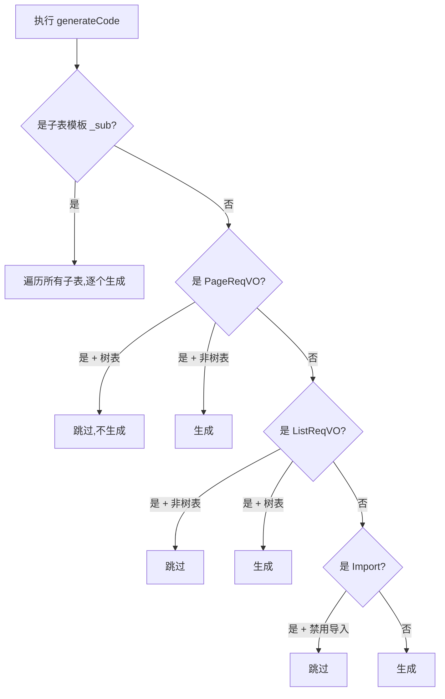

# 2.1 模板分组：CRUD/树/主子表

> 学习 ruoyi 的 6 种模板类型，以及它们在生成阶段的分支处理。

## 🎯 学习目标

完成本文档后，你将能够：
- 列出 `CodegenTemplateTypeEnum` 的 6 个值
- 区分"单表"和"树表"在 Service 接口上的差异
- 区分"主子表-普通/ERP/内嵌"三种模式的适用场景
- 在 `CodegenEngine` 中找到模板分发的关键代码

## 📚 前置知识

- 总览（详见 [总览](./01-overview.md)）
- 基本 CRUD 业务（详见 [MVC 分层](../07-business-modules/02-mvc-layers.md)）

## 1. 核心概念

### 1.1 6 种模板类型

```java
public enum CodegenTemplateTypeEnum {
    ONE(1),                // 单表（增删改查）
    TREE(2),               // 树表（增删改查）

    MASTER_NORMAL(10),     // 主子表 - 主表 - 普通模式
    MASTER_ERP(11),        // 主子表 - 主表 - ERP 模式
    MASTER_INNER(12),      // 主子表 - 主表 - 内嵌模式
    SUB(15),               // 主子表 - 子表
}
```

### 1.2 三种主子表模式对比

| 模式 | 子表操作 | 典型场景 |
|------|---------|---------|
| **NORMAL** | 在主表单中**整体提交**子表数组 | 评论 + 评论图片 |
| **ERP** | 主表表单 + **独立增删改查**子表 | 销售订单 + 销售明细 |
| **INNER** | **内嵌子表**作为 JSON 字段 | 配置项 + 配置值 |

### 1.3 模板分发流程



## 2. 代码示例

### 2.1 单表 vs 树表 Controller 差异

```java
// ONE / MASTER_*：分页接口
@GetMapping("/page")
public CommonResult<PageResult<XXXRespVO>> getXXXPage(PageReqVO reqVO) { ... }

// TREE：列表接口（无分页）
@GetMapping("/list")
public CommonResult<List<XXXRespVO>> getXXXList(ListReqVO reqVO) { ... }
```

### 2.2 主子表 - NORMAL 模式的 Service

```java
// 创建主表 + 子表
public Long createXXX(XXXSaveReqVO reqVO) {
    // 1. 保存主表
    XXXDO main = BeanUtils.toBean(reqVO, XXXDO.class);
    mainMapper.insert(main);
    // 2. 批量保存子表
    List<SubDO> subList = reqVO.getSubs().stream()
        .map(s -> { s.setMainId(main.getId()); return s; })
        .toList();
    subMapper.insertBatch(subList);
    return main.getId();
}
```

## 3. 关键要点总结

- 6 种模板类型 = **2**（CRUD 形态：单/树） + **3**（主子表模式：NORMAL/ERP/INNER） + **1**（子表 SUB）
- **树表**没有分页 → 用 `list` 接口
- **主子表 ERP 模式**子表有独立 CRUD
- **主子表 NORMAL/INNER 模式**子表随主表一起提交
- 模板过滤规则在 `CodegenEngine.execute()` 中集中处理

---

**文档版本**：v1.0
**最后更新**：2026-07-13
