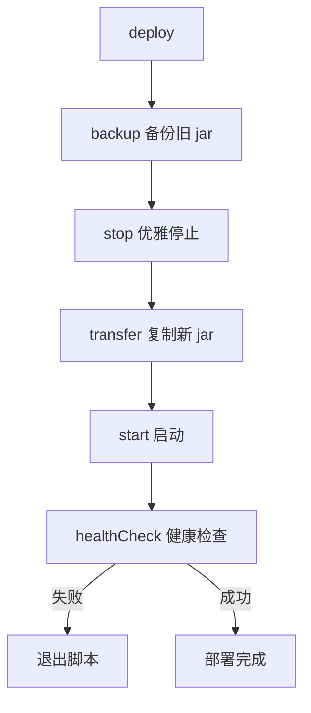

# 2.5 ruoyi 的部署脚本

> 深入理解 ruoyi 的部署脚本（deploy.sh + Jenkinsfile + docker-compose），掌握企业级部署完整流程。

## 🎯 学习目标

完成本文档后，你将能够：
- 理解 ruoyi 的部署全流程：构建 → 传输 → 停止 → 启动 → 健康检查
- 掌握 Shell 脚本中的 PID 管理、信号处理、优雅停机
- 看懂 Jenkinsfile 的 pipeline 阶段
- 能独立编写 Spring Boot 应用的部署脚本

## 📚 前置知识

- Shell 基础（bash 函数、变量、信号）
- 可执行 JAR（详见 [Spring Boot JAR](./04-spring-boot-jar.md)）
- Docker Compose（详见 [Compose](../../_common/09-containerization/04-compose.md)）
- CI/CD 与 Jenkins（详见 [CI/CD 概念](../../_common/11-cicd/01-concepts.md)、[Jenkins](../../_common/11-cicd/04-jenkins.md)）
- 部署策略（蓝绿/滚动，详见 [蓝绿](../../_common/12-deploy-strategies/01-blue-green.md)、[滚动](../../_common/12-deploy-strategies/03-rolling-and-ab.md)）

## 1. 核心概念

### 1.1 ruoyi 的两种部署方式

| 方式 | 工具 | 适用场景 |
|------|------|---------|
| 传统部署 | `deploy.sh` + Jenkins | 单机/虚拟机，自建机房 |
| 容器化部署 | `docker-compose`（Dockerfile 详见 [Dockerfile](../../_common/09-containerization/02-dockerfile.md)） | 容器平台（开发/测试） |

### 1.2 deploy.sh 的核心流程



### 1.3 优雅停机 vs 强制 kill

| 信号 | 行为 | 适用 |
|------|------|------|
| `kill -15` (SIGTERM) | Spring Boot 触发 `@PreDestroy` 清理资源 | 正常停止 |
| `kill -9` (SIGKILL) | 立即终止，可能丢数据 | 兜底强制 |

ruoyi 先发 `-15` 等待 120 秒，超时再发 `-9`。

## 2. 代码示例

### 2.1 PID 查找与停止

```bash
#!/bin/bash
APP_HOME=/work/projects/yudao-server

stop() {
    PID=$(ps -ef | grep $APP_HOME/yudao-server | grep -v "grep" | awk '{print $2}')
    if [ -n "$PID" ]; then
        kill -15 $PID
        # 等待关闭
        for ((i = 0; i < 120; i++)); do
            sleep 1
            PID=$(ps -ef | grep $APP_HOME/yudao-server | grep -v "grep" | awk '{print $2}')
            if [ -z "$PID" ]; then
                echo "停止成功"
                break
            fi
        done
        # 兜底强制 kill
        if [ -n "$PID" ]; then
            kill -9 $PID
        fi
    fi
}
```

**说明**：
- `ps -ef | grep` 找进程，过滤 `grep` 本身
- `awk '{print $2}'` 取 PID
- `-15` → 等 120s → `-9` 是经典三段式优雅停机

### 2.2 健康检查

```bash
healthCheck() {
    HEALTH_CHECK_URL=http://127.0.0.1:48080/actuator/health/
    for ((i = 0; i < 120; i++)); do
        result=`curl -I -m 10 -o /dev/null -s -w %{http_code} $HEALTH_CHECK_URL || echo "000"`
        if [ "$result" == "200" ]; then
            echo "健康检查通过"
            break
        fi
        sleep 1
    done
    if [ ! "$result" == "200" ]; then
        tail -n 10 nohup.out
        exit 1
    fi
}
```

**说明**：
- `curl -I`：只取响应头
- `-m 10`：超时 10 秒
- `-w %{http_code}`：输出 HTTP 状态码
- 等待 120 秒内通过则成功

## 3. 关键要点总结

- ruoyi 的部署 = `Jenkinsfile`（CI）+ `deploy.sh`（CD）
- `deploy.sh` 五步：备份 → 停止 → 部署 → 启动 → 健康检查
- `BUILD_ID=dontKillMe` 是 Jenkins 部署的关键技巧
- 优雅停机：先 `kill -15`，等 120 秒，超时再 `kill -9`
- 健康检查基于 Spring Boot Actuator 的 `/actuator/health`

---

**文档版本**：v1.0
**最后更新**：2026-07-13
