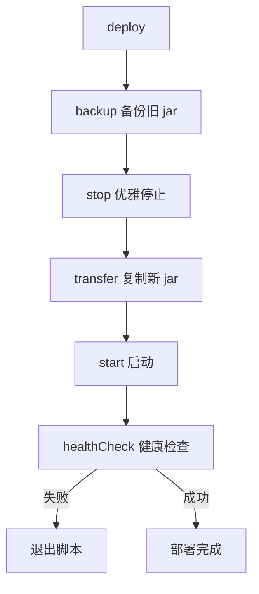

# 2.5 ruoyi 的部署脚本

> 深入理解 ruoyi 的部署脚本（deploy.sh + Jenkinsfile + docker-compose），掌握企业级部署完整流程。

## 🎯 学习目标

完成本文档后，你将能够：
- 理解 ruoyi 的部署全流程：构建 → 传输 → 停止 → 启动 → 健康检查
- 掌握 Shell 脚本中的 PID 管理、信号处理、优雅停机
- 看懂 Jenkinsfile 的 pipeline 阶段
- 能独立编写 Spring Boot 应用的部署脚本

## 📚 前置知识

- Shell 基础（bash 函数、变量、信号）
- `02-spring-boot-jar.md`
- `08-docker-compose.md`

## 1. 核心概念

### 1.1 ruoyi 的两种部署方式

| 方式 | 工具 | 适用场景 |
|------|------|---------|
| 传统部署 | `deploy.sh` + Jenkins | 单机/虚拟机，自建机房 |
| 容器化部署 | `docker-compose` | 容器平台（开发/测试） |

### 1.2 deploy.sh 的核心流程



### 1.3 优雅停机 vs 强制 kill

| 信号 | 行为 | 适用 |
|------|------|------|
| `kill -15` (SIGTERM) | Spring Boot 触发 `@PreDestroy` 清理资源 | 正常停止 |
| `kill -9` (SIGKILL) | 立即终止，可能丢数据 | 兜底强制 |

ruoyi 先发 `-15` 等待 120 秒，超时再发 `-9`。

## 2. 代码示例

### 2.1 PID 查找与停止

```bash
#!/bin/bash
APP_HOME=/work/projects/yudao-server

stop() {
    PID=$(ps -ef | grep $APP_HOME/yudao-server | grep -v "grep" | awk '{print $2}')
    if [ -n "$PID" ]; then
        kill -15 $PID
        # 等待关闭
        for ((i = 0; i < 120; i++)); do
            sleep 1
            PID=$(ps -ef | grep $APP_HOME/yudao-server | grep -v "grep" | awk '{print $2}')
            if [ -z "$PID" ]; then
                echo "停止成功"
                break
            fi
        done
        # 兜底强制 kill
        if [ -n "$PID" ]; then
            kill -9 $PID
        fi
    fi
}
```

**说明**：
- `ps -ef | grep` 找进程，过滤 `grep` 本身
- `awk '{print $2}'` 取 PID
- `-15` → 等 120s → `-9` 是经典三段式优雅停机

### 2.2 健康检查

```bash
healthCheck() {
    HEALTH_CHECK_URL=http://127.0.0.1:48080/actuator/health/
    for ((i = 0; i < 120; i++)); do
        result=`curl -I -m 10 -o /dev/null -s -w %{http_code} $HEALTH_CHECK_URL || echo "000"`
        if [ "$result" == "200" ]; then
            echo "健康检查通过"
            break
        fi
        sleep 1
    done
    if [ ! "$result" == "200" ]; then
        tail -n 10 nohup.out
        exit 1
    fi
}
```

**说明**：
- `curl -I`：只取响应头
- `-m 10`：超时 10 秒
- `-w %{http_code}`：输出 HTTP 状态码
- 等待 120 秒内通过则成功

## 3. ruoyi 仓库源码解读

### 3.1 deploy.sh 完整解读

**文件位置**：`/Users/xu/code/github/ruoyi-vue-pro/script/shell/deploy.sh`
**核心代码**（行 1-20）：

```bash
#!/bin/bash
set -e

DATE=$(date +%Y%m%d%H%M)
# 基础路径
BASE_PATH=/work/projects/yudao-server
# 编译后 jar 的地址。部署时，Jenkins 会上传 jar 包到该目录下
SOURCE_PATH=$BASE_PATH/build
# 服务名称。同时约定部署服务的 jar 包名字也为它。
SERVER_NAME=yudao-server
# 环境
PROFILES_ACTIVE=development
# 健康检查 URL
HEALTH_CHECK_URL=http://127.0.0.1:48080/actuator/health/

# heapError 存放路径
HEAP_ERROR_PATH=$BASE_PATH/heapError
# JVM 参数
JAVA_OPS="-Xms512m -Xmx512m -XX:+HeapDumpOnOutOfMemoryError -XX:HeapDumpPath=$HEAP_ERROR_PATH"
```

**解读**：
- 第 2 行：`set -e` — 任何命令失败立即退出
- 第 4 行：`DATE=$(date +%Y%m%d%H%M)` — 用于备份文件后缀
- 第 6 行：`BASE_PATH` — 服务部署目录
- 第 8 行：`SOURCE_PATH` — Jenkins 上传 jar 的目录
- 第 10 行：`SERVER_NAME=yudao-server` — **同时约定 jar 名也是它**（与 `pom.xml` 的 `finalName` 对应）
- 第 12 行：`PROFILES_ACTIVE=development` — 部署时激活 `development` profile
- 第 18-19 行：JVM 参数含 OOM 自动堆转储

### 3.2 backup 函数

**文件位置**：`/Users/xu/code/github/ruoyi-vue-pro/script/shell/deploy.sh`
**核心代码**（行 28-39）：

```bash
# 备份
function backup() {
    # 如果不存在，则无需备份
    if [ ! -f "$BASE_PATH/$SERVER_NAME.jar" ]; then
        echo "[backup] $BASE_PATH/$SERVER_NAME.jar 不存在，跳过备份"
    # 如果存在，则备份到 backup 目录下，使用时间作为后缀
    else
        echo "[backup] 开始备份 $SERVER_NAME ..."
        cp $BASE_PATH/$SERVER_NAME.jar $BASE_PATH/backup/$SERVER_NAME-$DATE.jar
        echo "[backup] 备份 $SERVER_NAME 完成"
    fi
}
```

**解读**：
- 第 30-32 行：第一次部署没有旧 jar，跳过备份
- 第 33-37 行：把旧 jar 复制到 `backup/` 目录，文件名带时间戳
- **回滚机制**：如果新版本有 bug，可手动把 backup 里的 jar 复制回 BASE_PATH

### 3.3 stop 函数（优雅停机）

**文件位置**：`/Users/xu/code/github/ruoyi-vue-pro/script/shell/deploy.sh`
**核心代码**（行 60-91）：

```bash
# 停止：优雅关闭之前已经启动的服务
function stop() {
    echo "[stop] 开始停止 $BASE_PATH/$SERVER_NAME"
    PID=$(ps -ef | grep $BASE_PATH/$SERVER_NAME | grep -v "grep" | awk '{print $2}')
    # 如果 Java 服务启动中，则进行关闭
    if [ -n "$PID" ]; then
        # 正常关闭
        echo "[stop] $BASE_PATH/$SERVER_NAME 运行中，开始 kill [$PID]"
        kill -15 $PID
        # 等待最大 120 秒，直到关闭完成。
        for ((i = 0; i < 120; i++))
            do
                sleep 1
                PID=$(ps -ef | grep $BASE_PATH/$SERVER_NAME | grep -v "grep" | awk '{print $2}')
                if [ -n "$PID" ]; then
                    echo -e ".\c"
                else
                    echo "[stop] 停止 $BASE_PATH/$SERVER_NAME 成功"
                    break
                fi
		    done

        # 如果正常关闭失败，那么进行强制 kill -9 进行关闭
        if [ -n "$PID" ]; then
            echo "[stop] $BASE_PATH/$SERVER_NAME 失败，强制 kill -9 $PID"
            kill -9 $PID
        fi
    # 如果 Java 服务未启动，则无需关闭
    else
        echo "[stop] $BASE_PATH/$SERVER_NAME 未启动，无需停止"
    fi
}
```

**解读**：
- 第 63 行：`ps -ef | grep ... | grep -v "grep" | awk '{print $2}'` — 找进程 PID（排除 grep 自身）
- 第 65 行：`[ -n "$PID" ]` — 检查 PID 是否非空
- 第 68 行：`kill -15 $PID` — 发送 SIGTERM 触发 Spring Boot 优雅停机
- 第 70-80 行：循环 120 秒，每秒检查进程是否退出
- 第 83-86 行：超时后强制 `kill -9`

### 3.4 start 函数（后台启动）

**文件位置**：`/Users/xu/code/github/ruoyi-vue-pro/script/shell/deploy.sh`
**核心代码**（行 93-104）：

```bash
# 启动：启动后后端项目
function start() {
    # 开启启动前，打印启动参数
    echo "[start] 开始启动 $BASE_PATH/$SERVER_NAME"
    echo "[start] JAVA_OPS: $JAVA_OPS"
    echo "[start] JAVA_AGENT: $JAVA_AGENT"
    echo "[start] PROFILES: $PROFILES_ACTIVE"

    # 开始启动
    BUILD_ID=dontKillMe nohup java -server $JAVA_OPS $JAVA_AGENT -jar $BASE_PATH/$SERVER_NAME.jar --spring.profiles.active=$PROFILES_ACTIVE &
    echo "[start] 启动 $BASE_PATH/$SERVER_NAME 完成"
}
```

**解读**：
- 第 102 行：`BUILD_ID=dontKillMe` — 关键！防止 Jenkins 杀掉衍生进程
  - Jenkins 构建完成后默认会 kill 掉 BUILD_ID 衍生的进程
  - 设为 `dontKillMe` 绕过此行为
- 第 102 行：`nohup ... &` — nohup 忽略 SIGHUP，后台运行
- 第 102 行：`java -server` — 启用 Server 模式 JVM
- 第 102 行：`$JAVA_OPS` — 堆参数
- 第 102 行：`$JAVA_AGENT` — SkyWalking agent（默认注释）
- 第 102 行：`--spring.profiles.active=$PROFILES_ACTIVE` — 切换 profile

### 3.5 healthCheck 函数

**文件位置**：`/Users/xu/code/github/ruoyi-vue-pro/script/shell/deploy.sh`
**核心代码**（行 106-143）：

```bash
# 健康检查：自动判断后端项目是否正常启动
function healthCheck() {
    # 如果配置健康检查，则进行健康检查
    if [ -n "$HEALTH_CHECK_URL" ]; then
        # 健康检查最大 120 秒，直到健康检查通过
        echo "[healthCheck] 开始通过 $HEALTH_CHECK_URL 地址，进行健康检查";
        for ((i = 0; i < 120; i++))
            do
                # 请求健康检查地址，只获取状态码。
                result=`curl -I -m 10 -o /dev/null -s -w %{http_code} $HEALTH_CHECK_URL || echo "000"`
                # 如果状态码为 200，则说明健康检查通过
                if [ "$result" == "200" ]; then
                    echo "[healthCheck] 健康检查通过";
                    break
                # 如果状态码非 200，则说明未通过。sleep 1 秒后，继续重试
                else
                    echo -e ".\c"
                    sleep 1
                fi
            done

        # 健康检查未通过，则异常退出 shell 脚本，不继续部署。
        if [ ! "$result" == "200" ]; then
            echo "[healthCheck] 健康检查不通过，可能部署失败。查看日志，自行判断是否启动成功";
            tail -n 10 nohup.out
            exit 1;
        # 健康检查通过，打印最后 10 行日志，可能部署的人想看下日志。
        else
            tail -n 10 nohup.out
        fi
    # 如果未配置健康检查，则 sleep 120 秒，人工看日志是否部署成功。
    else
        echo "[healthCheck] HEALTH_CHECK_URL 未配置，开始 sleep 120 秒";
        sleep 120
        echo "[healthCheck] sleep 120 秒完成，查看日志，自行判断是否启动成功";
        tail -n 50 nohup.out
    fi
}
```

**解读**：
- 第 115 行：`curl -I -m 10 -o /dev/null -s -w %{http_code} $HEALTH_CHECK_URL || echo "000"`
  - `-I`：只取响应头
  - `-m 10`：超时 10 秒
  - `-o /dev/null`：丢弃响应体
  - `-s`：静默模式
  - `-w %{http_code}`：输出 HTTP 状态码
  - `|| echo "000"`：curl 失败时返回 `000`
- 第 117-119 行：状态码 200 表示健康检查通过
- 第 128-131 行：**关键** — 健康检查失败立即 `exit 1`，让 CI 判定为部署失败
- 第 134 行：成功后输出日志最后 10 行

### 3.6 deploy 编排

**文件位置**：`/Users/xu/code/github/ruoyi-vue-pro/script/shell/deploy.sh`
**核心代码**（行 145-160）：

```bash
# 部署
function deploy() {
    cd $BASE_PATH
    # 备份原 jar
    backup
    # 停止 Java 服务
    stop
    # 部署新 jar
    transfer
    # 启动 Java 服务
    start
    # 健康检查
    healthCheck
}

deploy
```

**解读**：
- 顺序固定：备份 → 停止 → 部署 → 启动 → 健康检查
- `set -e` 在脚本顶部，任一函数失败立即退出

### 3.7 Jenkinsfile

**文件位置**：`/Users/xu/code/github/ruoyi-vue-pro/script/jenkins/Jenkinsfile`
**核心代码**（行 1-60）：

```groovy
#!groovy
pipeline {
    agent any

    parameters {
        string(name: 'TAG_NAME', defaultValue: '', description: '')
    }

    environment {
        DOCKER_CREDENTIAL_ID = 'dockerhub-id'
        GITHUB_CREDENTIAL_ID = 'github-id'
        KUBECONFIG_CREDENTIAL_ID = 'demo-kubeconfig'
        REGISTRY = 'docker.io'
        DOCKERHUB_NAMESPACE = 'docker_username'
        GITHUB_ACCOUNT = 'https://gitee.com/zhijiantianya/ruoyi-vue-pro'
        APP_NAME = 'yudao-server'
        APP_DEPLOY_BASE_DIR = '/media/pi/KINGTON/data/work/projects/'
    }

    stages {
        stage('检出') {
            steps {
                git url: "https://gitee.com/will-we/ruoyi-vue-pro.git",
                        branch: "devops"
            }
        }

        stage('构建') {
            steps {
                sh 'if [ ! -d "' + "${env.HOME}" + '/resources" ];then\n' +
                        '  echo "配置文件不存在无需修改"\n' +
                        'else\n' +
                        '  cp  -rf  ' + "${env.HOME}" + '/resources/*.yaml ' + "${env.APP_NAME}" + '/src/main/resources\n' +
                        '  echo "配置文件替换"\n' +
                        'fi'
                sh 'mvn clean package -Dmaven.test.skip=true'
            }
        }

        stage('部署') {
            steps {
                sh 'cp -f ' + ' bin/deploy.sh ' + "${env.APP_DEPLOY_BASE_DIR}" + "${env.APP_NAME}"
                sh 'cp -f ' + "${env.APP_NAME}" + '/target/*.jar ' + "${env.APP_DEPLOY_BASE_DIR}" + "${env.APP_NAME}" +'/build/'
                archiveArtifacts "${env.APP_NAME}" + '/target/*.jar'
                sh 'chmod +x ' + "${env.APP_DEPLOY_BASE_DIR}" + "${env.APP_NAME}" + '/deploy.sh'
                sh 'bash ' + "${env.APP_DEPLOY_BASE_DIR}" + "${env.APP_NAME}" + '/deploy.sh'
            }
        }
    }
}
```

**解读**：
- 第 2 行：`agent any` — 任意可用 agent
- 第 5-7 行：`parameters` — 流水线参数（运行时传入）
- 第 10-26 行：`environment` — 全局环境变量（凭证 ID、路径）
- **三个阶段**：
  - 第 30-34 行：检出 — `git` 拉取 devops 分支
  - 第 37-48 行：构建 — 可选覆盖配置文件（`${HOME}/resources/*.yaml` 存在则替换），然后 `mvn package`
  - 第 50-57 行：部署 — 复制 deploy.sh 和 jar 到目标服务器，执行 deploy.sh
- 第 54 行：`archiveArtifacts` — 把 jar 归档到 Jenkins 制品库

## 4. 关键要点总结

- ruoyi 的部署 = `Jenkinsfile`（CI）+ `deploy.sh`（CD）
- `deploy.sh` 五步：备份 → 停止 → 部署 → 启动 → 健康检查
- `BUILD_ID=dontKillMe` 是 Jenkins 部署的关键技巧
- 优雅停机：先 `kill -15`，等 120 秒，超时再 `kill -9`
- 健康检查基于 Spring Boot Actuator 的 `/actuator/health`

## 5. 练习题

### 练习 1：基础（必做）

本地启动 yudao-server，复制 `deploy.sh` 改为 `deploy-local.sh`，把 `BASE_PATH` 改成本地目录，测试能否完成 "备份→停止→部署→启动" 流程。

### 练习 2：进阶

把 `deploy.sh` 改造成支持多环境（local / dev / prod）：通过第一个参数选择环境，对应不同的 `PROFILES_ACTIVE` 和 `BASE_PATH`。

### 练习 3：挑战（选做）

为 deploy.sh 添加**回滚函数**：在 backup 目录保留最近 5 个版本，新版本部署失败时自动回滚到上一个版本。

## 6. 参考资料

- `/Users/xu/code/github/ruoyi-vue-pro/script/shell/deploy.sh`
- `/Users/xu/code/github/ruoyi-vue-pro/script/jenkins/Jenkinsfile`
- `/Users/xu/code/github/ruoyi-vue-pro/script/docker/docker-compose.yml`
- [Jenkins Pipeline 文档](https://www.jenkins.io/doc/book/pipeline/)
- [Bash 信号处理](https://www.gnu.org/software/bash/manual/html_node/Signals.html)

---

**文档版本**：v1.0
**最后更新**：2026-07-13
