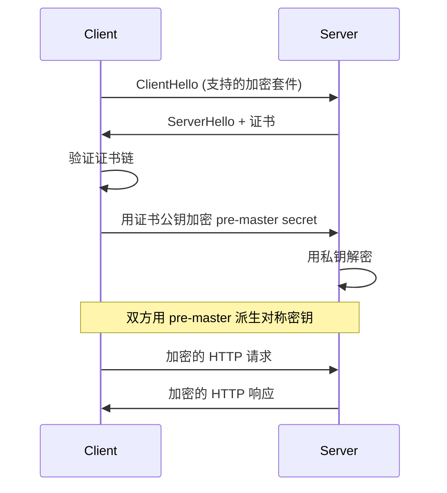

# 3.2 HTTPS 配置

> 理解 HTTPS 的工作原理，掌握 Nginx + Let's Encrypt 证书部署与自动续期。

## 🎯 学习目标

完成本文档后，你将能够：
- 理解 TLS/SSL 握手与证书链
- 掌握 Nginx HTTPS 配置
- 知道如何使用 Let's Encrypt 免费证书
- 掌握 HTTP → HTTPS 自动跳转

## 📚 前置知识

- HTTP 协议基础
- `10-nginx-proxy.md`

## 1. 核心概念

### 1.1 为什么需要 HTTPS？

| HTTP 问题 | HTTPS 解决方案 |
|----------|---------------|
| 明文传输，密码可被抓包 | TLS 加密 |
| 无法验证服务器身份 | 数字证书 |
| 运营商可注入广告 | 端到端加密 |

### 1.2 TLS 握手过程



### 1.3 证书类型

| 类型 | 验证级别 | 价格 | 适用 |
|------|---------|------|------|
| DV（域名验证） | 仅验证域名所有权 | 免费 | 个人/小站 |
| OV（组织验证） | 验证公司 | 收费 | 企业 |
| EV（扩展验证） | 严格验证 | 昂贵 | 金融 |

**Let's Encrypt** 提供免费的 DV 证书（90 天，自动续期）。

## 2. 代码示例

### 2.1 Nginx HTTPS 基础配置

```nginx
server {
    listen 443 ssl;
    server_name api.example.com;

    # 证书文件
    ssl_certificate     /etc/nginx/ssl/fullchain.pem;
    ssl_certificate_key /etc/nginx/ssl/privkey.pem;

    # 协议与加密套件
    ssl_protocols TLSv1.2 TLSv1.3;
    ssl_ciphers ECDHE-ECDSA-AES256-GCM-SHA384:ECDHE-RSA-AES256-GCM-SHA384;
    ssl_prefer_server_ciphers on;

    # 性能优化
    ssl_session_cache shared:SSL:10m;
    ssl_session_timeout 1d;
    ssl_session_tickets off;

    # HSTS
    add_header Strict-Transport-Security "max-age=31536000" always;

    location / {
        proxy_pass http://127.0.0.1:48080;
        proxy_set_header Host $host;
        proxy_set_header X-Real-IP $remote_addr;
        proxy_set_header X-Forwarded-For $proxy_add_x_forwarded_for;
        proxy_set_header X-Forwarded-Proto $scheme;
    }
}

# HTTP 自动跳转 HTTPS
server {
    listen 80;
    server_name api.example.com;
    return 301 https://$server_name$request_uri;
}
```

**说明**：
- `ssl_protocols TLSv1.2 TLSv1.3` — 禁用 TLS 1.0/1.1（有 POODLE 等漏洞）
- `ssl_session_cache shared:SSL:10m` — 复用 SSL 会话，避免每次握手
- `HSTS` — 告诉浏览器永远用 HTTPS 访问
- `return 301` — 80 端口的请求 301 跳转到 HTTPS

### 2.2 Let's Encrypt 申请证书

```bash
# 安装 certbot
apt install -y certbot python3-certbot-nginx

# 申请证书（自动修改 nginx 配置）
certbot --nginx -d api.example.com

# 测试自动续期
certbot renew --dry-run
```

## 3. ruoyi 仓库源码解读

**注**：ruoyi 仓库**没有 HTTPS 相关代码**（属于部署层面）。

ruoyi 的部署文档在 `https://doc.iocoder.cn/deployment-server/` 提供完整指南。

**典型部署架构**：

```
用户 (https://yudao.example.com)
    ↓ HTTPS
Nginx (443 端口，反代)
    ↓ HTTP
yudao-server (48080 端口)
```

**Nginx 配置**（基于 ruoyi 的路径）：

```nginx
upstream yudao-server {
    server 127.0.0.1:48080;
}

# HTTP 跳转 HTTPS
server {
    listen 80;
    server_name yudao.example.com;
    return 301 https://$server_name$request_uri;
}

# HTTPS
server {
    listen 443 ssl http2;
    server_name yudao.example.com;

    ssl_certificate     /etc/letsencrypt/live/yudao.example.com/fullchain.pem;
    ssl_certificate_key /etc/letsencrypt/live/yudao.example.com/privkey.pem;

    # 上传文件大小（与 Spring Boot 一致）
    client_max_body_size 32M;

    # WebSocket
    location /infra/ws {
        proxy_pass http://yudao-server;
        proxy_http_version 1.1;
        proxy_set_header Upgrade $http_upgrade;
        proxy_set_header Connection "upgrade";
        proxy_set_header Host $host;
        proxy_read_timeout 86400s;
    }

    # 后端 API
    location /admin-api/ {
        proxy_pass http://yudao-server;
        proxy_http_version 1.1;
        proxy_set_header Host $host;
        proxy_set_header X-Real-IP $remote_addr;
        proxy_set_header X-Forwarded-For $proxy_add_x_forwarded_for;
        proxy_set_header X-Forwarded-Proto $scheme;
    }

    # 前端
    location / {
        root /opt/yudao-ui-admin/dist;
        try_files $uri $uri/ /index.html;
    }
}
```

**关键点**：
- `proxy_set_header X-Forwarded-Proto $scheme` — 让 Spring Boot 知道是 HTTPS 请求
- ruoyi 的 `XSS exclude-urls` 不需要 HTTPS 特殊处理
- `client_max_body_size 32M` 与 ruoyi 的 `spring.servlet.multipart.max-request-size` 一致

## 4. 关键要点总结

- HTTPS = HTTP + TLS 加密 + 数字证书
- Let's Encrypt 提供 90 天免费证书，通过 `certbot` 自动续期
- 禁用 TLS 1.0/1.1（安全漏洞）
- `X-Forwarded-Proto` 让后端知道原始协议
- HTTP 80 端口必须 301 跳转到 HTTPS
- HSTS 头告诉浏览器强制 HTTPS

## 5. 练习题

### 练习 1：基础（必做）

用 `openssl req -x509 -newkey rsa:2048 -keyout key.pem -out cert.pem -days 365 -nodes` 生成自签证书，配置 Nginx 监听 443 启用 HTTPS。

### 练习 2：进阶

用 certbot 为 `your-domain.com` 申请 Let's Encrypt 证书，配置自动续期 cron：`0 3 * * * certbot renew --quiet`。

### 练习 3：挑战（选做）

在 Spring Boot 端直接启用 HTTPS（不经过 Nginx）：生成 keystore，配置 `server.ssl.*`，对比 Nginx 终止 TLS 的性能差异。

## 6. 参考资料

- `/Users/xu/code/github/ruoyi-vue-pro/script/docker/docker-compose.yml`
- [Let's Encrypt 官方文档](https://letsencrypt.org/zh-cn/docs/)
- [Mozilla SSL 配置生成器](https://ssl-config.mozilla.org/)
- [Nginx HTTPS 优化](https://nginx.org/en/docs/http/configuring_https_servers.html)
- ruoyi 部署文档：https://doc.iocoder.cn/deployment-server/

---

**文档版本**：v1.0
**最后更新**：2026-07-13
