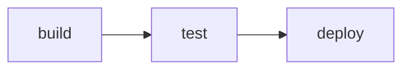

# 4.2 GitLab CI 实战

> 理解 GitLab CI/CD 的工作原理，掌握 `.gitlab-ci.yml` 编写，为 ruoyi 配置国内主流的 CI 流水线。

## 🎯 学习目标

完成本文档后，你将能够：
- 理解 GitLab CI 的核心概念（pipeline、stage、job、runner）
- 掌握 `.gitlab-ci.yml` 编写
- 能为 ruoyi 编写"编译 → 部署"流水线
- 了解 GitLab Runner 的注册与使用

## 📚 前置知识

- Git 基础
- Maven 命令
- `01-maven-build.md`
- `14-github-actions.md`（对比学习）

## 1. 核心概念

### 1.1 什么是 GitLab CI？

GitLab 内置的 CI/CD 平台：
- 配置文件：`.gitlab-ci.yml`（仓库根目录）
- 执行环境：GitLab Runner（可自建）
- 触发：push / MR / tag / schedule

### 1.2 核心概念

| 概念 | 说明 |
|------|------|
| **Pipeline** | 一次 CI 任务（每次 push 触发） |
| **Stage** | 阶段（同一 stage 的 job 并行） |
| **Job** | 执行单元（必须属于某个 stage） |
| **Runner** | 执行 Job 的 worker 进程 |
| **Artifact** | Job 之间的文件传递 |

### 1.3 Stage 流程



默认 stage 串行执行（同一 stage 内 job 并行）。

## 2. 代码示例

### 2.1 最小 GitLab CI 配置

```yaml
# 文件：.gitlab-ci.yml
stages:
  - build
  - deploy

build:
  stage: build
  image: maven:3.8-openjdk-8
  script:
    - mvn clean package -pl yudao-server -am -DskipTests
  artifacts:
    paths:
      - yudao-server/target/*.jar
    expire_in: 30 days

deploy:
  stage: deploy
  image: alpine:latest
  script:
    - apk add --no-cache openssh-client
    - scp yudao-server/target/yudao-server.jar root@server:/work/projects/yudao-server/build/
    - ssh root@server "bash /work/projects/yudao-server/deploy.sh"
  only:
    - main
```

**说明**：
- `stages` — 定义阶段顺序
- `image` — Job 运行的 Docker 镜像
- `artifacts.paths` — 产物路径（供后续 job 下载）
- `only: main` — 只在 main 分支运行

### 2.2 缓存 Maven 依赖

```yaml
build:
  stage: build
  image: maven:3.8-openjdk-8
  cache:
    key: m2-cache
    paths:
      - .m2/repository/
  script:
    - mvn clean package -DskipTests
```

### 2.3 SSH 部署（避免明文密码）

```yaml
deploy:
  stage: deploy
  before_script:
    - 'which ssh-agent || ( apt-get update -y && apt-get install openssh-client -y )'
    - eval $(ssh-agent -s)
    - echo "$SSH_PRIVATE_KEY" | tr -d '\r' | ssh-add -
    - mkdir -p ~/.ssh
    - chmod 700 ~/.ssh
  script:
    - ssh user@server "bash /work/deploy.sh"
```

**配置 CI/CD Variables**（Settings → CI/CD → Variables）：
- `SSH_PRIVATE_KEY`：私钥内容

## 3. ruoyi 仓库源码解读

**注**：ruoyi 仓库**没有 `.gitlab-ci.yml`**，CI 使用 Jenkins（`script/jenkins/Jenkinsfile`）。

**基于 ruoyi 架构的 GitLab CI 推荐配置**：

```yaml
# 文件：.gitlab-ci.yml
stages:
  - build
  - deploy

variables:
  MAVEN_OPTS: "-Xmx2g -XX:MaxRAMPercentage=75.0"
  APP_NAME: "yudao-server"
  DEPLOY_DIR: "/work/projects/yudao-server"

# ===== 阶段 1：构建 =====
build:
  stage: build
  image: maven:3.8-openjdk-8
  cache:
    key: m2-cache
    paths:
      - .m2/repository/
  script:
    # 可选：覆盖配置文件
    - 'if [ -d "$HOME/resources" ]; then cp -rf $HOME/resources/*.yaml '"$APP_NAME"'/src/main/resources/; fi'
    # 编译
    - mvn clean package -pl $APP_NAME -am -Dmaven.test.skip=true
  artifacts:
    paths:
      - $APP_NAME/target/*.jar
    expire_in: 30 days
  only:
    - main
    - dev

# ===== 阶段 2：部署 =====
deploy:
  stage: deploy
  image: alpine:latest
  needs: ["build"]
  before_script:
    - 'which ssh-agent || ( apk add --no-cache openssh-client )'
    - eval $(ssh-agent -s)
    - echo "$SSH_PRIVATE_KEY" | tr -d '\r' | ssh-add -
    - mkdir -p ~/.ssh
    - echo -e "Host *\n\tStrictHostKeyChecking no\n\n" > ~/.ssh/config
  script:
    - scp $APP_NAME/target/*.jar root@$DEPLOY_HOST:$DEPLOY_DIR/build/
    - scp script/shell/deploy.sh root@$DEPLOY_HOST:$DEPLOY_DIR/
    - ssh root@$DEPLOY_HOST "cd $DEPLOY_DIR && chmod +x deploy.sh && bash deploy.sh"
  environment:
    name: production
    url: https://yudao.example.com
  only:
    - main
```

**解读**：
- 第 3-6 行：定义全局变量
- 第 9-30 行：build stage
  - 第 11-15 行：缓存 `~/.m2/repository` 加速构建
  - 第 19-20 行：可选覆盖配置（参考 `Jenkinsfile` 的做法）
  - 第 21 行：编译
  - 第 23-26 行：上传 jar 作为 artifact
- 第 33-52 行：deploy stage
  - 第 35-40 行：注入 SSH 私钥
  - 第 41-43 行：scp 上传 jar
  - 第 44 行：执行远程 `deploy.sh`（参考 `09-ruoyi-deploy.md`）
  - 第 47-49 行：声明部署环境（GitLab UI 会显示）

## 4. 关键要点总结

- `.gitlab-ci.yml` 放在仓库根目录
- `stages` 定义阶段顺序，同 stage 内 job 并行
- `image` 字段指定 Job 运行的 Docker 镜像
- `artifacts` 跨 job 传递文件
- `cache` 加速依赖下载
- SSH 私钥通过 CI/CD Variables 注入（**不要写在 yaml 里**）
- 部署脚本可复用 ruoyi 的 `script/shell/deploy.sh`

## 5. 练习题

### 练习 1：基础（必做）

在 GitLab 仓库（可自建 GitLab 或用 `gitlab.com`）添加 `.gitlab-ci.yml`，配置 build stage（编译 yudao-server），验证 artifact 上传成功。

### 练习 2：进阶

添加 deploy stage，配置 SSH 密钥，通过 `scp` 上传 jar 到测试服务器，执行 `deploy.sh`。

### 练习 3：挑战（选做）

配置多环境部署：dev 分支部署到测试环境，main 分支部署到生产环境。使用 `environment` 字段区分。

## 6. 参考资料

- [GitLab CI/CD 官方文档](https://docs.gitlab.com/ee/ci/)
- [GitLab Runner 安装](https://docs.gitlab.com/runner/install/)
- ruoyi 部署文档：https://doc.iocoder.cn/

---

**文档版本**：v1.0
**最后更新**：2026-07-13
