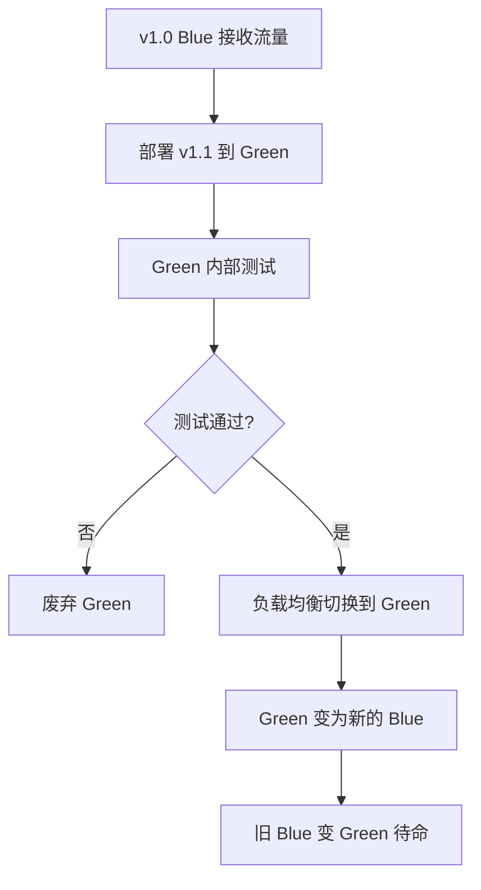
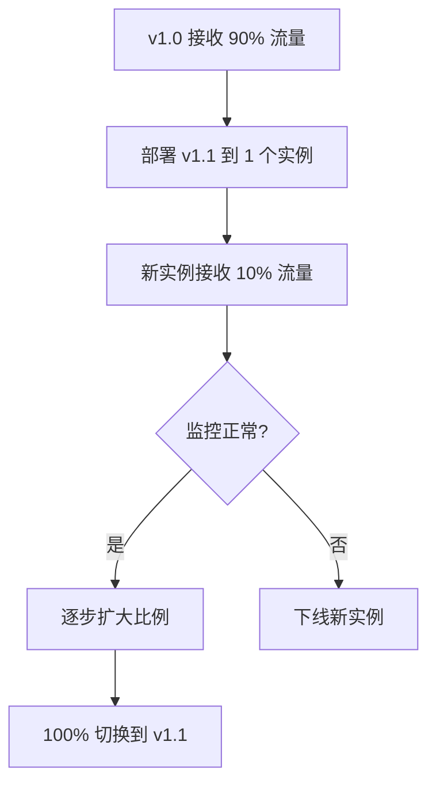
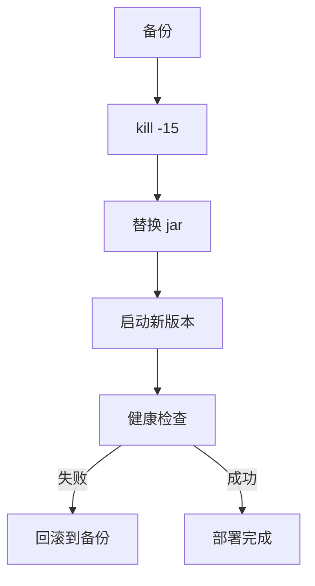

# 4.4 蓝绿部署 / 灰度发布

> 理解蓝绿部署（Blue/Green）和灰度发布（Canary）的原理与实践，掌握企业级零停机发布方案。

## 🎯 学习目标

完成本文档后，你将能够：
- 区分蓝绿部署、灰度发布、滚动发布的差异
- 掌握各种部署策略的实现原理
- 能在 Nginx 层面实现蓝绿切换
- 知道 ruoyi 中如何做零停机发布

## 📚 前置知识

- 负载均衡基础（`12-load-balance.md`）
- `10-nginx-proxy.md`

## 1. 核心概念

### 1.1 三种发布策略对比

| 策略 | 原理 | 优点 | 缺点 |
|------|------|------|------|
| **蓝绿部署** | 同时维护两套环境，瞬时切换 | 切换快、回滚快 | 资源占用 2 倍 |
| **灰度发布** | 按比例逐步推送 | 影响范围可控 | 规则复杂 |
| **滚动发布** | 逐个替换旧实例 | 资源占用少 | 回滚慢 |

### 1.2 蓝绿部署流程



**关键点**：
- 同时维护两套完全一样的环境
- 切换是**瞬时**的（修改 Nginx upstream）
- 切换后旧环境保留，用于**快速回滚**

### 1.3 灰度发布（Canary）



**关键点**：
- 灰度比例：10% → 30% → 60% → 100%
- 按用户分群（VIP / 内测用户先体验）
- 实时监控异常率

## 2. 代码示例

### 2.1 Nginx 蓝绿部署

```nginx
upstream yudao-blue {
    server 127.0.0.1:48080;  # v1.0（当前 Blue）
}

upstream yudao-green {
    server 127.0.0.1:48090;  # v1.1（新部署的 Green）
}

# 当前激活的 upstream
upstream yudao-active {
    server 127.0.0.1:48080;  # 默认指向 blue
}

server {
    listen 80;
    location / {
        proxy_pass http://yudao-active;
    }
}
```

**切换操作**（修改 upstream 后 `nginx -s reload`）：

```nginx
upstream yudao-active {
    server 127.0.0.1:48090;  # 切换到 green
}
```

### 2.2 Nginx 灰度发布（按比例）

```nginx
upstream yudao-cluster {
    server 127.0.0.1:48080 weight=9;   # v1.0 占 90%
    server 127.0.0.1:48090 weight=1;   # v1.1 占 10%
}
```

**逐步调整 weight**：9:1 → 5:5 → 1:9 → 0:10

### 2.3 Nginx 灰度发布（按用户）

```nginx
server {
    listen 80;

    # 白名单用户（VIP / 测试）走 v1.1
    set $backend "yudao-stable";
    if ($http_user_id ~* "^(vip_user_1|vip_user_2)$") {
        set $backend "yudao-canary";
    }

    location / {
        proxy_pass http://$backend;
    }
}

upstream yudao-stable {
    server 127.0.0.1:48080;
}

upstream yudao-canary {
    server 127.0.0.1:48090;
}
```

**说明**：通过请求头/cookie 决定路由到哪个版本。

## 3. ruoyi 仓库源码解读

**注**：ruoyi 的 Jenkinsfile 是**滚动发布**（先停后启），不是真正的蓝绿。

**ruoyi 现有部署流程分析**（参考 `09-ruoyi-deploy.md`）：



**问题**：
- 步骤 B-C 之间**有停机时间**（约 5-30 秒）
- 旧版本被 kill 后**没有流量**，无法平滑切换

### 3.1 ruoyi 实现蓝绿部署的推荐方案

```yaml
# 文件：docker-compose-blue-green.yml
version: "3.4"
name: yudao-blue-green

services:
  # Blue 环境（v1.0）
  blue:
    image: yudao-server:v1.0
    container_name: yudao-blue
    ports:
      - "48080:48080"
    environment:
      SPRING_PROFILES_ACTIVE: prod

  # Green 环境（v1.1 待发布）
  green:
    image: yudao-server:v1.1
    container_name: yudao-green
    ports:
      - "48090:48080"
    environment:
      SPRING_PROFILES_ACTIVE: prod
```

**配套 Nginx 配置**（蓝绿切换）：

```nginx
upstream yudao-active {
    # 修改这里切换版本
    server 127.0.0.1:48080;  # blue
    # server 127.0.0.1:48090;  # green（取消注释 = 切换到 green）
}

server {
    listen 80;
    location / {
        proxy_pass http://yudao-active;
        proxy_set_header Host $host;
    }
}
```

**部署步骤**：

```bash
# 1. 部署新版本到 green（不接收流量）
docker-compose up -d green

# 2. 在 green 上跑冒烟测试
curl http://localhost:48090/actuator/health

# 3. 切换流量到 green
sed -i 's/48080;/48090;/' /etc/nginx/conf.d/yudao.conf
nginx -s reload

# 4. 观察一段时间
sleep 300

# 5. 确认无误后，停止 blue
docker stop yudao-blue

# 6. 紧急回滚（如果出问题）
sed -i 's/48090;/48080;/' /etc/nginx/conf.d/yudao.conf
nginx -s reload
```

### 3.2 使用 yudao-cloud 实现灰度

在微服务版（yudao-cloud）中，可通过 **Spring Cloud Gateway + Nacos** 实现灰度：

```yaml
# 在 Nacos gateway-router.yaml 中配置
spring:
  cloud:
    gateway:
      routes:
        - id: yudao-system-v1
          uri: lb://yudao-system
          predicates:
            - Path=/admin-api/system/**
            - Header=version, v1.0      # v1.0 路由到稳定实例
        - id: yudao-system-canary
          uri: lb://yudao-system-canary
          predicates:
            - Path=/admin-api/system/**
            - Header=version, v1.1      # v1.1 路由到灰度实例
```

**灰度控制**：在测试请求中加 `version: v1.1` 头部即可走灰度版本。

## 4. 关键要点总结

- 蓝绿部署：两套环境 + 瞬时切换，资源占用 2 倍但回滚快
- 灰度发布：按比例或按用户分批推送，影响范围可控
- 滚动发布：逐个替换实例，资源占用少但回滚慢
- **Nginx 层实现蓝绿**：通过修改 `upstream` + `nginx -s reload` 完成秒级切换
- **Spring Cloud Gateway 实现灰度**：通过 Header / Cookie 路由到不同版本
- ruoyi 当前是**滚动发布**（先停后启），微服务版可实现真正的蓝绿/灰度

## 5. 练习题

### 练习 1：基础（必做）

在本地启动 2 个 yudao-server（端口 48080、48090），配置 Nginx 蓝绿切换。修改配置后 `nginx -s reload`，观察流量切换。

### 练习 2：进阶

把 Nginx 蓝绿配置改造成灰度配置：用 `weight=9` vs `weight=1` 实现 90/10 流量分配，逐步调整为 50/50，最后 0/10。

### 练习 3：挑战（选做）

为部署脚本添加**回滚机制**：检测到新版本启动失败时，自动切换 Nginx upstream 回到旧版本，停止 green 容器。

## 6. 参考资料

- `/Users/xu/code/github/ruoyi-vue-pro/script/shell/deploy.sh`
- `/Users/xu/code/github/ruoyi-vue-pro/script/docker/docker-compose.yml`
- [Nginx upstream 文档](http://nginx.org/en/docs/http/ngx_http_upstream_module.html)
- [Spring Cloud Gateway 灰度发布](https://docs.spring.io/spring-cloud-gateway/docs/current/reference/html/)

---

**文档版本**：v1.0
**最后更新**：2026-07-13
